# Wiki Documentation for https://github.com/sicko7947/local-bento

Generated on: 2025-05-20 21:21:46

## Table of Contents

- [Introduction to Local Bento](#overview-intro)
- [Getting Started with Local Bento](#overview-getting-started)
- [System Architecture Overview](#architecture-overview)
- [Component Details](#architecture-components)
- [Task Management System](#features-task-management)
- [Zero-Knowledge Proving](#features-zk-proving)
- [Data Flow within Local Bento](#data-flow)
- [Data Storage Mechanisms](#data-storage)
- [Task Database](#backend-taskdb)
- [Workflow Engine](#backend-workflow)
- [Docker Deployment](#deployment-docker)
- [S3 Integration](#deployment-s3)

<a id='overview-intro'></a>

## Introduction to Local Bento

### Related Pages

Related topics: [System Architecture Overview](#architecture-overview), [Getting Started with Local Bento](#overview-getting-started)

<details>
<summary>Relevant source files</summary>

The following files were used as context for generating this wiki page:

- [crates\taskdb\src\planner\mod.rs](crates\taskdb\src\planner\mod.rs)
- [crates\taskdb\src\lib.rs](crates\taskdb\src\lib.rs)
- [crates\workflow\src\tasks\finalize.rs](crates\workflow\src\tasks\finalize.rs)
- [crates\workflow\src\tasks\executor.rs](crates\workflow\src\tasks\executor.rs)
- [crates\api\src\lib.rs](crates\api\src\lib.rs)
- [crates\workflow\src\tasks\snark.rs](crates\workflow\src\tasks\snark.rs)
</details>

# Introduction to Local Bento

Local Bento appears to be a system for managing and executing tasks, potentially related to zero-knowledge proofs or similar computationally intensive operations. It involves components for task definition, scheduling, execution, and result management, leveraging databases and object storage. The system incorporates features for handling different task types (e.g., segment, keccak, finalize, snark), managing task dependencies, and ensuring fault tolerance through retries and timeouts. This wiki page aims to provide a comprehensive overview of the system's architecture and key components based on the provided source files.

## Task Management and Planning

The `taskdb` crate seems to be responsible for managing tasks within the Local Bento system. It includes functionality for creating, scheduling, and tracking tasks, as well as managing task dependencies. The `Planner` struct in `crates\taskdb\src\planner\mod.rs` is central to this process.

The `Planner` appears to manage the order and dependencies of tasks, particularly those related to segmentation and cryptographic operations. It uses a stack-based approach to traverse and represent the task dependency graph. [crates\taskdb\src\planner\mod.rs]()

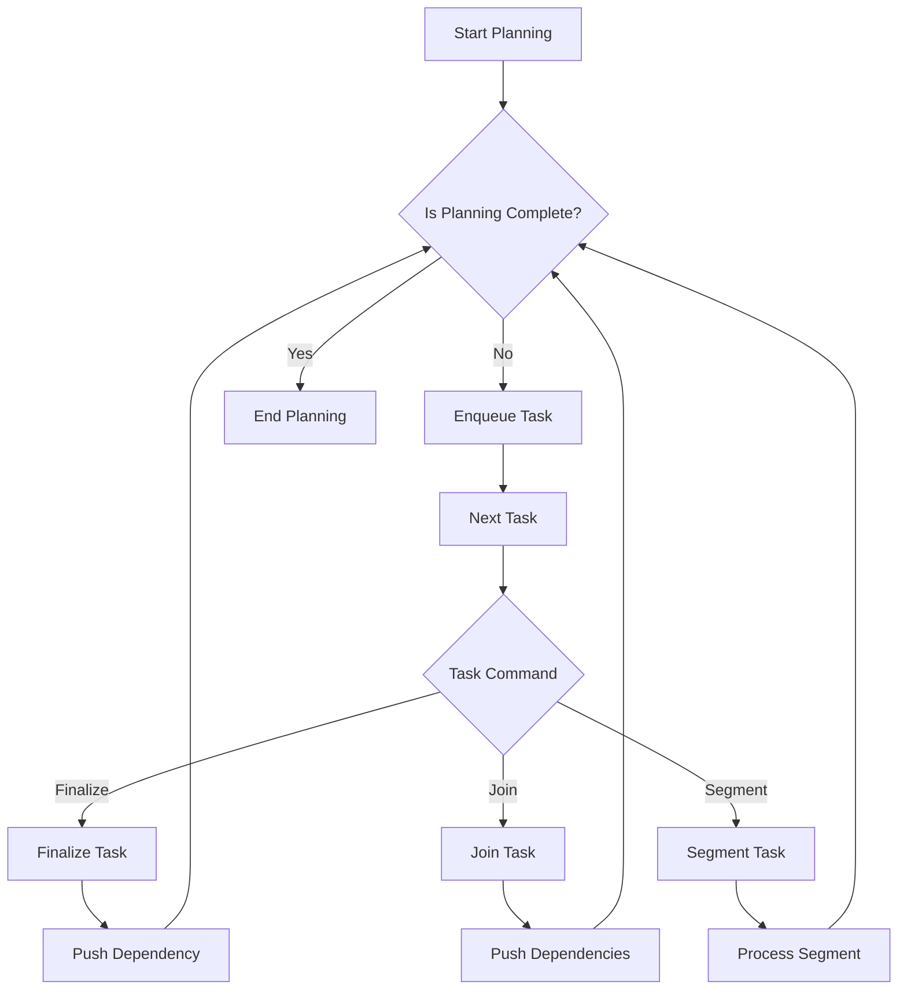
```mermaid
graph TD
    A[Start Planning] --> B{Is Planning Complete?};
    B -- No --> C[Enqueue Task];
    C --> D[Next Task];
    D --> E{Task Command};
    E -- Finalize --> F[Finalize Task];
    E -- Join --> G[Join Task];
    E -- Segment --> H[Segment Task];
    F --> I[Push Dependency];
    G --> J[Push Dependencies];
    H --> K[Process Segment];
    I --> B;
    J --> B;
    K --> B;
    B -- Yes --> L[End Planning];
```

The planner enqueues different types of tasks, such as `Segment` and `Keccak`, and manages their dependencies. The `finish` function likely marks the end of the planning phase, after which `Finalize` tasks are created. [crates\taskdb\src\planner\mod.rs]()

The `crates\taskdb\src\lib.rs` file provides functions for interacting with the task database, including creating jobs and tasks, updating task states, and retrieving task information.

```rust
{{#include crates\taskdb\src\lib.rs:31-43}}
```

This code snippet demonstrates how a job and its associated tasks can be deleted from the database.  Sources: [crates\taskdb\src\lib.rs:31-43]()

## Task Execution Workflow

The `workflow` crate defines the execution flow of different task types. The `crates\workflow\src\tasks\executor.rs` file shows how tasks like `Finalize` and `Snark` are created and managed.

```rust
{{#include crates\workflow\src\tasks\executor.rs:19-34}}
```

This code snippet shows the creation of a `Finalize` task after a tree task is completed. It also shows how a `Snark` task is created if compression is enabled. Sources: [crates\workflow\src\tasks\executor.rs:19-34]()

The `crates\workflow\src\tasks\finalize.rs` file implements the logic for the `Finalize` task, which involves retrieving receipts and journals from Redis, verifying the rollup receipt, and uploading the final receipt to S3.

```rust
{{#include crates\workflow\src\tasks\finalize.rs:26-32}}
```

This snippet retrieves the root receipt from Redis.  Sources: [crates\workflow\src\tasks\finalize.rs:26-32]()

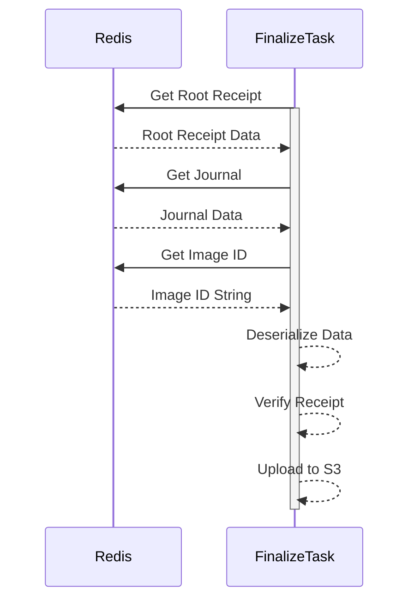
```mermaid
sequenceDiagram
    participant Redis
    participant FinalizeTask
    FinalizeTask->>Redis: Get Root Receipt
    activate FinalizeTask
    Redis-->>FinalizeTask: Root Receipt Data
    FinalizeTask->>Redis: Get Journal
    Redis-->>FinalizeTask: Journal Data
    FinalizeTask->>Redis: Get Image ID
    Redis-->>FinalizeTask: Image ID String
    FinalizeTask-->>FinalizeTask: Deserialize Data
    FinalizeTask-->>FinalizeTask: Verify Receipt
    FinalizeTask-->>FinalizeTask: Upload to S3
    deactivate FinalizeTask
```

This sequence diagram illustrates the flow of data during the finalization process.

## API Endpoints

The `crates\api\src\lib.rs` file defines the API endpoints for interacting with the Local Bento system. These endpoints include routes for uploading inputs and receipts, starting and checking the status of SNARK proofs, and downloading receipts.

| Endpoint                 | Method | Description                                     |
| ------------------------ | ------ | ----------------------------------------------- |
| `/inputs/upload/:input_id` | PUT    | Uploads an input file to S3.                    |
| `/receipts/upload`       | POST   | Generates a URL for uploading a receipt.        |
| `/receipts/upload/:receipt_id`| PUT    | Uploads a receipt file to S3.                   |
| `/snark/create`          | POST   | Starts a SNARK proof generation process.       |
| `/snark/status/:job_id`   | GET    | Retrieves the status of a SNARK proof job.      |
| `/receipts/groth16/receipt/:job_id` | GET    | Downloads a Groth16 receipt.                |
| `/sessions/create`       | POST   | Starts a STARK proving session.               |
| `/receipts/:job_id`      | GET    | Retrieves a receipt download URL.             |
| `/sessions/exec_only_journal/:job_id` | GET    | Retrieves a preflight journal.              |

Sources: [crates\api\src\lib.rs]()

```rust
{{#include crates\api\src\lib.rs:108-125}}
```

This code shows the implementation for uploading an input file. Sources: [crates\api\src\lib.rs:108-125]()

## SNARK Proof Generation

The `crates\workflow\src\tasks\snark.rs` file contains the logic for converting a STARK proof to a SNARK proof. It involves downloading the STARK receipt from S3, performing an identity predicate, and then using a separate application (`stark_verify`) to generate the witness and proof files.

```rust
{{#include crates\workflow\src\tasks\snark.rs:30-36}}
```

This code snippet shows how the receipt is downloaded from S3. Sources: [crates\workflow\src\tasks\snark.rs:30-36]()

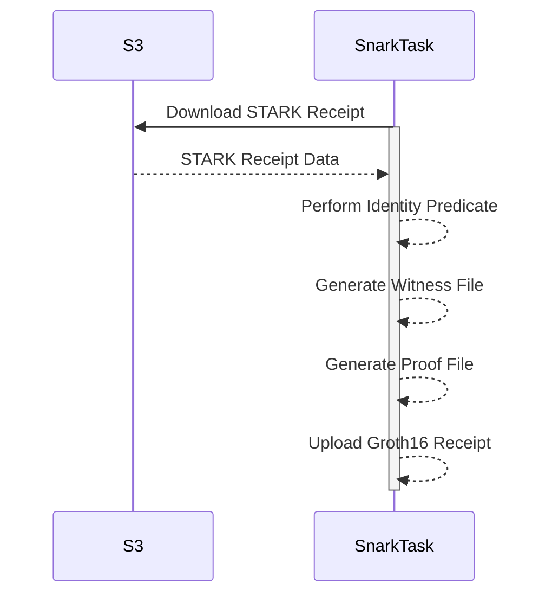
```mermaid
sequenceDiagram
    participant S3
    participant SnarkTask
    SnarkTask->>S3: Download STARK Receipt
    activate SnarkTask
    S3-->>SnarkTask: STARK Receipt Data
    SnarkTask-->>SnarkTask: Perform Identity Predicate
    SnarkTask-->>SnarkTask: Generate Witness File
    SnarkTask-->>SnarkTask: Generate Proof File
    SnarkTask-->>SnarkTask: Upload Groth16 Receipt
    deactivate SnarkTask
```

This diagram outlines the steps involved in the SNARK proof generation process.

## Conclusion

Local Bento is a task management and execution system that supports various task types, including those related to zero-knowledge proofs. It uses a combination of databases, object storage, and message queues to manage tasks, dependencies, and results. The system provides API endpoints for interacting with its core functionalities, such as uploading inputs, starting proof generation, and retrieving results.


---

<a id='overview-getting-started'></a>

## Getting Started with Local Bento

### Related Pages

Related topics: [Docker Deployment](#deployment-docker)

<details>
<summary>Relevant source files</summary>

The following files were used as context for generating this wiki page:

- [crates\api\src\lib.rs](crates\api\src\lib.rs)
- [crates\workflow\src\tasks\executor.rs](crates\workflow\src\tasks\executor.rs)
- [crates\workflow\src\tasks\finalize.rs](crates\workflow\src\tasks\finalize.rs)
- [crates\workflow\src\tasks\snark.rs](crates\workflow\src\tasks\snark.rs)
- [crates\taskdb\src\lib.rs](crates\taskdb\src\lib.rs)
- [crates\taskdb\src\planner\mod.rs](crates\taskdb\src\planner\mod.rs)
</details>

# Getting Started with Local Bento

This page provides a guide to understanding the core components and workflows within the Local Bento system. It covers key aspects such as task management, data handling, and the execution pipeline, focusing on how different parts of the system interact to process tasks and generate results.

## Task Management and Workflow

The Local Bento system utilizes a task database (`taskdb`) to manage and orchestrate various computational tasks. The system defines several task types, including `Segment`, `Keccak`, and `Finalize`, each representing a specific stage in the overall workflow. The `Planner` module within `taskdb` is responsible for organizing these tasks and their dependencies. [crates\taskdb\src\planner\mod.rs]()

### Task Planning and Execution

The `Planner` enqueues tasks such as `Segment` and `Keccak`, which are then processed. After these tasks are completed, a `Finalize` task is enqueued to consolidate the results. The system uses a stack-based approach to manage task dependencies and execution order. [crates\taskdb\src\planner\mod.rs]()

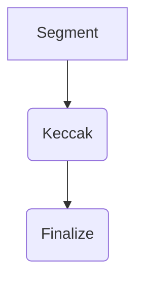
```mermaid
graph TD
    A[Segment] --> B(Keccak);
    B --> C(Finalize);
```

This diagram illustrates a basic task flow where a `Segment` task is followed by a `Keccak` task, and finally a `Finalize` task. [crates\taskdb\src\planner\mod.rs]()

### Task Database Interactions

The `taskdb` crate provides functions to create, manage, and query tasks within the database. Key functions include:

*   `create_job`: Creates a new job in the database. [crates\taskdb\src\lib.rs]()
*   `create_task`: Creates a new task associated with a job. [crates\taskdb\src\lib.rs]()
*   `get_job_state`: Retrieves the current state of a job. [crates\api\src\lib.rs]()

These functions are used to manage the lifecycle of tasks, from creation to completion or failure. [crates\taskdb\src\lib.rs](), [crates\api\src\lib.rs]()

## Data Handling and Storage

The system relies on object storage (S3) for storing various data artifacts, including input data, intermediate results, and final receipts. The `api` crate defines several API endpoints for uploading and retrieving data from S3. [crates\api\src\lib.rs]()

### API Endpoints for Data Upload

The following API endpoints are used for uploading data:

*   `/inputs/upload/:input_id`: Uploads input data to S3. [crates\api\src\lib.rs]()
*   `/receipts/upload`: Initiates a receipt upload and returns a URL for uploading the receipt data. [crates\api\src\lib.rs]()
*   `/receipts/upload/:receipt_id`: Uploads receipt data to S3. [crates\api\src\lib.rs]()
*   `/images/upload/:image_id`: Uploads an image to S3. [crates\api\src\lib.rs]()

These endpoints handle the storage of input data, receipts, and images required for task execution. [crates\api\src\lib.rs]()

### Data Flow

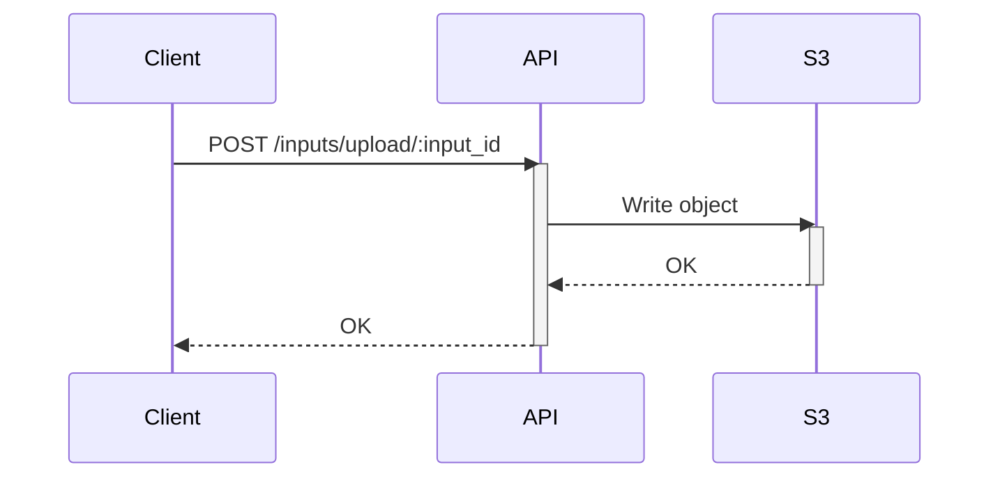
```mermaid
sequenceDiagram
    participant Client
    participant API
    participant S3

    Client->>API: POST /inputs/upload/:input_id
    activate API
    API->>S3: Write object
    activate S3
    S3-->>API: OK
    deactivate S3
    API-->>Client: OK
    deactivate API
```

This sequence diagram illustrates the flow of data when uploading an input to S3. The client sends a POST request to the API, which then writes the data to S3. [crates\api\src\lib.rs]()

### Data Storage Locations

The system uses specific directories within the S3 bucket to store different types of data:

*   `INPUT_BUCKET_DIR`: Stores input data. [crates\api\src\lib.rs]()
*   `RECEIPT_BUCKET_DIR`: Stores receipts. [crates\api\src\lib.rs]()
*   `STARK_BUCKET_DIR`: Stores Stark-related data. [crates\api\src\lib.rs]()
*   `GROTH16_BUCKET_DIR`: Stores Groth16 proofs. [crates\api\src\lib.rs]()
*   `ELF_BUCKET_DIR`: Stores uploaded images. [crates\api\src\lib.rs]()
*   `PREFLIGHT_JOURNALS_BUCKET_DIR`: Stores preflight journals. [crates\api\src\lib.rs]()

These directories help organize the data within the S3 bucket. [crates\api\src\lib.rs]()

## Task Execution and Finalization

The `workflow` crate defines the logic for executing various tasks, including the finalization of results and the generation of SNARK proofs. [crates\workflow\src\tasks\executor.rs](), [crates\workflow\src\tasks\finalize.rs](), [crates\workflow\src\tasks\snark.rs]()

### Finalization Process

The finalization process involves retrieving intermediate results from Redis, constructing a final receipt, and verifying the receipt against a known image ID. [crates\workflow\src\tasks\finalize.rs]()

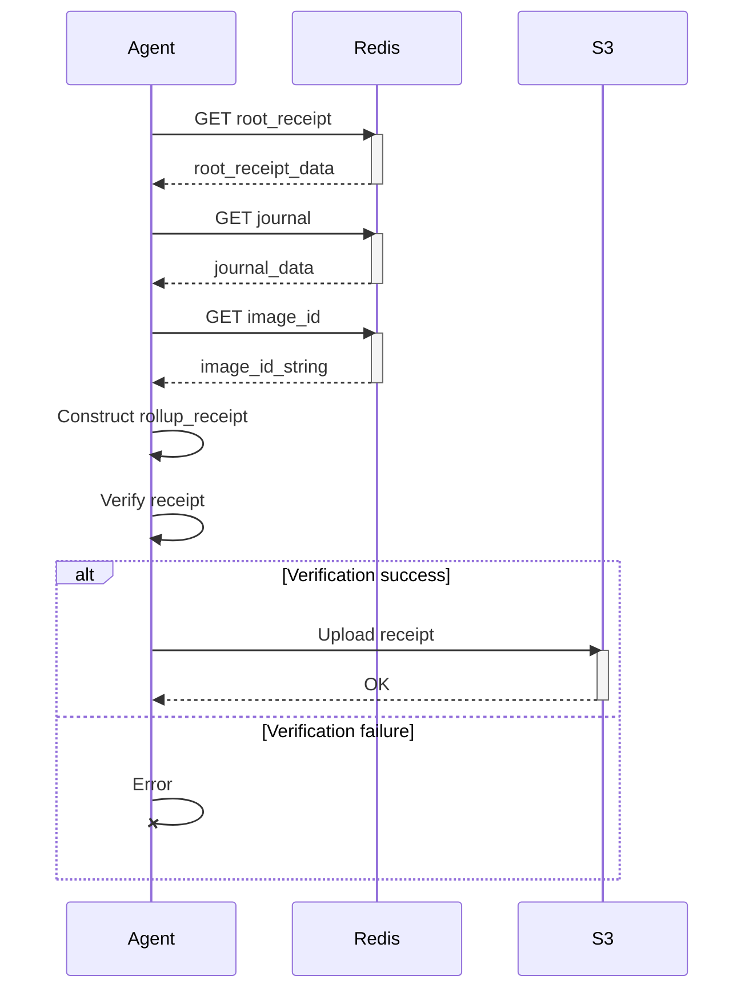
```mermaid
sequenceDiagram
    participant Agent
    participant Redis
    participant S3

    Agent->>Redis: GET root_receipt
    activate Redis
    Redis-->>Agent: root_receipt_data
    deactivate Redis
    Agent->>Redis: GET journal
    activate Redis
    Redis-->>Agent: journal_data
    deactivate Redis
    Agent->>Redis: GET image_id
    activate Redis
    Redis-->>Agent: image_id_string
    deactivate Redis
    Agent->>Agent: Construct rollup_receipt
    Agent->>Agent: Verify receipt
    alt Verification success
        Agent->>S3: Upload receipt
        activate S3
        S3-->>Agent: OK
        deactivate S3
    else Verification failure
        Agent-xAgent: Error
    end
```

This sequence diagram illustrates the finalization process, including retrieving data from Redis, constructing the final receipt, and verifying it. [crates\workflow\src\tasks\finalize.rs]()

### SNARK Proof Generation

The system supports the generation of SNARK proofs using the Groth16 proving system. The `stark2snark` function converts a Stark receipt to a SNARK proof. [crates\workflow\src\tasks\snark.rs]()

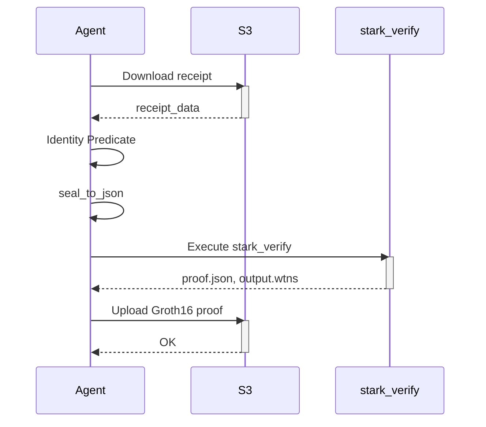
```mermaid
sequenceDiagram
    participant Agent
    participant S3
    participant stark_verify

    Agent->>S3: Download receipt
    activate S3
    S3-->>Agent: receipt_data
    deactivate S3
    Agent->>Agent: Identity Predicate
    Agent->>Agent: seal_to_json
    Agent->>stark_verify: Execute stark_verify
    activate stark_verify
    stark_verify-->>Agent: proof.json, output.wtns
    deactivate stark_verify
    Agent->>S3: Upload Groth16 proof
    activate S3
    S3-->>Agent: OK
    deactivate S3
```

This sequence diagram shows the process of converting a Stark receipt to a SNARK proof, including downloading the receipt, executing `stark_verify`, and uploading the resulting proof. [crates\workflow\src\tasks\snark.rs]()

The `stark2snark` function performs the following steps:

1.  Downloads a Stark receipt from S3. [crates\workflow\src\tasks\snark.rs]()
2.  Performs an identity predicate on the receipt. [crates\workflow\src\tasks\snark.rs]()
3.  Converts the seal to JSON format. [crates\workflow\src\tasks\snark.rs]()
4.  Executes the `stark_verify` command to generate a witness file and a proof file. [crates\workflow\src\tasks\snark.rs]()
5.  Uploads the Groth16 proof to S3. [crates\workflow\src\tasks\snark.rs]()

### Executor Task

The `Executor` is responsible for managing the execution of tasks. It handles the creation of tasks, setting up pre-requisites and defining task types such as `Finalize` and `Snark`. [crates\workflow\src\tasks\executor.rs]()

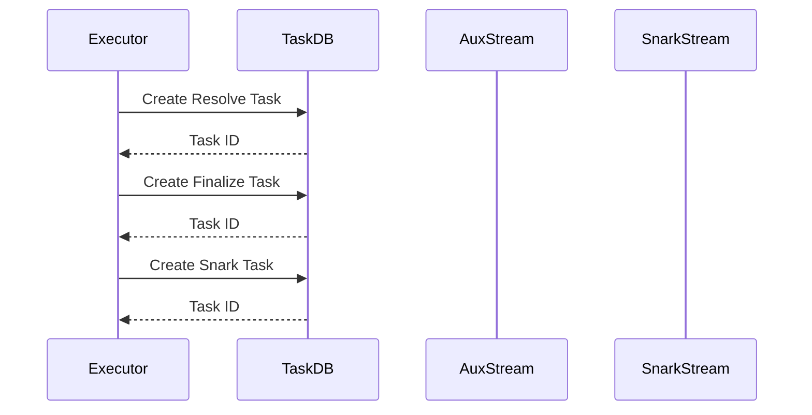
```mermaid
sequenceDiagram
    participant Executor
    participant TaskDB
    participant AuxStream
    participant SnarkStream

    Executor->>TaskDB: Create Resolve Task
    TaskDB-->>Executor: Task ID
    Executor->>TaskDB: Create Finalize Task
    TaskDB-->>Executor: Task ID
    Executor->>TaskDB: Create Snark Task
    TaskDB-->>Executor: Task ID
```

This sequence diagram illustrates the creation of tasks by the Executor. [crates\workflow\src\tasks\executor.rs]()

## Error Handling

The system defines a custom error type, `AppError`, to handle errors that may occur during API request processing. This error type includes variants for various error conditions, such as input already exists, image already exists, and receipt missing. [crates\api\src\lib.rs]()

```rust
#[derive(Error, Debug)]
pub enum AppError {
    #[error("Input already exists: {0}")]
    InputAlreadyExists(String),
    #[error("Image already exists: {0}")]
    ImgAlreadyExists(String),
    #[error("Image ID mismatch: expected {0}, got {1}")]
    ImageIdMismatch(String, String),
    #[error("Receipt missing: {0}")]
    ReceiptMissing(String),
    #[error(transparent)]
    UnexpectedError(#[from] AnyhowErr),
    #[error(transparent)]
    TaskDbError(#[from] TaskDbErr),
}
```

This code snippet defines the `AppError` enum, which includes variants for different error conditions. [crates\api\src\lib.rs]()

## Summary

The Local Bento system orchestrates computational tasks using a task database, manages data in object storage, and executes tasks to generate results and SNARK proofs. The system includes API endpoints for data upload and retrieval, as well as error handling mechanisms to ensure robustness. This architecture allows for efficient and reliable processing of complex workflows.


---

<a id='architecture-overview'></a>

## System Architecture Overview

### Related Pages

Related topics: [Component Details](#architecture-components)

<details>
<summary>Relevant source files</summary>

The following files were used as context for generating this wiki page:

- [crates/api/src/lib.rs](crates/api/src/lib.rs)
- [crates/workflow/src/lib.rs](crates/workflow/src/lib.rs)
- [crates/taskdb/src/lib.rs](crates/taskdb/src/lib.rs)
- [crates/workflow/src/tasks/executor.rs](crates/workflow/src/tasks/executor.rs)
- [crates/workflow-common/src/lib.rs](crates/workflow-common/src/lib.rs)
- [crates/workflow/src/tasks/snark.rs](crates/workflow/src/tasks/snark.rs)
</details>

# System Architecture Overview

This document provides a high-level overview of the system architecture, focusing on how tasks are created, managed, and executed within the Bonsai system. It covers the interaction between the API, task database, workflow agent, and object storage, providing a foundation for understanding the system's operation. The architecture facilitates the execution of various task types, including executors, provers, joiners, resolvers, finalizers, and snarks, ensuring a robust and scalable workflow. [crates/api/src/lib.rs](), [crates/workflow/src/lib.rs](), [crates/taskdb/src/lib.rs]()

The system architecture is designed to handle computationally intensive tasks by distributing them across different worker types. The API layer receives requests, which are then translated into tasks and stored in the task database. Workflow agents monitor the task database for new tasks and execute them accordingly. The results, including receipts and proofs, are stored in object storage. This architecture enables efficient task management, distribution, and storage of results. [crates/workflow/src/lib.rs](), [crates/taskdb/src/lib.rs](), [crates/workflow-common/src/lib.rs]()

## Core Components

The system architecture consists of several key components that work together to execute tasks and manage the overall workflow. These components include the API, task database, workflow agent, and object storage.

### API

The API layer serves as the entry point for submitting tasks to the system. It defines various endpoints for creating sessions, uploading data, and checking the status of tasks. Key API endpoints include:

*   `/sessions/create`: Creates a new execution session. [crates/api/src/lib.rs]()
*   `/sessions/status/{job_id}`: Retrieves the status of a session. [crates/api/src/lib.rs]()
*   `/inputs/upload/{input_id}`: Uploads input data for a session. [crates/api/src/lib.rs]()
*   `/receipts/upload`: Initiates the upload of a receipt. [crates/api/src/lib.rs]()
*   `/receipts/upload/{receipt_id}`: Completes the upload of a receipt. [crates/api/src/lib.rs]()
*   `/snark/create`: Creates a snark proof. [crates/api/src/lib.rs]()
*   `/snark/status/{job_id}`: Retrieves the status of a snark proof. [crates/api/src/lib.rs]()

The API uses the `axum` framework to define routes and handle requests. It interacts with the task database to create and manage jobs, and with object storage to store and retrieve data. [crates/api/src/lib.rs]()

### Task Database

The task database is responsible for storing and managing tasks, jobs, and their dependencies. It uses PostgreSQL as the underlying database and the `sqlx` crate for database interactions. Key database operations include:

*   `create_job`: Creates a new job in the database. [crates/taskdb/src/lib.rs]()
*   `request_work`: Retrieves a ready task from the database. [crates/taskdb/src/lib.rs]()
*   `update_task_done`: Updates the status of a task to "done". [crates/taskdb/src/lib.rs]()
*   `update_task_failed`: Updates the status of a task to "failed". [crates/taskdb/src/lib.rs]()
*   `get_job_state`: Retrieves the state of a job. [crates/taskdb/src/lib.rs]()

The task database ensures that tasks are executed in the correct order, based on their dependencies. It also provides a mechanism for tracking the progress and status of each task. [crates/taskdb/src/lib.rs]()

### Workflow Agent

The workflow agent monitors the task database for new tasks and executes them accordingly. It supports different worker types, including CPU, prove, join, and snark. The workflow agent uses the `redis` crate for communication and coordination. [crates/workflow/src/lib.rs]()

The workflow agent retrieves tasks from the task database using the `request_work` function. It then executes the task based on its type and updates the task status in the database. The workflow agent also interacts with object storage to retrieve input data and store output data. [crates/workflow/src/lib.rs]()

### Object Storage

Object storage is used to store input data, receipts, proofs, and other artifacts generated during task execution. The system uses S3-compatible object storage, such as MinIO. The `S3Client` struct provides an interface for interacting with object storage. [crates/workflow-common/src/lib.rs](), [crates/api/src/lib.rs]()

Key object storage operations include:

*   `read_from_s3`: Reads data from object storage. [crates/api/src/lib.rs]()
*   `write_buf_to_s3`: Writes data to object storage. [crates/api/src/lib.rs]()
*   `object_exists`: Checks if an object exists in object storage. [crates/api/src/lib.rs]()

The system uses different buckets and directories within object storage to organize data. These include:

*   `INPUT_BUCKET_DIR`: Stores input data. [crates/api/src/lib.rs]()
*   `RECEIPT_BUCKET_DIR`: Stores receipts. [crates/api/src/lib.rs]()
*   `STARK_BUCKET_DIR`: Stores stark proofs. [crates/api/src/lib.rs]()
*   `GROTH16_BUCKET_DIR`: Stores groth16 proofs. [crates/api/src/lib.rs]()

## Task Execution Flow

The task execution flow involves several steps, from submitting a task to the API to storing the results in object storage. The following diagram illustrates the task execution flow:

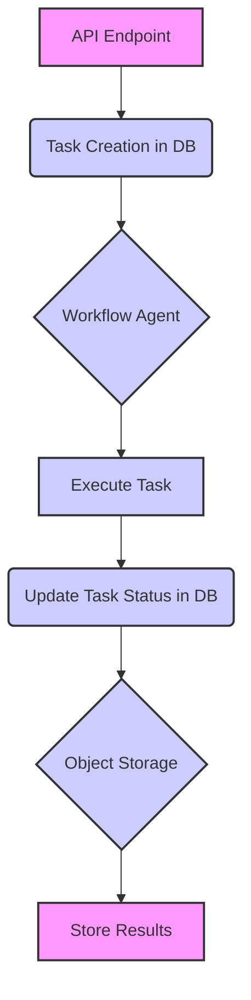
```mermaid
graph TD
    A[API Endpoint] --> B(Task Creation in DB);
    B --> C{Workflow Agent};
    C --> D[Execute Task];
    D --> E(Update Task Status in DB);
    E --> F{Object Storage};
    F --> G[Store Results];
    style A fill:#f9f,stroke:#333,stroke-width:2px
    style B fill:#ccf,stroke:#333,stroke-width:2px
    style C fill:#ccf,stroke:#333,stroke-width:2px
    style D fill:#ccf,stroke:#333,stroke-width:2px
    style E fill:#ccf,stroke:#333,stroke-width:2px
    style F fill:#ccf,stroke:#333,stroke-width:2px
    style G fill:#f9f,stroke:#333,stroke-width:2px
```

This diagram shows the high-level flow of task execution, starting from the API endpoint and ending with storing the results in object storage. [crates/api/src/lib.rs](), [crates/taskdb/src/lib.rs](), [crates/workflow/src/lib.rs]()

1.  **Task Submission:** A user submits a task to the API endpoint. [crates/api/src/lib.rs]()
2.  **Task Creation:** The API creates a new job and associated tasks in the task database. [crates/taskdb/src/lib.rs]()
3.  **Workflow Agent Monitoring:** The workflow agent monitors the task database for new tasks. [crates/workflow/src/lib.rs]()
4.  **Task Execution:** The workflow agent retrieves a ready task and executes it. [crates/workflow/src/lib.rs]()
5.  **Task Status Update:** The workflow agent updates the task status in the task database. [crates/taskdb/src/lib.rs]()
6.  **Result Storage:** The workflow agent stores the results of the task in object storage. [crates/api/src/lib.rs]()

## Task Types

The system supports several task types, each with its own specific purpose and execution logic. These task types are defined in the `TaskType` enum in `crates/workflow-common/src/lib.rs`. [crates/workflow-common/src/lib.rs]()

The following table summarizes the different task types:

| Task Type  | Description                                                                  |
| :--------- | :--------------------------------------------------------------------------- |
| Executor   | Executes a RISC-V program.                                                   |
| Prove      | Generates a proof for a segment of a RISC-V program execution.                |
| Join       | Joins two receipts together.                                                 |
| Resolve    | Resolves a set of receipts into a final receipt.                             |
| Finalize   | Finalizes a job by creating the final rollup receipt.                        |
| Snark      | Converts a stark proof to a snark proof.                                    |
| Keccak     | Performs a Keccak computation.                                               |
| Union      | Combines two receipts in a union operation.                                  |

Sources: [crates/workflow-common/src/lib.rs:207-264]()

### Executor Task

The executor task executes a RISC-V program. It takes an `ExecutorReq` struct as input, which specifies the image, input data, user ID, and other parameters. The executor task uses the `risc0-zkvm` crate to execute the program and generate a receipt. [crates/workflow-common/src/lib.rs](), [crates/workflow/src/tasks/executor.rs]()

```rust
#[derive(Debug, Deserialize, Serialize)]
pub struct ExecutorReq {
    /// Image ID (hash) of the code to execute
    pub image: String,
    /// Input data passed to the guest program
    pub input: String,
    /// User ID associated with the execution
    pub user_id: String,
    /// Assumptions to include in the execution
    pub assumptions: Vec<String>,
    /// Whether to execute only, skipping proving
    pub execute_only: bool,
    /// Type of compression to use on the receipt
    pub compress: CompressType,
    /// Optional execution cycle limit (in mcycles)
    pub exec_limit: Option<u64>,
}
```

Sources: [crates/workflow-common/src/lib.rs:39-55]()

The executor task is responsible for managing the execution of the RISC-V program, handling input and output data, and generating the receipt. It also updates the task status in the task database. [crates/workflow/src/tasks/executor.rs]()

### Snark Task

The snark task converts a stark proof to a snark proof. It takes a `SnarkReq` struct as input, which specifies the receipt UUID and the type of snark compression to use. The snark task uses the `risc0-zkvm` crate to perform the conversion. [crates/workflow-common/src/lib.rs](), [crates/workflow/src/tasks/snark.rs]()

```rust
#[derive(Debug, Serialize, Deserialize)]
pub struct SnarkReq {
    /// Stark receipt UUID to pull from minio
    pub receipt: String,
    /// Type of snark compression to run
    pub compress_type: CompressType,
}
```

Sources: [crates/workflow-common/src/lib.rs:177-184]()

The snark task downloads the stark receipt from object storage, performs the conversion, and stores the snark proof back in object storage. It also updates the task status in the task database. [crates/workflow/src/tasks/snark.rs]()

## Conclusion

The system architecture provides a robust and scalable framework for executing computationally intensive tasks. The API, task database, workflow agent, and object storage work together to manage tasks, distribute them across different worker types, and store the results. The system supports various task types, including executors, provers, joiners, resolvers, finalizers, and snarks, ensuring a flexible and extensible workflow. [crates/api/src/lib.rs](), [crates/workflow/src/lib.rs](), [crates/taskdb/src/lib.rs]()


---

<a id='architecture-components'></a>

## Component Details

### Related Pages

Related topics: [Task Database](#backend-taskdb), [Workflow Engine](#backend-workflow)

<details>
<summary>Relevant source files</summary>

The following files were used as context for generating this wiki page:

- [crates/api/src/lib.rs](crates/api/src/lib.rs)
- [crates/taskdb/src/lib.rs](crates/taskdb/src/lib.rs)
- [crates/workflow/src/lib.rs](crates/workflow/src/lib.rs)
- [crates/workflow/src/tasks/executor.rs](crates/workflow/src/tasks/executor.rs)
- [crates/workflow/src/tasks/snark.rs](crates/workflow/src/tasks/snark.rs)
- [crates/workflow/src/tasks/finalize.rs](crates/workflow/src/tasks/finalize.rs)
- [crates/taskdb/src/planner/mod.rs](crates/taskdb/src/planner/mod.rs)
</details>

# Component Details

The `api` crate serves as the API layer for the Bonsai service, handling external requests and coordinating backend workflows. It defines the API endpoints, request/response structures, and the overall application state. The `taskdb` crate provides the functionality for managing tasks and jobs within the system, including creation, tracking, and state management. The `workflow` crate implements the task execution logic, defining how different task types are processed and chained together. This includes managing executors, provers, joiners and snark verifiers.

## API Endpoints

The `api` crate defines various API endpoints using `axum` for handling different operations, such as session creation, status retrieval, and data uploads. These endpoints interact with the `taskdb` and `workflow` crates to manage the underlying tasks and jobs.

### Session Management

#### Create Session (Stark Proving)

The `/sessions/create` endpoint initiates a new Stark proving session. It receives a `ProofReq` containing the image and input data, creates a job in the `taskdb`, and returns a `CreateSessRes` with the job UUID. Sources: [crates/api/src/lib.rs:343-374]()

```json
{
  "img": "image_id",
  "input": "input_data"
}
```
Sources: [crates/api/src/lib.rs:346-347]()

```json
{
  "uuid": "job_uuid"
}
```
Sources: [crates/api/src/lib.rs:372-373]()

#### Get Session Status (Stark Proving)

The `/sessions/status/:job_id` endpoint retrieves the status of a Stark proving session. It queries the `taskdb` for the job state and returns a `SessionStatusRes` with the status, error message (if any), and receipt URL (if the job is done). Sources: [crates/api/src/lib.rs:376-417]()

```json
{
  "state": "job_state",
  "error_msg": "error_message",
  "output": "receipt_url"
}
```
Sources: [crates/api/src/lib.rs:413-415]()

#### Create Session (Groth16 Proving)

The `/snark/create` endpoint initiates a new Groth16 proving session. It receives a `SnarkReq` containing the session ID, creates a job in the `taskdb`, and returns a `CreateSessRes` with the job UUID. Sources: [crates/api/src/lib.rs:155-185]()

```json
{
  "session_id": "session_uuid"
}
```
Sources: [crates/api/src/lib.rs:158-159]()

```json
{
  "uuid": "job_uuid"
}
```
Sources: [crates/api/src/lib.rs:183-184]()

#### Get Session Status (Groth16 Proving)

The `/snark/status/:job_id` endpoint retrieves the status of a Groth16 proving session. It queries the `taskdb` for the job state and returns a `SnarkStatusRes` with the status, error message (if any), and receipt URL (if the job is done). Sources: [crates/api/src/lib.rs:187-218]()

```json
{
  "status": "job_state",
  "error_msg": "error_message",
  "output": "receipt_url"
}
```
Sources: [crates/api/src/lib.rs:215-217]()

### Data Upload

#### Image Upload

The `/images/upload/:image_id` endpoint allows uploading a new image. It checks if the image already exists, and if not, it returns an `ImgUploadRes` with the upload URL. Sources: [crates/api/src/lib.rs:452-463]()

```json
{
  "url": "upload_url"
}
```
Sources: [crates/api/src/lib.rs:461-462]()

#### Receipt Upload

The `/receipts/upload` endpoint allows uploading a new receipt. It checks if the receipt already exists, and if not, it returns an `UploadRes` with the upload URL and UUID. Sources: [crates/api/src/lib.rs:297-308]()

```json
{
  "url": "upload_url",
  "uuid": "receipt_uuid"
}
```
Sources: [crates/api/src/lib.rs:306-307]()

#### Input Upload

The `/inputs/upload/:input_id` endpoint allows uploading new input data. It checks if the input already exists, and if not, it returns an `UploadRes` with the upload URL and UUID. Sources: [crates/api/src/lib.rs:261-272]()

```json
{
  "url": "upload_url",
  "uuid": "input_uuid"
}
```
Sources: [crates/api/src/lib.rs:270-271]()

### Data Download

#### Receipt Download (Stark)

The `/receipts/stark/receipt/:job_id` endpoint allows downloading a Stark receipt. It retrieves the receipt from the object store and returns it as a byte stream. Sources: [crates/api/src/lib.rs:250-258]()

#### Receipt Download (Groth16)

The `/receipts/groth16/receipt/:job_id` endpoint allows downloading a Groth16 receipt. It retrieves the receipt from the object store and returns it as a byte stream. Sources: [crates/api/src/lib.rs:220-228]()

## Task Database Interactions

The `taskdb` crate is responsible for managing the tasks and jobs within the system. It provides functions for creating jobs, requesting work, updating task states, and retrieving job information.

### Job Creation

The `create_job` function creates a new job in the `taskdb`. It takes the stream ID, task definition, retry count, timeout, and user ID as input. Sources: [crates/taskdb/src/lib.rs]()

```rust
{{#include crates/taskdb/src/lib.rs:73-82}}
```
Sources: [crates/api/src/lib.rs:174-179](), [crates/api/src/lib.rs:363-368]()

### Task Request

The `request_work` function retrieves a ready task from the `taskdb`. It takes the worker type as input and returns a `ReadyTask` struct containing the task information. Sources: [crates/taskdb/src/lib.rs]()

```rust
{{#include crates/taskdb/src/lib.rs:101-110}}
```

### Task Completion and Failure

The `complete_task` and `fail_task` functions update the state of a task in the `taskdb`. They take the job ID, task ID, and output or error message as input. Sources: [crates/taskdb/src/lib.rs]()

```rust
{{#include crates/taskdb/src/lib.rs:129-138}}
```

```rust
{{#include crates/taskdb/src/lib.rs:140-149}}
```

### Job State Retrieval

The `get_job_state` function retrieves the state of a job from the `taskdb`. It takes the job ID and user ID as input and returns a `JobState` enum representing the job's state. Sources: [crates/taskdb/src/lib.rs]()

```rust
{{#include crates/taskdb/src/lib.rs:168-177}}
```
Sources: [crates/api/src/lib.rs:190-192](), [crates/api/src/lib.rs:379-381]()

## Workflow Execution

The `workflow` crate defines the task execution logic for different task types. It includes functions for executing executor tasks, snark tasks, and finalize tasks.

### Task Types

The `TaskType` enum defines the different types of tasks that can be executed by the workflow. These include `Executor`, `Snark`, and `Finalize` tasks. Sources: [crates/workflow/src/lib.rs]()

### Executor Task

The `executor` module contains the logic for executing executor tasks. This involves running a RISC Zero program with the provided input and generating a receipt. Sources: [crates/workflow/src/tasks/executor.rs]()

### Snark Task

The `snark` module contains the logic for converting a Stark receipt to a Snark proof. This involves downloading the Stark receipt from S3, running the `stark_verify` command, and uploading the Snark proof to S3. Sources: [crates/workflow/src/tasks/snark.rs]()

### Finalize Task

The `finalize` module contains the logic for finalizing a job. This involves retrieving the root receipt and journal from Redis, constructing the rollup receipt, verifying the receipt, and uploading it to S3. Sources: [crates/workflow/src/tasks/finalize.rs]()

### Task Flow

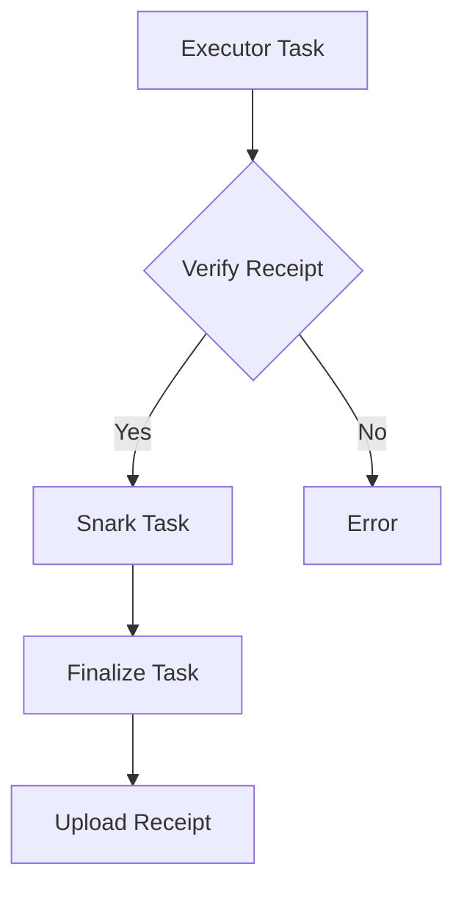
```mermaid
graph TD
    A[Executor Task] --> B{Verify Receipt};
    B -- Yes --> C[Snark Task];
    B -- No --> D[Error];
    C --> E[Finalize Task];
    E --> F[Upload Receipt];
```
Sources: [crates/workflow/src/tasks/executor.rs](), [crates/workflow/src/tasks/snark.rs](), [crates/workflow/src/tasks/finalize.rs]()

The diagram above shows a high-level overview of the task flow. An executor task runs first, then the receipt is verified. If verification succeeds, a snark task is run, followed by a finalize task. The final receipt is then uploaded.

## API Request Handling Flow

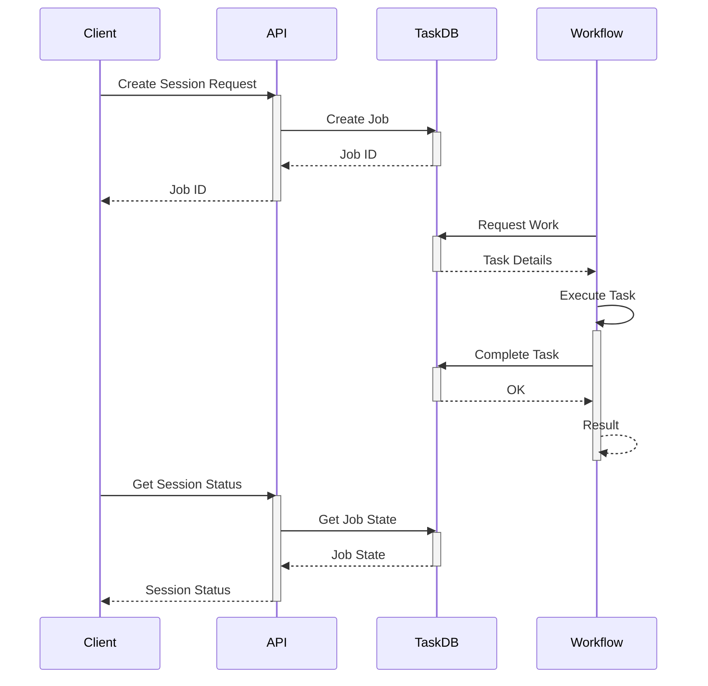
```mermaid
sequenceDiagram
    participant Client
    participant API
    participant TaskDB
    participant Workflow
    Client->>API: Create Session Request
    activate API
    API->>TaskDB: Create Job
    activate TaskDB
    TaskDB-->>API: Job ID
    deactivate TaskDB
    API-->>Client: Job ID
    deactivate API
    Workflow->>TaskDB: Request Work
    activate TaskDB
    TaskDB-->>Workflow: Task Details
    deactivate TaskDB
    Workflow->>Workflow: Execute Task
    activate Workflow
    Workflow->>TaskDB: Complete Task
    activate TaskDB
    TaskDB-->>Workflow: OK
    deactivate TaskDB
    Workflow-->>Workflow: Result
    deactivate Workflow
    Client->>API: Get Session Status
    activate API
    API->>TaskDB: Get Job State
    activate TaskDB
    TaskDB-->>API: Job State
    deactivate TaskDB
    API-->>Client: Session Status
    deactivate API
```
Sources: [crates/api/src/lib.rs](), [crates/taskdb/src/lib.rs](), [crates/workflow/src/lib.rs]()

The sequence diagram illustrates the flow of requests and data between the client, API, TaskDB, and Workflow components.

## Conclusion

The `api`, `taskdb`, and `workflow` crates work together to provide a complete API service for managing and executing tasks. The `api` crate handles external requests, the `taskdb` crate manages the tasks and jobs, and the `workflow` crate executes the tasks.


---

<a id='features-task-management'></a>

## Task Management System

### Related Pages

Related topics: [Task Database](#backend-taskdb)

<details>
<summary>Relevant source files</summary>

The following files were used as context for generating this wiki page:

- [crates/taskdb/src/lib.rs](crates/taskdb/src/lib.rs)
- [crates/workflow/src/tasks/executor.rs](crates/workflow/src/tasks/executor.rs)
- [crates/taskdb/benches/taskdb.rs](crates/taskdb/benches/taskdb.rs)
- [crates/taskdb/examples/stress.rs](crates/taskdb/examples/stress.rs)
- [crates/taskdb/tests/e2e.rs](crates/taskdb/tests/e2e.rs)
- [crates/api/src/lib.rs](crates/api/src/lib.rs)
</details>

# Task Management System

The Task Management System is a component responsible for managing and orchestrating tasks within the application. It provides functionalities for creating, scheduling, tracking, and finalizing tasks, ensuring the reliable execution of workflows. The system uses a PostgreSQL database for persistent storage and Redis for caching and communication. It supports various task types, including executor, snark, and finalize tasks, and integrates with other services for job execution and data processing. [crates/taskdb/src/lib.rs]().

The system is designed to handle complex dependencies between tasks, manage retries and timeouts, and provide real-time status updates. It uses a combination of SQL queries and stored procedures to manage the task lifecycle and ensure data consistency. The system also includes tools for stress testing and benchmarking to ensure its scalability and reliability. [crates/taskdb/examples/stress.rs](), [crates/taskdb/benches/taskdb.rs]().

## Architecture

The Task Management System adopts a multi-layered architecture comprising the following key components:

*   **API Layer:** Exposes endpoints for task creation, status retrieval, and job management. [crates/api/src/lib.rs]().
*   **Task Database (TaskDB):** Provides persistent storage for tasks, jobs, streams, and their dependencies using PostgreSQL. [crates/taskdb/src/lib.rs]().
*   **Task Executor:** Responsible for executing individual tasks, managing retries, and handling timeouts. [crates/workflow/src/tasks/executor.rs]().
*   **Redis Integration:** Utilized for caching, real-time updates, and inter-process communication. [crates/workflow/src/tasks/executor.rs]().

### Components

The core components of the Task Management System are:

*   **Jobs:** Represent a collection of tasks that form a logical unit of work.  Jobs are created with a specified stream ID, task definition, maximum retries, timeout, and user ID. [crates/taskdb/src/lib.rs]().
*   **Tasks:** Represent individual units of work within a job. Tasks have dependencies, a state, and associated data.  Tasks are created with a job ID, task ID, stream ID, task definition, prerequisites, maximum retries, and timeout. [crates/taskdb/src/lib.rs]().
*   **Streams:** Represent a queue of tasks for a specific worker type. Streams are created with a worker type, reserved capacity, BE multiplier, and user ID. [crates/taskdb/src/lib.rs]().
*   **Workers:** Processes that execute tasks from a specific stream. Workers request work from the TaskDB and update the task status upon completion or failure. [crates/taskdb/examples/stress.rs]().

### Data Flow

The data flow within the Task Management System involves the following steps:

1.  **Task Creation:** A new task is created via the API layer, which persists the task information in the TaskDB. [crates/api/src/lib.rs]().
2.  **Task Scheduling:** Tasks are scheduled for execution based on their dependencies and stream assignment. [crates/taskdb/src/lib.rs]().
3.  **Task Execution:** Workers request tasks from the TaskDB, execute them, and update the task status. [crates/taskdb/src/lib.rs]().
4.  **Status Updates:** Task status updates are propagated to the API layer and any interested subscribers. [crates/taskdb/src/lib.rs]().
5.  **Finalization:** Upon completion of all tasks in a job, a finalization process is triggered to aggregate results and perform cleanup. [crates/workflow/src/tasks/finalize.rs]().

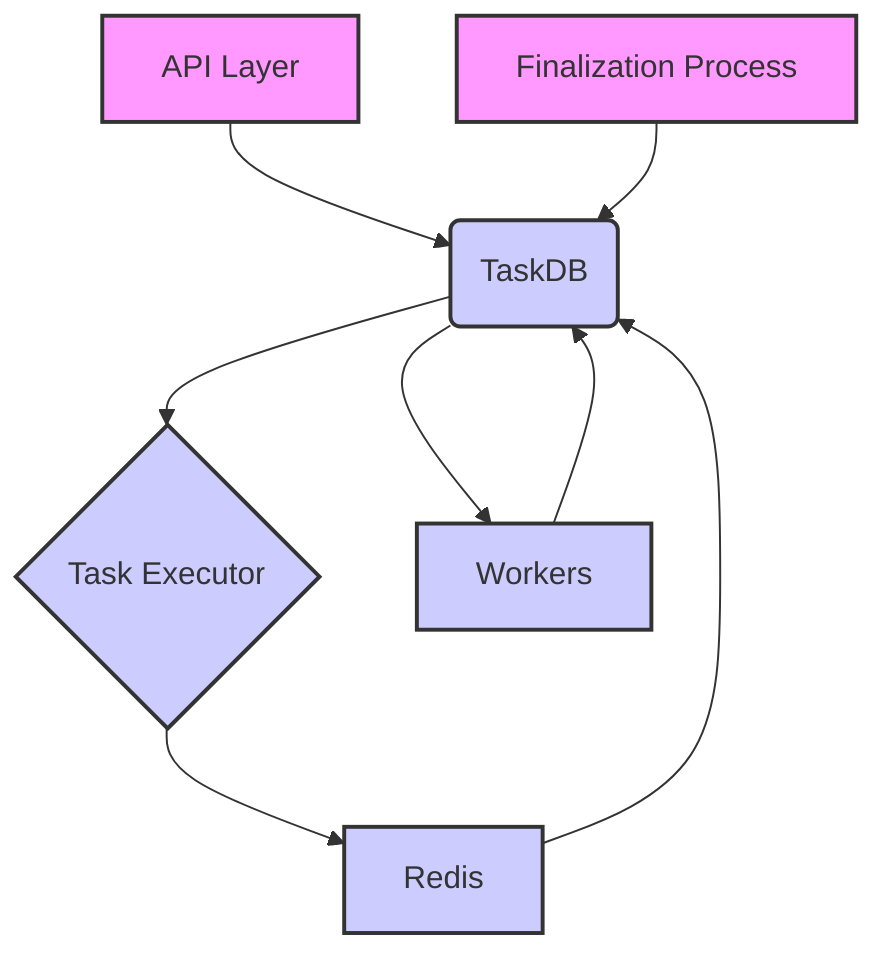
```mermaid
graph TD
    A[API Layer] --> B(TaskDB);
    B --> C{Task Executor};
    C --> D[Redis];
    D --> B;
    B --> E[Workers];
    E --> B;
    F[Finalization Process] --> B;
    style A fill:#f9f,stroke:#333,stroke-width:2px
    style B fill:#ccf,stroke:#333,stroke-width:2px
    style C fill:#ccf,stroke:#333,stroke-width:2px
    style D fill:#ccf,stroke:#333,stroke-width:2px
    style E fill:#ccf,stroke:#333,stroke-width:2px
    style F fill:#f9f,stroke:#333,stroke-width:2px
```

This diagram illustrates the high-level architecture and data flow within the Task Management System.  The API Layer interacts with the TaskDB to create and manage tasks. The Task Executor executes tasks, leveraging Redis for caching and communication. Workers process tasks and update the TaskDB. Finally, the Finalization Process aggregates results and performs cleanup. Sources: [crates/taskdb/src/lib.rs](), [crates/workflow/src/tasks/executor.rs](), [crates/api/src/lib.rs]().

## Task Lifecycle

The Task Management System manages the lifecycle of tasks through several states:

*   `Pending`: The task has been created but is not yet ready for execution. [crates/taskdb/src/lib.rs]()
*   `Ready`: The task is ready for execution and waiting to be picked up by a worker. [crates/taskdb/src/lib.rs]()
*   `Running`: The task is currently being executed by a worker. [crates/taskdb/src/lib.rs]()
*   `Done`: The task has been successfully executed. [crates/taskdb/src/lib.rs]()
*   `Failed`: The task has failed to execute. [crates/taskdb/src/lib.rs]()

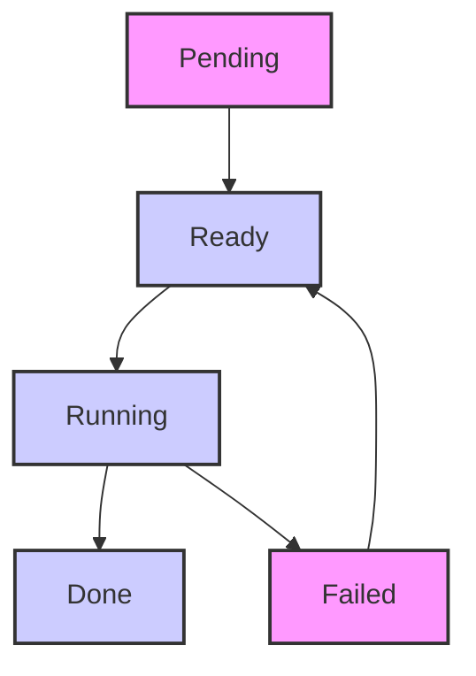
```mermaid
graph TD
    Pending --> Ready;
    Ready --> Running;
    Running --> Done;
    Running --> Failed;
    Failed --> Ready;
    style Pending fill:#f9f,stroke:#333,stroke-width:2px
    style Ready fill:#ccf,stroke:#333,stroke-width:2px
    style Running fill:#ccf,stroke:#333,stroke-width:2px
    style Done fill:#ccf,stroke:#333,stroke-width:2px
    style Failed fill:#f9f,stroke:#333,stroke-width:2px
```

This diagram illustrates the task state transitions within the Task Management System. Tasks transition from `Pending` to `Ready` when their dependencies are met.  `Ready` tasks are picked up by workers and transitioned to `Running`.  `Running` tasks can transition to either `Done` upon successful execution or `Failed` upon encountering an error.  `Failed` tasks may be retried, transitioning them back to the `Ready` state. Sources: [crates/taskdb/src/lib.rs]().

## API Endpoints

The Task Management System exposes several API endpoints for managing tasks and jobs:

*   `/sessions/create`: Creates a new job and associated initial task. [crates/api/src/lib.rs]()
*   `/sessions/status/{job_id}`: Retrieves the status of a job. [crates/api/src/lib.rs]()
*   `/blobs/{hash}`: Endpoint related to data blobs (details not available in provided files).
*   `/results/{job_id}`: Endpoint for retrieving job results (details not available in provided files).

### `create_job` Function

The `create_job` function is used to create a new job in the TaskDB.

```rust
pub async fn create_job(
    pool: &PgPool,
    stream_id: &Uuid,
    task_def: &JsonValue,
    max_retries: i32,
    timeout_secs: i32,
    user_id: &str,
) -> Result<Uuid, TaskDbErr> {
    sqlx::query!(
        "SELECT create_job($1, $2, $3, $4, $5) as id",
        stream_id,
        task_def,
        max_retries,
        timeout_secs,
        user_id,
    )
    .fetch_one(pool)
    .await?
    .id
    .ok_or(TaskDbErr::InternalErr(
        "create_job result missing id field".into(),
    ))
}
```

This code snippet shows the `create_job` function signature and its interaction with the database. It takes a database connection pool, stream ID, task definition, maximum retries, timeout, and user ID as input and returns the UUID of the newly created job. Sources: [crates/taskdb/src/lib.rs:141-163]().

### `create_task` Function

The `create_task` function is used to create a new task in the TaskDB.

```rust
pub async fn create_task(
    pool: &PgPool,
    job_id: &Uuid,
    task_id: &str,
    stream_id: &Uuid,
    task_def: &JsonValue,
    prereqs: &JsonValue,
    max_retries: i32,
    timeout_secs: i32,
) -> Result<(), TaskDbErr> {
    sqlx::query!(
        "CALL create_task($1, $2, $3, $4, $5, $6, $7)",
        job_id,
        task_id,
        stream_id,
        task_def,
        prereqs,
        max_retries,
        timeout_secs,
    )
    .execute(pool)
    .await?;

    Ok(())
}
```

This code snippet shows the `create_task` function signature and its interaction with the database. It takes a database connection pool, job ID, task ID, stream ID, task definition, prerequisites, maximum retries, and timeout as input. Sources: [crates/taskdb/src/lib.rs:171-191]().

## Task Types

The Task Management System supports different task types, including:

*   `Executor`: Executes a specified image with a given input. [crates/api/src/lib.rs]()
*   `Snark`: Generates a SNARK proof for a given receipt. [crates/workflow/src/tasks/executor.rs]()
*   `Finalize`: Finalizes a job by creating a rollup receipt and uploading it to S3. [crates/workflow/src/tasks/executor.rs](), [crates/workflow/src/tasks/finalize.rs]()
*   `Segment`: (Mentioned in planner, but details not available in provided files).
*   `Join`: (Mentioned in planner, but details not available in provided files).

## Error Handling

The Task Management System uses the `TaskDbErr` enum to represent errors that can occur during task management operations. [crates/taskdb/src/lib.rs](). Common error types include database errors, internal errors, and invalid input errors. The system also provides mechanisms for retrying failed tasks and setting timeouts to prevent tasks from running indefinitely. [crates/taskdb/src/lib.rs]().

## Conclusion

The Task Management System is a crucial component for managing and orchestrating tasks within the application. It provides a robust and scalable framework for executing complex workflows, handling dependencies, and ensuring data consistency. The system's modular architecture, combined with its comprehensive error handling and monitoring capabilities, makes it a reliable and efficient solution for managing tasks.


---

<a id='features-zk-proving'></a>

## Zero-Knowledge Proving

### Related Pages

Related topics: [Data Flow within Local Bento](#data-flow)

<details>
<summary>Relevant source files</summary>

The following files were used as context for generating this wiki page:

- [crates/workflow/src/tasks/snark.rs](crates/workflow/src/tasks/snark.rs)
- [crates/api/src/lib.rs](crates/api/src/lib.rs)
- [crates/workflow-common/src/lib.rs](crates/workflow-common/src/lib.rs)
- [crates/workflow/src/tasks/executor.rs](crates/workflow/src/tasks/executor.rs)
- [crates/workflow/src/lib.rs](crates/workflow/src/lib.rs)
- [crates/workflow/src/tasks/finalize.rs](crates/workflow/src/tasks/finalize.rs)
- [crates/workflow/src/tasks/prove.rs](crates/workflow/src/tasks/prove.rs)
</details>

# Zero-Knowledge Proving

Zero-Knowledge Proving (ZKP) is a cryptographic method used within this project to verify the correctness of computations without revealing the underlying data. It's primarily implemented through the conversion of STARK proofs to SNARK proofs, leveraging services like `bonsai-sdk` to create and manage these proofs. The system uses a combination of object storage (S3), Redis, and task queues to orchestrate the proving process.

## Stark to Snark Conversion

The core of Zero-Knowledge Proving involves converting STARK proofs into SNARK proofs. This conversion is initiated by the `stark2snark` function, which takes a STARK receipt and transforms it into a Groth16 SNARK receipt. Sources: [crates/workflow/src/tasks/snark.rs:26-114]()

### Process Flow

The conversion process includes the following steps:

1.  **Receipt Retrieval:** The `stark2snark` function begins by retrieving a STARK receipt from object storage (S3) based on the `receipt` identifier provided in the `SnarkReq`.  Sources: [crates/workflow/src/tasks/snark.rs:31-36]()

2.  **Identity Predicate:** An identity predicate is performed on the receipt to generate a seal, which is then converted to JSON format.  Sources: [crates/workflow/src/tasks/snark.rs:38-49]()

3.  **Witness Generation:** The `stark_verify` application generates a witness file based on the seal.  Sources: [crates/workflow/src/tasks/snark.rs:58-60]()

4.  **Groth16 Proving:** The `prover` application uses the witness file to generate a Groth16 proof.  Sources: [crates/workflow/src/tasks/snark.rs:68-72]()

5.  **Proof Parsing and Receipt Creation:** The generated proof is parsed, and a `Groth16Receipt` is created.  Sources: [crates/workflow/src/tasks/snark.rs:82-92]()

6.  **Receipt Upload:** The final SNARK receipt is uploaded to object storage (S3).  Sources: [crates/workflow/src/tasks/snark.rs:94-100]()

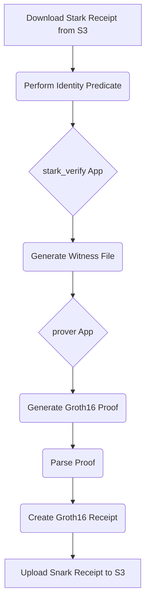
```mermaid
graph TD
    A[Download Stark Receipt from S3] --> B(Perform Identity Predicate);
    B --> C{stark_verify App};
    C --> D(Generate Witness File);
    D --> E{prover App};
    E --> F(Generate Groth16 Proof);
    F --> G(Parse Proof);
    G --> H(Create Groth16 Receipt);
    H --> I[Upload Snark Receipt to S3];
```

This diagram illustrates the flow of data and processes within the `stark2snark` function, highlighting the interaction between different components and applications. Sources: [crates/workflow/src/tasks/snark.rs:26-114]()

### Key Functions and Components

*   **`stark2snark`**: Converts a STARK receipt to a SNARK receipt. Sources: [crates/workflow/src/tasks/snark.rs:26-114]()
*   **`seal_to_json`**: Converts a seal to JSON format. Sources: [crates/workflow/src/tasks/snark.rs:47-49]()
*   **`stark_verify`**: An external application that generates a witness file. Sources: [crates/workflow/src/tasks/snark.rs:58-60]()
*   **`prover`**: An external application that generates a Groth16 proof. Sources: [crates/workflow/src/tasks/snark.rs:68-72]()
*   **`Groth16Receipt`**: Represents the SNARK receipt. Sources: [crates/workflow/src/tasks/snark.rs:86-92]()

### Code Snippet

```rust
{{#include crates/workflow/src/tasks/snark.rs:26:36}}
```

This snippet shows how the STARK receipt is downloaded from S3. Sources: [crates/workflow/src/tasks/snark.rs:26-36]()

## API Endpoints for SNARK Proof Generation

The API provides endpoints to initiate and check the status of SNARK proof generation.

### `/snark/create`

This endpoint is used to start a SNARK proof generation process. It accepts a `SnarkReq` as input and returns a `CreateSessRes` containing the job UUID. Sources: [crates/api/src/lib.rs:95-118]()

```rust
{{#include crates/api/src/lib.rs:95:101}}
```

#### Request Parameters (`SnarkReq`)

| Parameter    | Type   | Description                                          | Source                               |
| :----------- | :----- | :--------------------------------------------------- | :----------------------------------- |
| `session_id` | `String` | The session ID of the STARK receipt to be converted. | [crates/api/src/lib.rs:103-106]() |

#### Response (`CreateSessRes`)

| Parameter | Type   | Description                | Source                               |
| :-------- | :----- | :------------------------- | :----------------------------------- |
| `uuid`    | `String` | The UUID of the SNARK job. | [crates/api/src/lib.rs:114-117]() |

### `/snark/status/:job_id`

This endpoint is used to check the status of a SNARK proof generation job. It takes the `job_id` as a path parameter and returns a `SnarkStatusRes` containing the job status and output. Sources: [crates/api/src/lib.rs:120-144]()

#### Path Parameters

| Parameter | Type   | Description          | Source                               |
| :-------- | :----- | :------------------- | :----------------------------------- |
| `job_id`  | `Uuid` | The UUID of the job. | [crates/api/src/lib.rs:122-124]() |

#### Response (`SnarkStatusRes`)

| Parameter | Type     | Description                                                                                                | Source                               |
| :-------- | :------- | :--------------------------------------------------------------------------------------------------------- | :----------------------------------- |
| `status`  | `String` | The status of the job (e.g., "RUNNING", "SUCCEEDED", "FAILED").                                           | [crates/api/src/lib.rs:125-142]() |
| `output`  | `Option<String>` | The URL of the generated SNARK receipt if the job succeeded.                                                                  | [crates/api/src/lib.rs:125-142]() |

## Task Orchestration

The SNARK proof generation process is orchestrated using a task queue system. The `TaskType::Snark` enum represents a SNARK task, which contains the `receipt` (STARK receipt UUID) and `compress_type` (type of SNARK compression to run). Sources: [crates/workflow-common/src/lib.rs:235-248]()

```rust
{{#include crates/workflow-common/src/lib.rs:235:248}}
```

The `stark2snark` function is executed as part of a larger workflow managed by the task queue system. The `Executor` is responsible for creating tasks, including the SNARK task. Sources: [crates/workflow/src/tasks/executor.rs:82-88]()

```rust
{{#include crates/workflow/src/tasks/executor.rs:82:88}}
```

The `process_task` function in `crates/workflow/src/tasks/executor.rs` does not directly handle `TaskCmd::Snark`. Instead, the snark task is created as part of the executor workflow, specifically after the finalize task. Sources: [crates/workflow/src/tasks/executor.rs:221-236]()

## Finalization Task

The `finalize` task is responsible for creating the final rollup receipt and uploading it to S3. This task is executed after the join tasks are completed. Sources: [crates/workflow/src/tasks/finalize.rs:21-58]()

### Process

1.  **Retrieve Root Receipt:** The root receipt is retrieved from Redis. Sources: [crates/workflow/src/tasks/finalize.rs:27-31]()
2.  **Retrieve Journal:** The journal is retrieved from Redis. Sources: [crates/workflow/src/tasks/finalize.rs:34-38]()
3.  **Construct Rollup Receipt:** A rollup receipt is constructed using the root receipt and journal. Sources: [crates/workflow/src/tasks/finalize.rs:40-41]()
4.  **Retrieve Image ID:** The image ID is retrieved from Redis. Sources: [crates/workflow/src/tasks/finalize.rs:44-48]()
5.  **Verify Receipt:** The rollup receipt is verified against the image ID. Sources: [crates/workflow/src/tasks/finalize.rs:50-52]()
6.  **Upload Receipt:** The rollup receipt is uploaded to S3. Sources: [crates/workflow/src/tasks/finalize.rs:55-57]()

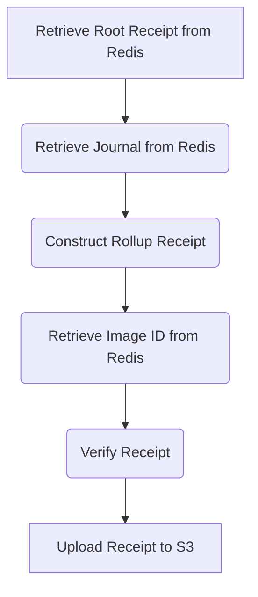
```mermaid
graph TD
    A[Retrieve Root Receipt from Redis] --> B(Retrieve Journal from Redis);
    B --> C(Construct Rollup Receipt);
    C --> D(Retrieve Image ID from Redis);
    D --> E(Verify Receipt);
    E --> F[Upload Receipt to S3];
```

This diagram outlines the steps involved in the finalization process, ensuring the integrity and persistence of the final result. Sources: [crates/workflow/src/tasks/finalize.rs:21-58]()

## Proving Task

The `prover` task is responsible for generating a proof for a given segment. This task is executed as part of the overall workflow. Sources: [crates/workflow/src/tasks/prove.rs:20-54]()

### Process

1.  **Retrieve Segment:** The segment data is retrieved from Redis. Sources: [crates/workflow/src/tasks/prove.rs:26-30]()
2.  **Prove Segment:** A proof is generated for the segment using the prover. Sources: [crates/workflow/src/tasks/prove.rs:32-36]()
3.  **Lift Receipt:** The segment receipt is lifted. Sources: [crates/workflow/src/tasks/prove.rs:38-41]()
4.  **Write Lifted Receipt:** The lifted receipt is written back to Redis. Sources: [crates/workflow/src/tasks/prove.rs:45-50]()

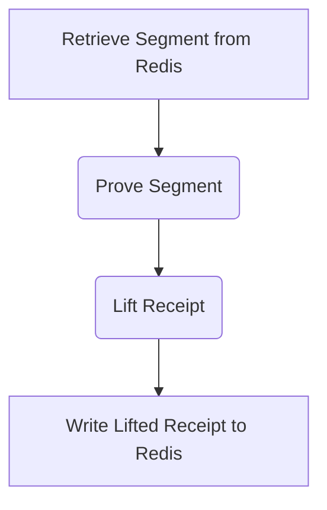
```mermaid
graph TD
    A[Retrieve Segment from Redis] --> B(Prove Segment);
    B --> C(Lift Receipt);
    C --> D[Write Lifted Receipt to Redis];
```

This diagram illustrates the steps involved in the proving process, highlighting the interaction between Redis, the prover, and the segment data. Sources: [crates/workflow/src/tasks/prove.rs:20-54]()

## Conclusion

Zero-Knowledge Proving is a crucial component of this project, enabling the verification of computations without revealing sensitive data. The system leverages a combination of STARK and SNARK proofs, orchestrated through a task queue system and managed by various API endpoints. The `stark2snark` conversion process, along with the finalization and proving tasks, ensures the integrity and security of the overall workflow.


---

<a id='data-flow'></a>

## Data Flow within Local Bento

### Related Pages

Related topics: [Data Storage Mechanisms](#data-storage)

<details>
<summary>Relevant source files</summary>

The following files were used as context for generating this wiki page:

- [crates/workflow/src/lib.rs](crates/workflow/src/lib.rs)
- [crates/api/src/lib.rs](crates/api/src/lib.rs)
- [crates/taskdb/src/lib.rs](crates/taskdb/src/lib.rs)
- [crates/workflow/src/tasks/executor.rs](crates/workflow/src/tasks/executor.rs)
- [crates/workflow/src/tasks/finalize.rs](crates/workflow/src/tasks/finalize.rs)
- [crates/workflow/src/tasks/snark.rs](crates/workflow/src/tasks/snark.rs)
</details>

# Data Flow within Local Bento

Local Bento's data flow encompasses the movement and transformation of data as it progresses through various stages of task execution, receipt generation, and proof creation. This involves interactions between API endpoints, task database, object storage (S3), and different task types like execution, finalization, and SNARK proving. The system is designed to manage and orchestrate complex workflows, ensuring data integrity and efficient processing.

## API Endpoints and Task Creation

The API layer defines several endpoints that initiate and manage the data flow. These endpoints handle requests for proving (both STARK and Groth16), uploading data, and checking job statuses.

### Stark Proof Creation

The `/sessions/create` endpoint initiates a STARK proof. It receives a `ProofReq` containing the image and input data. The API then serializes a `TaskType::Executor` request and creates a job in the `taskdb`.  The `taskdb` assigns the task to an execution stream. Sources: [crates/api/src/lib.rs:246-267]()

```rust
{{#include crates/api/src/lib.rs:251-257}}
```

### Snark Proof Creation

The `/snark/create` endpoint starts a Groth16 SNARK proof.  It takes a `SnarkReq` containing the session ID of a STARK receipt. A `TaskType::Snark` request is serialized and a job is created in the `taskdb`, assigned to a snark stream. Sources: [crates/api/src/lib.rs:110-126]()

```rust
{{#include crates/api/src/lib.rs:115-120}}
```

### Data Upload

The `/inputs/upload/:input_id` endpoint allows uploading input data to S3.  The data is stored with a key derived from the `input_id`.  Similarly, `/receipts/upload` and `/receipts/upload/:receipt_id` handle receipt uploads to S3. Sources: [crates/api/src/lib.rs:172-207]()

### Status Retrieval

The `/sessions/status/:job_id` and `/snark/status/:job_id` endpoints provide the status of STARK and SNARK jobs, respectively. They query the `taskdb` for the job state and any associated error messages or output URLs. Sources: [crates/api/src/lib.rs:271-305](), [crates/api/src/lib.rs:130-149]()

## Task Database Interaction

The `taskdb` crate manages the lifecycle of tasks and jobs. It provides functions for creating jobs, creating tasks, updating task states, and retrieving job information.

### Job and Task Creation

The `create_job` function creates a new job in the database, assigning it to a specific stream. The `create_task` function adds a new task to a job, specifying its dependencies, task definition, and timeouts. Sources: [crates/taskdb/src/lib.rs]()

### Task Execution and State Updates

Workers request work from the `taskdb` using the `request_work` function. Once a task is completed, the `update_task_done` function updates the task's state in the database.  The `get_job_state` function retrieves the current state of a job. Sources: [crates/taskdb/src/lib.rs]()

### Data Flow Diagram: Task Creation and Execution

```mermaid
graph TD
    subgraph API
        A[/sessions/create] --> B(Create Task Def);
        A --> C(Create Job in TaskDB);
    end

    C --> D{TaskDB};

    subgraph TaskDB
        D --> E(Assign Task to Stream);
    end

    E --> F(Worker Polls for Work);
    F --> G{Worker};

    subgraph Worker
        G --> H(Execute Task);
        H --> I(Update Task State in TaskDB);
    end

    I --> D;
```

This diagram illustrates the initial data flow when a STARK proof session is created. The API creates a task definition and a job in the TaskDB. The TaskDB assigns the task to a stream, and a worker polls for work, executes the task, and updates the task state back in the TaskDB. Sources: [crates/api/src/lib.rs](), [crates/taskdb/src/lib.rs]()

## Workflow Tasks

The `workflow` crate defines different types of tasks that can be executed as part of a job. These include executor tasks, finalize tasks, and SNARK tasks.

### Executor Task

The `Executor` task executes a RISC Zero program. It receives an image, input data, and execution limits. The task execution results in a receipt and a journal, which are then stored. Sources: [crates/workflow/src/tasks/executor.rs]()

### Finalize Task

The `Finalize` task creates the final rollup receipt. It retrieves the root receipt and journal from Redis, verifies the receipt against the image ID, and uploads the final receipt to S3. Sources: [crates/workflow/src/tasks/finalize.rs]()

### SNARK Task

The `Snark` task converts a STARK receipt to a Groth16 SNARK proof. It downloads the STARK receipt from S3, performs an identity predicate, and then uses a prover to generate the SNARK proof. The proof is then stored in S3. Sources: [crates/workflow/src/tasks/snark.rs]()

### Data Flow Diagram: Workflow Task Execution

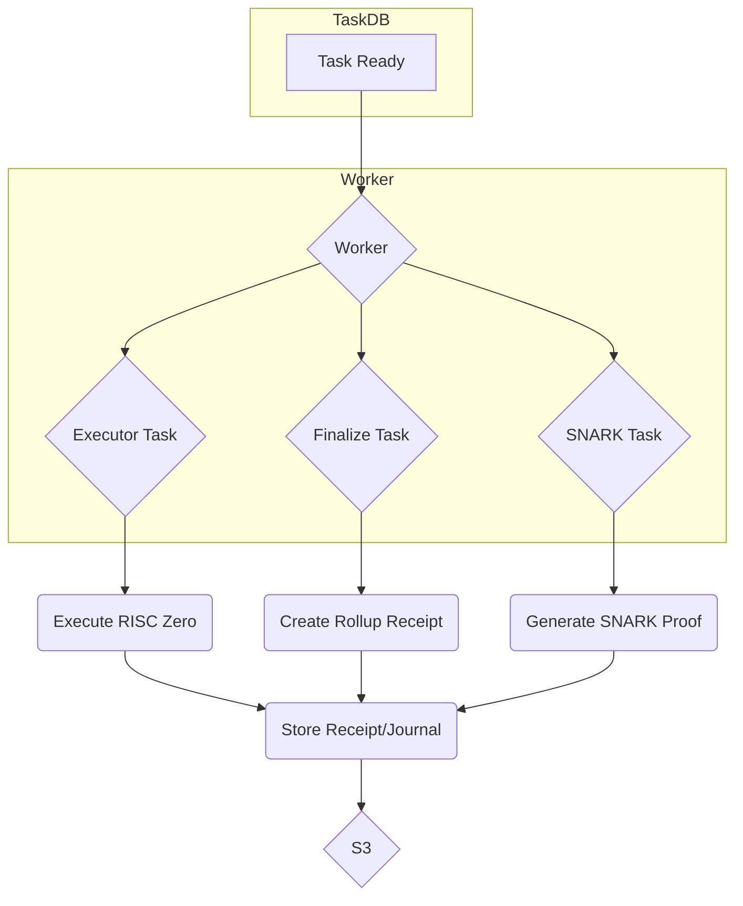
```mermaid
graph TD
    subgraph TaskDB
        A[Task Ready];
    end

    A --> B{Worker};

    subgraph Worker
        B --> C{Executor Task};
        B --> D{Finalize Task};
        B --> E{SNARK Task};
    end

    C --> F(Execute RISC Zero);
    D --> G(Create Rollup Receipt);
    E --> H(Generate SNARK Proof);

    F --> I(Store Receipt/Journal);
    G --> I;
    H --> I;

    I --> J{S3};
```

This diagram shows the data flow during workflow task execution. A worker picks up a task from the TaskDB and executes it based on its type (Executor, Finalize, or SNARK). The results (receipts, journals, proofs) are then stored in S3. Sources: [crates/workflow/src/tasks/executor.rs](), [crates/workflow/src/tasks/finalize.rs](), [crates/workflow/src/tasks/snark.rs]()

## Object Storage (S3)

S3 is used for storing various data artifacts, including input data, receipts, journals, and SNARK proofs. The `s3` module in `workflow_common` provides functions for interacting with S3. Sources: [crates/api/src/lib.rs]()

### Data Storage Locations

The following table summarizes the S3 storage locations for different data types:

| Data Type           | Bucket Directory               | File Naming Convention                                  |
| ------------------- | ------------------------------ | ----------------------------------------------------- |
| Input Data          | `INPUT_BUCKET_DIR`             | `{input_id}`                                          |
| STARK Receipts      | `RECEIPT_BUCKET_DIR/STARK_BUCKET_DIR` | `{receipt_id}.bincode`                                |
| Groth16 Proofs      | `RECEIPT_BUCKET_DIR/GROTH16_BUCKET_DIR`| `{job_id}.bincode`                                    |
| Preflight Journals  | `PREFLIGHT_JOURNALS_BUCKET_DIR`| `{job_id}.bin`                                        |

Sources: [crates/api/src/lib.rs]()

## Conclusion

The data flow within Local Bento is a complex process involving multiple components and data transformations. The API layer provides endpoints for initiating and managing tasks, the `taskdb` crate orchestrates task execution, the `workflow` crate defines the different types of tasks, and S3 is used for storing data artifacts. Understanding the data flow is crucial for developing, debugging, and optimizing the system.


---

<a id='data-storage'></a>

## Data Storage Mechanisms

### Related Pages

Related topics: [S3 Integration](#deployment-s3)

<details>
<summary>Relevant source files</summary>

The following files were used as context for generating this wiki page:

- [crates/taskdb/src/lib.rs](crates/taskdb/src/lib.rs)
- [crates/workflow/src/tasks/executor.rs](crates/workflow/src/tasks/executor.rs)
- [crates/workflow/src/tasks/finalize.rs](crates/workflow/src/tasks/finalize.rs)
- [crates/api/src/lib.rs](crates/api/src/lib.rs)
- [crates/workflow/src/tasks/snark.rs](crates/workflow/src/tasks/snark.rs)
- [crates/workflow/src/lib.rs](crates/workflow/src/lib.rs)
</details>

# Data Storage Mechanisms

This page details the data storage mechanisms employed by the Bonsai project, focusing on how task-related data is managed and persisted. The system utilizes a combination of PostgreSQL (accessed via `sqlx`), Redis, and S3 object storage to handle different aspects of task management, intermediate data, and final results. These mechanisms are crucial for maintaining the state of jobs, tasks, and associated data throughout the execution workflow.

## Overview of Storage Components

The Bonsai project uses a multi-faceted approach to data storage, leveraging different technologies for specific purposes.

*   **PostgreSQL (via `sqlx`):** Used for persistent storage of job and task metadata, relationships, and state transitions. The `taskdb` crate provides an abstraction layer for interacting with the PostgreSQL database.
*   **Redis:** Used as a fast, in-memory data store for caching intermediate results, such as journals and receipts, and for managing task queues.
*   **S3 Object Storage:** Used for storing larger data objects, such as ELF files, input data, receipts, execution logs, and Groth16 proofs.

## PostgreSQL with `taskdb`

The `taskdb` crate provides the primary interface for interacting with the PostgreSQL database. It defines functions for creating, querying, updating, and deleting jobs, tasks, and streams.

### Key Functions and Data Structures

*   **`create_stream`:** Creates a new stream, which is associated with a specific worker type and resource allocation. Streams are used to manage the flow of tasks within the system. `Sources: [crates/taskdb/src/lib.rs:177-194]()`
*   **`create_job`:** Creates a new job, which represents a high-level workflow. Jobs are associated with a stream and a task definition. `Sources: [crates/taskdb/src/lib.rs:196-213]()`
*   **`create_task`:** Creates a new task, which represents a unit of work within a job. Tasks are associated with a job, a stream, and a task definition. `Sources: [crates/taskdb/src/lib.rs:215-235]()`
*   **`get_job_state`:** Retrieves the current state of a job. `Sources: [crates/api/src/lib.rs:313-315]()`
*   **`JobState` enum:** Represents the possible states of a job (e.g., `Running`, `Done`, `Failed`). `Sources: [crates/taskdb/src/lib.rs:77-83]()`
*   **`TaskState` enum:** Represents the possible states of a task (e.g., `Running`, `Done`, `Failed`). `Sources: [crates/taskdb/src/lib.rs:85-90]()`

### Data Model

The `taskdb` crate uses SQLx to interact with the PostgreSQL database. The following diagram illustrates the relationships between the key tables:

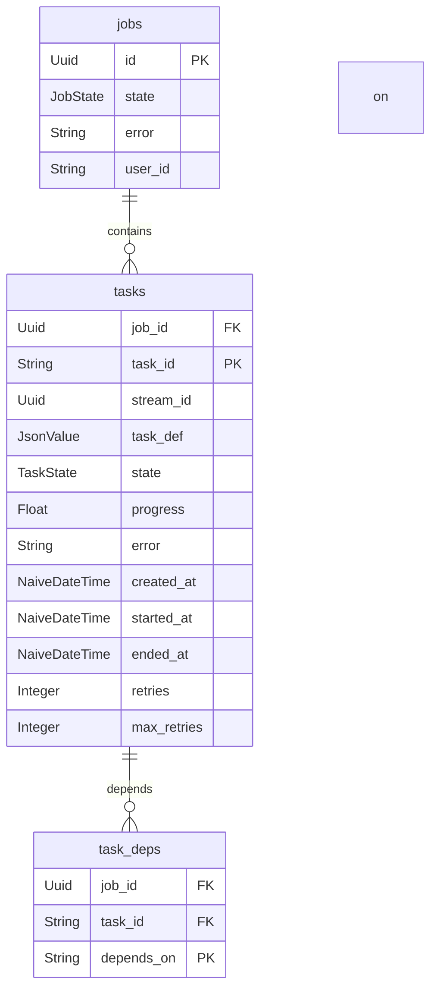
```mermaid
erDiagram
    jobs {
        Uuid id PK
        JobState state
        String error
        String user_id
    }
    tasks {
        Uuid job_id FK
        String task_id PK
        Uuid stream_id
        JsonValue task_def
        TaskState state
        Float progress
        String error
        NaiveDateTime created_at
        NaiveDateTime started_at
        NaiveDateTime ended_at
        Integer retries
        Integer max_retries
    }
    task_deps {
        Uuid job_id FK
        String task_id FK
        String depends_on PK
    }
    jobs ||--o{ tasks : contains
    tasks ||--o{ task_deps : depends on
```

This diagram shows the `jobs`, `tasks`, and `task_deps` tables and their relationships. A job can contain multiple tasks, and a task can depend on other tasks. `Sources: [crates/taskdb/src/lib.rs]()`

### Example: Creating a Task

The following code snippet shows how to create a new task using the `create_task` function:

```rust
{{#include ../../crates/taskdb/src/lib.rs:215:235}}
```

This function takes a database connection pool, a job ID, a task ID, a stream ID, a task definition, and prerequisite tasks as input. It inserts a new row into the `tasks` table and creates entries in the `task_deps` table to represent the task's dependencies.

## Redis

Redis is used as a fast, in-memory data store for caching intermediate results and managing task queues. The `workflow` crate uses Redis to store journals and receipts.

### Key Usage Patterns

*   **Journal Storage:** Journals, which contain execution traces, are stored in Redis using keys prefixed with `job:{job_id}:journal`. `Sources: [crates/workflow/src/tasks/executor.rs:107-122](), [crates/workflow/src/tasks/finalize.rs:27-31]()`
*   **Receipt Storage:** Receipts, which represent proof of computation, are stored in Redis using keys prefixed with `job:{job_id}:{RECUR_RECEIPT_PATH}:{max_idx}`. `Sources: [crates/workflow/src/tasks/finalize.rs:21-25]()`
*   **Image ID Storage:** Image IDs are stored in Redis using keys prefixed with `job:{job_id}:image_id`. `Sources: [crates/workflow/src/tasks/finalize.rs:37-41]()`

### Redis Data Flow

The following diagram illustrates the flow of data between the workflow agent and Redis:

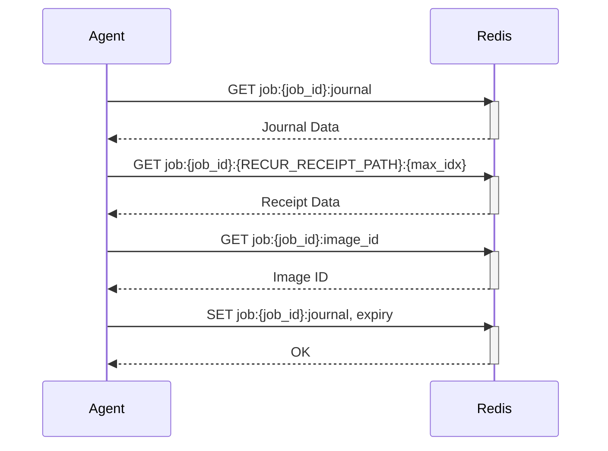
```mermaid
sequenceDiagram
    participant Agent
    participant Redis

    Agent->>Redis: GET job:{job_id}:journal
    activate Redis
    Redis-->>Agent: Journal Data
    deactivate Redis

    Agent->>Redis: GET job:{job_id}:{RECUR_RECEIPT_PATH}:{max_idx}
    activate Redis
    Redis-->>Agent: Receipt Data
    deactivate Redis

    Agent->>Redis: GET job:{job_id}:image_id
    activate Redis
    Redis-->>Agent: Image ID
    deactivate Redis

    Agent->>Redis: SET job:{job_id}:journal, expiry
    activate Redis
    Redis-->>Agent: OK
    deactivate Redis
```

This diagram shows the agent retrieving journal data, receipt data, and image IDs from Redis. It also shows the agent setting the journal data in Redis with an expiry time.

## S3 Object Storage

S3 object storage is used for storing larger data objects, such as ELF files, input data, receipts, execution logs, and Groth16 proofs. The `workflow-common` crate defines constants for the S3 bucket directories.

### Key Constants

*   **`ELF_BUCKET_DIR`:**  Directory for storing ELF files. `Sources: [crates/api/src/lib.rs:67]()`
*   **`INPUT_BUCKET_DIR`:** Directory for storing input data. `Sources: [crates/api/src/lib.rs:67]()`
*   **`RECEIPT_BUCKET_DIR`:** Directory for storing receipts. `Sources: [crates/api/src/lib.rs:68]()`
*   **`STARK_BUCKET_DIR`:** Subdirectory within `RECEIPT_BUCKET_DIR` for storing STARK receipts. `Sources: [crates/api/src/lib.rs:68]()`
*   **`GROTH16_BUCKET_DIR`:** Directory for storing Groth16 proofs. `Sources: [crates/workflow/src/tasks/snark.rs:50]()`
*   **`PREFLIGHT_JOURNALS_BUCKET_DIR`:** Directory for storing preflight journals. `Sources: [crates/api/src/lib.rs:68]()`

### S3 Data Flow

The following diagram illustrates the flow of data between the workflow agent and S3 object storage:

```mermaid
sequenceDiagram
    participant Agent
    participant S3

    Agent->>S3: Upload ELF file to {ELF_BUCKET_DIR}/{image_id}
    activate S3
    S3-->>Agent: OK
    deactivate S3

    Agent->>S3: Upload Input to {INPUT_BUCKET_DIR}/{input_id}
    activate S3
    S3-->>Agent: OK
    deactivate S3

    Agent->>S3: Upload Receipt to {RECEIPT_BUCKET_DIR}/{STARK_BUCKET_DIR}/{receipt_id}.bincode
    activate S3
    S3-->>Agent: OK
    deactivate S3

    Agent->>S3: Download Receipt from {RECEIPT_BUCKET_DIR}/{STARK_BUCKET_DIR}/{receipt_id}.bincode
    activate S3
    S3-->>Agent: Receipt Data
    deactivate S3

    Agent->>S3: Upload Groth16 Proof to {GROTH16_BUCKET_DIR}/{job_id}.json
    activate S3
    S3-->>Agent: OK
    deactivate S3
```

This diagram shows the agent uploading and downloading various data objects to and from S3 object storage.

### Example: Uploading a Receipt

The following code snippet shows how to upload a receipt to S3 object storage:

```rust
{{#include ../../crates/api/src/lib.rs:503:521}}
```

This code defines an API endpoint for uploading receipts to S3 object storage. It generates a unique receipt ID and stores the receipt in the `RECEIPT_BUCKET_DIR/STARK_BUCKET_DIR` directory.

## Interaction of Storage Mechanisms

The different storage mechanisms interact to provide a complete solution for managing task-related data. PostgreSQL stores the metadata and state of jobs and tasks, Redis caches intermediate results, and S3 object storage stores larger data objects.

```mermaid
graph TD
    PG[(PostgreSQL)]
    Redis[(Redis)]
    S3[(S3 Object Storage)]

    PG -- Stores Job/Task Metadata --> Redis
    PG -- Stores Job/Task Metadata --> S3
    Redis -- Caches Journals/Receipts --> S3
    S3 -- Stores ELF/Input/Receipt Data --> PG
```

This diagram illustrates how PostgreSQL, Redis, and S3 object storage interact to manage task-related data.

## Conclusion

The Bonsai project utilizes a combination of PostgreSQL, Redis, and S3 object storage to manage task-related data. PostgreSQL provides persistent storage for job and task metadata, Redis caches intermediate results for fast access, and S3 object storage stores larger data objects. This multi-faceted approach ensures that the system can efficiently manage the state of jobs, tasks, and associated data throughout the execution workflow.


---

<a id='backend-taskdb'></a>

## Task Database

### Related Pages

Related topics: [Task Management System](#features-task-management)

```html
<details>
<summary>Relevant source files</summary>

The following files were used as context for generating this wiki page:

- [crates/taskdb/src/lib.rs](crates/taskdb/src/lib.rs)
- [crates/taskdb/tests/e2e.rs](crates/taskdb/tests/e2e.rs)
- [crates/taskdb/src/planner/mod.rs](crates/taskdb/src/planner/mod.rs)
- [crates/taskdb/benches/taskdb.rs](crates/taskdb/benches/taskdb.rs)
- [crates/taskdb/src/test_helpers.rs](crates/taskdb/src/test_helpers.rs)
- [crates/taskdb/examples/stress.rs](crates/taskdb/examples/stress.rs)
</details>
```

# Task Database

The Task Database (taskdb) is a system designed for managing and executing tasks within a distributed workflow environment. It provides mechanisms for creating tasks, defining dependencies, assigning tasks to workers, tracking task status, and handling task completion or failure. The taskdb crate offers functionalities to interact with a PostgreSQL database, providing an interface for managing jobs, tasks, and streams. It's a crucial component for orchestrating complex workflows by ensuring tasks are executed in the correct order and dependencies are met. [crates/taskdb/src/lib.rs]()

## Core Concepts

### Task

A task represents a unit of work to be performed. Each task is associated with a job, a stream, and a task definition. Tasks can have dependencies on other tasks, ensuring that they are executed in the correct order. The state of a task can be `Pending`, `Ready`, `Running`, `Done`, or `Failed`. [crates/taskdb/src/lib.rs]()

### Job

A job is a collection of tasks that form a logical unit of work. Jobs are associated with a stream, which defines the type of worker that can execute the tasks within the job. Jobs can be in various states, such as `Pending`, `Running`, `Done`, or `Failed`. [crates/taskdb/src/lib.rs]()

### Stream

A stream represents a queue of tasks that are processed by workers of a specific type. Streams are defined by a worker type, a reservation count, and a "be_mult" value. Streams are used to manage the flow of tasks to available workers. [crates/taskdb/src/lib.rs]()

### Task States

The `TaskState` enum represents the possible states of a task within the system.

```rust
#[derive(sqlx::Type, Debug, PartialEq)]
#[sqlx(type_name = "task_state", rename_all = "snake_case")]
pub enum TaskState {
    Pending,
    Ready,
    Running,
    Done,
    Failed,
}
```
Sources: [crates/taskdb/src/lib.rs:182-189]()

This enum is used to track the progress of individual tasks.

## Data Model

The Task Database uses a relational data model, primarily stored in PostgreSQL. Key tables include:

*   **jobs**: Stores information about jobs, including their state, stream ID, and user ID.
*   **tasks**: Stores information about tasks, including their job ID, task ID, stream ID, state, and dependencies.
*   **task\_deps**: Stores task dependencies.
*   **streams**: Stores information about streams, including their worker type and reservation count.

### Entity Relationship Diagram

```mermaid
erDiagram
    jobs {
        uuid id PK
        uuid stream_id FK
        JobState state
        string user_id
    }
    tasks {
        uuid job_id FK
        string task_id PK
        uuid stream_id FK
        TaskState state
        JSON task_def
        JSON prerequisites
    }
    streams {
        uuid id PK
        string worker_type
        int reserved
        float be_mult
    }
    task_deps {
        uuid job_id FK
        string task_id FK
        string depends_on FK
    }
    jobs ||--o{ tasks : contains
    tasks ||--o{ task_deps : depends on
    streams ||--o{ jobs : uses
```

This diagram shows the relationships between the core entities in the Task Database.  Sources: [crates/taskdb/src/lib.rs](), [crates/taskdb/src/test_helpers.rs]()

## API Functions

The `taskdb` crate provides several key functions for interacting with the Task Database:

*   `create_stream`: Creates a new stream.
*   `create_job`: Creates a new job.
*   `create_task`: Creates a new task.
*   `request_work`: Retrieves a task that is ready to be executed by a worker.
*   `update_task_done`: Updates the state of a task to "done".
*   `get_job_state`: Retrieves the state of a job.
*   `delete_job`: Deletes a job and all associated tasks and dependencies.

### Sequence Diagram for Task Creation and Execution

```mermaid
sequenceDiagram
    participant Client
    participant TaskDB as Task Database
    participant Worker

    Client->>TaskDB: create_stream(worker_type, reserved, be_mult, user_id)
    activate TaskDB
    TaskDB-->>Client: stream_id
    deactivate TaskDB

    Client->>TaskDB: create_job(stream_id, task_def, max_retries, timeout_secs, user_id)
    activate TaskDB
    TaskDB-->>Client: job_id
    deactivate TaskDB

    Client->>TaskDB: create_task(job_id, task_id, stream_id, task_def, prereqs, max_retries, timeout_secs)
    activate TaskDB
    TaskDB-->>Client: OK
    deactivate TaskDB

    Worker->>TaskDB: request_work(worker_type)
    activate TaskDB
    TaskDB-->>Worker: ReadyTask (job_id, task_id, task_def, prereqs, max_retries)
    deactivate TaskDB

    Worker->>Worker: Execute Task
    activate Worker
    Worker-->>TaskDB: update_task_done(job_id, task_id, output)
    deactivate Worker
    activate TaskDB
    TaskDB-->>Client: OK
    deactivate TaskDB
```

This diagram illustrates the typical flow of creating a task and having a worker execute it. Sources: [crates/taskdb/src/lib.rs]()

### Code Snippet for Creating a Task

```rust
pub async fn create_task(
    pool: &PgPool,
    job_id: &Uuid,
    task_id: &str,
    stream_id: &Uuid,
    task_def: &JsonValue,
    prereqs: &JsonValue,
    max_retries: i32,
    timeout_secs: i32,
) -> Result<(), TaskDbErr> {
    sqlx::query!(
        "CALL create_task($1, $2, $3, $4, $5, $6, $7)",
        job_id,
        task_id,
        stream_id,
        task_def,
        prereqs,
        max_retries,
        timeout_secs,
    )
    .execute(pool)
    .await?;

    Ok(())
}
```
Sources: [crates/taskdb/src/lib.rs:91-111]()

This function creates a new task in the database, associating it with a job, stream, and task definition.

## Task Planning

The `planner` module provides functionality for organizing tasks into a dependency graph and determining the order in which they should be executed. This module is still in early stages of development. [crates/taskdb/src/planner/mod.rs]()

## Testing

The `taskdb` crate includes extensive testing capabilities to ensure the reliability and correctness of its functionality. These tests cover various aspects of the system, including task creation, execution, and state management. [crates/taskdb/tests/e2e.rs]()

### Example Test Case

```rust
#[sqlx::test()]
async fn update_task(pool: PgPool) -> sqlx::Result<()> {
    let user_id = "user1";
    let worker_type = "CPU";
    let stream_id = create_stream(&pool, worker_type, 1, 1.0, user_id)
        .await
        .unwrap();
    let task_def = serde_json::json!({"init": "test"});
    let job_id = create_job(&pool, &stream_id, &task_def, 0, 100, user_id)
        .await
        .unwrap();

    let init = request_work(&pool, worker_type).await.unwrap().unwrap();

    let output_res_value = "SUCCESS";
    let output_res = serde_json::json!({"result": output_res_value});
    assert!(update_task_done(&pool, &job_id, &init.task_id, output_res)
        .await
        .unwrap());

    let tasks = get_tasks(&pool).await.unwrap();

    assert_eq!(tasks.len(), 1);
    let init = &tasks[0];

    assert!(init.error.is_none());
    assert_eq!(
        init.output
            .as_ref()
            .unwrap()
            .get("result")
            .unwrap()
            .as_str()
            .unwrap(),
        output_res_value
    );

    Ok(())
}
```
Sources: [crates/taskdb/tests/e2e.rs:136-173]()

This test case demonstrates how to create a task, request work, and update the task's state.

## Benchmarking

The `taskdb` crate includes benchmarks to measure the performance of key operations, such as task creation and execution. These benchmarks help identify potential performance bottlenecks and ensure that the system can handle the required workload. [crates/taskdb/benches/taskdb.rs]()

## Conclusion

The Task Database is a fundamental component for managing and executing tasks in a distributed workflow environment. It provides a robust and reliable system for creating tasks, defining dependencies, assigning tasks to workers, and tracking task status. The `taskdb` crate offers a comprehensive API for interacting with the Task Database, making it easy to integrate into other systems and applications.


---

<a id='backend-workflow'></a>

## Workflow Engine

### Related Pages

Related topics: [Task Management System](#features-task-management)

<details>
<summary>Relevant source files</summary>

The following files were used as context for generating this wiki page:

- [crates/workflow/src/lib.rs](crates/workflow/src/lib.rs)
- [crates/workflow/src/tasks/executor.rs](crates/workflow/src/tasks/executor.rs)
- [crates/api/src/lib.rs](crates/api/src/lib.rs)
- [crates/taskdb/src/lib.rs](crates/taskdb/src/lib.rs)
- [crates/workflow/src/tasks/finalize.rs](crates/workflow/src/tasks/finalize.rs)
- [crates/workflow/src/tasks/snark.rs](crates/workflow/src/tasks/snark.rs)
</details>

# Workflow Engine

The Workflow Engine is a system designed to manage and execute tasks within the RISC Zero infrastructure. It handles various task types, including execution, finalization, and SNARK proving, ensuring each task is processed according to its defined dependencies and requirements. The engine integrates with a task database (taskdb) and a Redis server for task management and data caching, and uses S3 for storing artifacts. [crates/workflow/src/lib.rs]().

The engine operates by monitoring task streams, processing tasks, and updating task status in the database. It supports configurable parameters such as polling intervals, database connection limits, and Redis TTLs, allowing for flexible deployment and scaling. The system is designed to be extensible, allowing new task types and processing logic to be added as needed. [crates/workflow/src/lib.rs]().

## Architecture

The Workflow Engine's architecture comprises several key components that work together to manage and execute tasks. These components include the Agent, task database (taskdb), Redis server, and S3 storage.

```mermaid
graph TD
    A[Agent] --> B(Task Database);
    A --> C(Redis Server);
    A --> D(S3 Storage);
    B -- Stores Task Definitions --> E[Task Definitions];
    C -- Caches Task Data --> F[Task Data];
    D -- Stores Artifacts --> G[Artifacts];
```

The Agent monitors task streams, retrieves task definitions from the task database, uses Redis for caching, and interacts with S3 for storing and retrieving artifacts. [crates/workflow/src/lib.rs]().

### Agent

The Agent is the core component responsible for monitoring task streams and processing tasks. It is configured with parameters such as task stream type, polling interval, database URL, Redis URL, segment PO2, database connection limits, Redis TTL, and S3 bucket details. The Agent uses these parameters to connect to the necessary services and execute tasks. [crates/workflow/src/lib.rs]().

```mermaid
graph TD
    A[Agent] --> B{Task Stream};
    B -- New Task --> C[Task Processing];
    C --> D(Task Database);
    C --> E(Redis Server);
    C --> F(S3 Storage);
```

The Agent continuously polls the task stream for new tasks, processes them, and updates the task status in the database. [crates/workflow/src/lib.rs]().

### Task Database (taskdb)

The task database (taskdb) is a PostgreSQL database that stores task definitions, task dependencies, and task statuses. It provides functions for creating tasks, requesting work, updating task statuses, and managing job states. The task database is a critical component for ensuring the reliability and consistency of the Workflow Engine. [crates/taskdb/src/lib.rs]().

Key functions provided by the task database include:

*   `create_stream`: Creates a new task stream. [crates/taskdb/src/lib.rs]().
*   `create_job`: Creates a new job. [crates/taskdb/src/lib.rs]().
*   `create_task`: Creates a new task. [crates/taskdb/src/lib.rs]().
*   `request_work`: Requests a task to be executed. [crates/taskdb/src/lib.rs]().
*   `update_task_done`: Updates the status of a task to "done". [crates/taskdb/src/lib.rs]().
*   `get_job_state`: Retrieves the state of a job. [crates/api/src/lib.rs]().

### Redis Server

The Redis server is used for caching task data and session information. It provides fast access to frequently used data, reducing the load on the task database and improving the performance of the Workflow Engine. The Redis TTL parameter determines the duration for which objects are stored in Redis before they expire automatically. [crates/workflow/src/lib.rs]().

### S3 Storage

S3 storage is used for storing artifacts such as ELF files, Groth16 proofs, input data, preflight journals, receipts, and STARK proofs. The Workflow Engine interacts with S3 to retrieve necessary artifacts and store the results of task executions. The S3 bucket parameter specifies the bucket to be used for storing these artifacts. [crates/workflow/src/lib.rs]().

## Task Types and Processing

The Workflow Engine supports several task types, each with its own processing logic. These task types include:

*   Executor tasks
*   Finalize tasks
*   SNARK tasks

### Executor Tasks

Executor tasks involve executing a RISC Zero image with a given input and producing a result. The `executor` function in `crates/workflow/src/tasks/executor.rs` handles the creation and management of these tasks. The process involves several steps:

1.  **Task Creation**: The `create_task` function from `taskdb` is used to create tasks in the database. [crates/taskdb/src/lib.rs]().
2.  **Image and Input Retrieval**: The executor retrieves the necessary image and input data.
3.  **Execution**: The RISC Zero image is executed with the provided input.
4.  **Result Storage**: The result of the execution is stored in S3 storage.
5.  **Finalize Task Creation**: A finalize task is created to generate a rollup receipt. [crates/workflow/src/tasks/executor.rs]().

```mermaid
sequenceDiagram
    participant Agent
    participant TaskDB
    participant Executor
    participant S3
    participant FinalizeTask
    Agent->>TaskDB: Request Work
    activate Agent
    Agent->>Executor: Execute Image
    activate Executor
    Executor->>S3: Retrieve Image/Input
    activate S3
    S3-->>Executor: Image/Input Data
    deactivate S3
    Executor->>S3: Store Result
    activate S3
    S3-->>Executor: Confirmation
    deactivate S3
    Executor->>TaskDB: Update Task Done
    Executor->>FinalizeTask: Create Finalize Task
    deactivate Executor
    deactivate Agent
```

The above diagram illustrates the sequence of operations for executing an executor task. [crates/workflow/src/tasks/executor.rs]().

### Finalize Tasks

Finalize tasks are responsible for creating the final rollup receipt. The `finalize` function in `crates/workflow/src/tasks/finalize.rs` handles the creation and management of these tasks. The process involves several steps:

1.  **Receipt Retrieval**: The finalize task retrieves the root receipt from Redis. [crates/workflow/src/tasks/finalize.rs]().
2.  **Journal Retrieval**: The finalize task retrieves the journal from Redis. [crates/workflow/src/tasks/finalize.rs]().
3.  **Receipt Verification**: The rollup receipt is verified using the image ID. [crates/workflow/src/tasks/finalize.rs]().
4.  **Receipt Storage**: The rollup receipt is stored in S3 storage.

```mermaid
sequenceDiagram
    participant Agent
    participant TaskDB
    participant FinalizeTask
    participant Redis
    participant S3
    Agent->>TaskDB: Request Work
    activate Agent
    Agent->>FinalizeTask: Finalize Receipt
    activate FinalizeTask
    FinalizeTask->>Redis: Retrieve Root Receipt
    activate Redis
    Redis-->>FinalizeTask: Root Receipt Data
    deactivate Redis
    FinalizeTask->>Redis: Retrieve Journal
    activate Redis
    Redis-->>FinalizeTask: Journal Data
    deactivate Redis
    FinalizeTask->>S3: Store Rollup Receipt
    activate S3
    S3-->>FinalizeTask: Confirmation
    deactivate S3
    FinalizeTask->>TaskDB: Update Task Done
    deactivate FinalizeTask
    deactivate Agent
```

The above diagram illustrates the sequence of operations for finalizing a receipt. [crates/workflow/src/tasks/finalize.rs]().

### SNARK Tasks

SNARK tasks involve converting a STARK proof to a SNARK proof. The `stark2snark` function in `crates/workflow/src/tasks/snark.rs` handles the creation and management of these tasks. The process involves several steps:

1.  **Receipt Retrieval**: The SNARK task retrieves the STARK receipt from S3 storage. [crates/workflow/src/tasks/snark.rs]().
2.  **Proof Generation**: A SNARK proof is generated from the STARK receipt.
3.  **Proof Storage**: The SNARK proof is stored in S3 storage.

```mermaid
sequenceDiagram
    participant Agent
    participant TaskDB
    participant SNARKTask
    participant S3
    Agent->>TaskDB: Request Work
    activate Agent
    Agent->>SNARKTask: Convert STARK to SNARK
    activate SNARKTask
    SNARKTask->>S3: Retrieve STARK Receipt
    activate S3
    S3-->>SNARKTask: STARK Receipt Data
    deactivate S3
    SNARKTask->>S3: Store SNARK Proof
    activate S3
    S3-->>SNARKTask: Confirmation
    deactivate S3
    SNARKTask->>TaskDB: Update Task Done
    deactivate SNARKTask
    deactivate Agent
```

The above diagram illustrates the sequence of operations for converting a STARK proof to a SNARK proof. [crates/workflow/src/tasks/snark.rs]().

## API Endpoints

The API provides endpoints for creating sessions, uploading images, and checking session statuses. These endpoints are defined in `crates/api/src/lib.rs`.

| Endpoint                  | Method | Description                                                              |
| ------------------------- | ------ | ------------------------------------------------------------------------ |
| `/sessions/create`        | POST   | Creates a new execution session.                                         |
| `/sessions/status/:job_id` | GET    | Retrieves the status of a session.                                       |
| `/img/upload`             | PUT    | Uploads an image.                                                          |
| `/snark/create`           | POST   | Creates a new SNARK proving session.                                     |
| `/snark/status/:job_id`    | GET    | Retrieves the status of a SNARK proving session.                         |

Sources: [crates/api/src/lib.rs]().

### Session Creation

The `/sessions/create` endpoint creates a new execution session. It takes an `ExecutorReq` as input, which specifies the image to execute, the input data, and other execution parameters. The endpoint creates a new job in the task database and returns a `CreateSessRes` containing the job ID. [crates/api/src/lib.rs]().

```rust
const SESSION_CREATE_PATH: &str = "/sessions/create";
async fn execute_stark(
    State(state): State<Arc<AppState>>,
    ExtractApiKey(api_key): ExtractApiKey,
    Json(start_req): Json<ExecutorReq>,
) -> Result<Json<CreateSessRes>, AppError> {
    let (
        _aux_stream,
        exec_stream,
        _gpu_prove_stream,
        _gpu_coproc_stream,
        _gpu_join_stream,
        _snark_stream,
    ) = helpers::get_or_create_streams(&state.db_pool, &api_key)
        .await
        .context("Failed to get / create steams")?;

    let task_def = serde_json::to_value(TaskType::Executor(ExecutorReq {
        image: start_req.img,
        input: start_req.input,
        user_id: api_key.clone(),
        assumptions: start_req.assumptions,
        execute_only: start_req.execute_only,
        compress: workflow_common::CompressType::None,
        exec_limit: start_req.exec_cycle_limit,
    }))
    .context("Failed to serialize ExecutorReq")?;

    let job_id = taskdb::create_job(
        &state.db_pool,
        &exec_stream,
        &task_def,
        state.exec_retries,
        state.exec_timeout,
        &api_key,
    )
    .await
    .context("Failed to create exec / init task")?;

    Ok(Json(CreateSessRes {
        uuid: job_id.to_string(),
    }))
}
```

Sources: [crates/api/src/lib.rs:240-278]().

### Session Status

The `/sessions/status/:job_id` endpoint retrieves the status of a session. It takes a job ID as input and returns a `SessionStatusRes` containing the job state, execution statistics, and receipt URL. The job state can be `Running` or `Done`. If the job is done, the endpoint retrieves execution statistics and the receipt URL. [crates/api/src/lib.rs]().

```rust
const STARK_STATUS_PATH: &str = "/sessions/status/:job_id";
async fn stark_status(
    State(state): State<Arc<AppState>>,
    Host(hostname): Host,
    Path(job_id): Path<Uuid>,
    ExtractApiKey(api_key): ExtractApiKey,
) -> Result<Json<SessionStatusRes>, AppError> {
    let job_state = taskdb::get_job_state(&state.db_pool, &job_id, &api_key)
        .await
        .context("Failed to get job state")?;

    let (exec_stats, receipt_url) = if job_state == JobState::Done {
        let exec_stats = helpers::get_exec_stats(&state.db_pool, &job_id)
            .await
            .context("Failed to get exec stats")?;
        let receipt_url = helpers::get_receipt_url(&state.s3_client, &job_id, &hostname)
            .await
            .context("Failed to get receipt url")?;
        (Some(exec_stats), Some(receipt_url))
    } else {
        (None, None)
    };

    Ok(Json(SessionStatusRes {
        status: job_state.to_string(),
        stats: exec_stats,
        output_url: receipt_url,
    }))
}
```

Sources: [crates/api/src/lib.rs:280-307]().

## Conclusion

The Workflow Engine is a critical component of the RISC Zero infrastructure, responsible for managing and executing tasks. It integrates with a task database, Redis server, and S3 storage to ensure the reliable and efficient processing of tasks. The engine supports various task types, including execution, finalization, and SNARK proving, and provides API endpoints for creating sessions and checking session statuses. [crates/workflow/src/lib.rs]().


---

<a id='deployment-docker'></a>

## Docker Deployment

### Related Pages

Related topics: [Getting Started with Local Bento](#overview-getting-started)

<details>
<summary>Relevant source files</summary>

The following files were used as context for generating this wiki page:

- [docker-compose.yml](docker-compose.yml)
- [dockerfiles/agent.dockerfile](dockerfiles/agent.dockerfile)
- [dockerfiles/rest_api.dockerfile](dockerfiles/rest_api.dockerfile)
- [crates\api\src\lib.rs](crates\api\src\lib.rs)
- [crates\workflow\src\tasks\finalize.rs](crates\workflow\src\tasks\finalize.rs)
- [crates\workflow\src\tasks\snark.rs](crates\workflow\src\tasks\snark.rs)
</details>

# Docker Deployment

This document outlines the Docker deployment strategy for the local-bento project. It details the components containerized using Docker, their configurations, and their roles within the system. The deployment leverages Docker to ensure consistent and reproducible environments across different stages of development, testing, and production.

## Docker Compose Configuration

The `docker-compose.yml` file defines the services that constitute the local-bento application. These services include the REST API, the agent, and potentially other supporting services. Docker Compose orchestrates the deployment and management of these multi-container applications.  Each service definition specifies the Docker image to use, environment variables, port mappings, and dependencies on other services.  This configuration allows for easy setup and teardown of the entire application stack. Sources: [docker-compose.yml]()

### Services Defined

The `docker-compose.yml` file specifies several services, including the `rest_api` and `agent`.  These services are built from Dockerfiles located in the `dockerfiles/` directory. The `depends_on` directive specifies the order in which services are started, ensuring that dependencies are met before a service attempts to start. Sources: [docker-compose.yml]()

```yaml
services:
  rest_api:
    build:
      context: .
      dockerfile: dockerfiles/rest_api.dockerfile
    ports:
      - "3000:3000"
    environment:
      DATABASE_URL: ${DATABASE_URL}
      S3_ENDPOINT: ${S3_ENDPOINT}
      S3_ACCESS_KEY: ${S3_ACCESS_KEY}
      S3_SECRET_KEY: ${S3_SECRET_KEY}
      REDIS_HOST: ${REDIS_HOST}
      REDIS_PORT: ${REDIS_PORT}
      AWS_REGION: ${AWS_REGION}
      EXEC_RETRIES: 0
      EXEC_TIMEOUT: 100
      SNARK_RETRIES: 0
      SNARK_TIMEOUT: 100
    depends_on:
      - postgres
      - redis

  agent:
    build:
      context: .
      dockerfile: dockerfiles/agent.dockerfile
    environment:
      DATABASE_URL: ${DATABASE_URL}
      S3_ENDPOINT: ${S3_ENDPOINT}
      S3_ACCESS_KEY: ${S3_ACCESS_KEY}
      S3_SECRET_KEY: ${S3_SECRET_KEY}
      REDIS_HOST: ${REDIS_HOST}
      REDIS_PORT: ${REDIS_PORT}
      AWS_REGION: ${AWS_REGION}
    depends_on:
      - postgres
      - redis
```
Sources: [docker-compose.yml]()

### Environment Variables

The `docker-compose.yml` file utilizes environment variables to configure the services. These variables include database connection details (`DATABASE_URL`), S3 storage credentials (`S3_ENDPOINT`, `S3_ACCESS_KEY`, `S3_SECRET_KEY`), Redis connection information (`REDIS_HOST`, `REDIS_PORT`), and AWS region (`AWS_REGION`). These variables allow for customization of the deployment environment without modifying the Docker images themselves. Sources: [docker-compose.yml]()

## Dockerfiles

The project uses Dockerfiles to define the environment inside each container.

### Agent Dockerfile

The `dockerfiles/agent.dockerfile` defines the steps to build the Docker image for the agent service. It starts from a base image, sets up the environment, copies the necessary files, and defines the command to run when the container starts. Sources: [dockerfiles/agent.dockerfile]()

```dockerfile
FROM ubuntu:latest

RUN apt-get update && apt-get install -y \
    ca-certificates \
    && rm -rf /var/lib/apt/lists/*

WORKDIR /app
COPY ./target/x86_64-unknown-linux-gnu/release/workflow /app/workflow
COPY ./crates/workflow/Cargo.toml /app/Cargo.toml
COPY ./crates/workflow/Cargo.lock /app/Cargo.lock

CMD ["/app/workflow"]
```
Sources: [dockerfiles/agent.dockerfile]()

### REST API Dockerfile

The `dockerfiles/rest_api.dockerfile` defines the steps to build the Docker image for the REST API service. Similar to the agent Dockerfile, it starts from a base image, sets up the environment, copies the necessary files, and defines the command to run when the container starts. Sources: [dockerfiles/rest_api.dockerfile]()

```dockerfile
FROM ubuntu:latest

RUN apt-get update && apt-get install -y \
    ca-certificates \
    && rm -rf /var/lib/apt/lists/*

WORKDIR /app
COPY ./target/x86_64-unknown-linux-gnu/release/api /app/api
COPY ./crates/api/Cargo.toml /app/Cargo.toml
COPY ./crates/api/Cargo.lock /app/Cargo.lock

EXPOSE 3000

CMD ["/app/api"]
```
Sources: [dockerfiles/rest_api.dockerfile]()

## API Endpoints

The REST API exposes several endpoints for interacting with the system. These endpoints are defined in `crates\api\src\lib.rs`.

### Image Upload

The `/images/upload/:image_id` endpoint allows uploading images to the system. It checks if an image with the given ID already exists and returns an error if it does.  It computes the image ID from the uploaded bytes to verify its integrity. Sources: [crates\api\src\lib.rs]()

```rust
const IMAGE_UPLOAD_PATH: &str = "/images/upload/:image_id";
async fn image_upload(
    State(state): State<Arc<AppState>>,
    Path(image_id): Path<String>,
    Host(hostname): Host,
) -> Result<Json<ImgUploadRes>, AppError> {
    let new_img_key = format!("{ELF_BUCKET_DIR}/{image_id}");
    if state
        .s3_client
        .object_exists(&new_img_key)
        .await
        .context("Failed to check if object exists")?
    {
        return Err(AppError::ImgAlreadyExists(image_id));
    }

    Ok(Json(ImgUploadRes {
        url: format!("http://{hostname}/images/upload/{image_id}"),
    }))
}
```
Sources: [crates\api\src\lib.rs:186-203]()

### Receipt Upload

The `/receipts/upload` endpoint allows uploading receipts to the system. It generates a UUID for the receipt and returns a URL for uploading the receipt data.  It checks for existing receipts with the same ID to prevent overwrites. Sources: [crates\api\src\lib.rs]()

```rust
const RECEIPT_UPLOAD_PATH: &str = "/receipts/upload";
async fn receipt_upload(
    State(state): State<Arc<AppState>>,
    Host(hostname): Host,
) -> Result<Json<UploadRes>, AppError> {
    let receipt_id = Uuid::new_v4();
    let new_receipt_key = format!("{RECEIPT_BUCKET_DIR}/{STARK_BUCKET_DIR}/{receipt_id}.bincode");
    if state
        .s3_client
        .object_exists(&new_receipt_key)
        .await
        .context("Failed to check if object exists")?
    {
        return Err(AppError::InputAlreadyExists(receipt_id.to_string()));
    }

    Ok(Json(UploadRes {
        url: format!("http://{hostname}/receipts/upload/{receipt_id}"),
        uuid: receipt_id.to_string(),
    }))
}
```
Sources: [crates\api\src\lib.rs:112-131]()

## Finalize Task

The `crates\workflow\src\tasks\finalize.rs` file describes the finalize task which is part of the workflow.

```rust
pub async fn finalize(agent: &Agent, job_id: &Uuid, request: &FinalizeReq) -> Result<()> {
    let mut conn = agent.redis_pool.get().await?;

    let job_prefix = format!("job:{job_id}");
    let root_receipt_key = format!("{job_prefix}:{RECUR_RECEIPT_PATH}:{}", request.max_idx);

    // pull the root receipt from redis
    let root_receipt: Vec<u8> = conn
        .get::<_, Vec<u8>>(&root_receipt_key)
        .await
        .with_context(|| format!("failed to get the root receipt key: {root_receipt_key}"))?;

    let root_receipt: SuccinctReceipt<ReceiptClaim> =
        deserialize_obj(&root_receipt).context("could not deseriailize the root receipt")?;

    // construct the journal key and grab the journal from redis
    let journal_key = format!("{job_prefix}:journal");
    let journal: Vec<u8> = conn
        .get::<_, Vec<u8>>(&journal_key)
        .await
        .with_context(|| format!("Journal data not found for key ID: {journal_key}"))?;

    let journal = deserialize_obj(&journal).context("could not deseriailize the journal");
    let rollup_receipt = Receipt::new(InnerReceipt::Succinct(root_receipt), journal?);

    // build the image ID for pulling the image from redis
    let image_key = format!("{job_prefix}:image_id");
    let image_id_string: String = conn
        .get::<_, String>(&image_key)
        .await
        .with_context(|| format!("Journal data not found for key ID: {image_key}"))?;
    let image_id = read_image_id(&image_id_string)?;

    rollup_receipt
        .verify(image_id)
        .context("Receipt verification failed")?;

    if !matches!(rollup_receipt.inner, InnerReceipt::Succinct(_)) {
        bail!("rollup_receipt is not Succinct")
    }
```
Sources: [crates\workflow\src\tasks\finalize.rs:17-69]()

## Snark Task

The `crates\workflow\src\tasks\snark.rs` file describes the snark task which is part of the workflow.

```rust
pub async fn stark2snark(agent: &Agent, job_id: &str, req: &SnarkReq) -> Result<SnarkResp> {
    let work_dir = tempdir().context("Failed to create tmpdir")?;

    let receipt_key = format!(
        "{RECEIPT_BUCKET_DIR}/{STARK_BUCKET_DIR}/{}.bincode",
        req.receipt
    );
    tracing::info!("Downloading receipt, {receipt_key}");
    let receipt: Receipt = agent
        .s3_client
        .read_from_s3(&receipt_key)
        .await
        .context("Failed to download receipt from obj store")?;

    tracing::info!("performing identity predicate on receipt, {job_id}");

    let succinct_receipt = receipt.inner.succinct()?;
    let receipt_ident = risc0_zkvm::recursion::identity_p254(succinct_receipt)
        .context("identity predicate failed")?;
    let seal_bytes = receipt_ident.get_seal_bytes();

    tracing::info!("Completing identity predicate, {job_id}");

    tracing::info!("Running seal-to-json, {job_id}");
    let seal_path = work_dir.path().join("input.json");
    let seal_json = File::create(&seal_path)?;
    let mut seal_reader = Cursor::new(&seal_bytes);
    seal_to_json(&mut seal_reader, &seal_json)?;

    let app_path = Path::new("/").join(APP_DIR);
    if !app_path.exists() {
        bail!("Missing app path");
    }

    tracing::info!("Running stark_verify, {job_id}");
    let witness_file = work_dir.path().join(WITNESS_FILE);

    // Create a named pipe for the witness data so that the prover can start before
    // the witness generation is complete.
    unistd::mkfifo(&witness_file, stat::Mode::S_IRWXU).context("Failed to create fifo")?;

    // Spawn stark_verify process
    let mut wit_gen = 
```
Sources: [crates\workflow\src\tasks\snark.rs:17-65]()


---

<a id='deployment-s3'></a>

## S3 Integration

### Related Pages

Related topics: [Data Storage Mechanisms](#data-storage)

<details>
<summary>Relevant source files</summary>

The following files were used as context for generating this wiki page:

- [crates/workflow-common/src/s3.rs](crates/workflow-common/src/s3.rs)
- [crates/api/src/lib.rs](crates/api/src/lib.rs)
- [crates/workflow/src/tasks/executor.rs](crates/workflow/src/tasks/executor.rs)
- [crates/workflow/src/tasks/finalize.rs](crates/workflow/src/tasks/finalize.rs)
- [crates/taskdb/src/lib.rs](crates/taskdb/src/lib.rs)
- [crates/workflow/src/lib.rs](crates/workflow/src/lib.rs)
</details>

# S3 Integration

The S3 integration within this project facilitates the storage and retrieval of various data artifacts, including inputs, images, receipts, and logs, using an S3-compatible object store. This integration is crucial for persisting data across different stages of the workflow, ensuring data availability and durability. The system uses S3 to store artifacts generated during zkVM execution, snark proving, and other tasks.

## Overview of S3 Client

The `S3Client` struct in `workflow-common` provides the core functionality for interacting with the S3 object store. It encapsulates the AWS SDK S3 client and the bucket name, offering methods for common operations such as writing objects, reading objects, and checking object existence. [crates/workflow-common/src/s3.rs]()

### Key Features of S3 Client

*   **Object Storage:** Manages the storage of data objects in S3 buckets.
*   **Data Transfer:** Provides methods to upload and download data to and from S3.
*   **Object Existence Check:** Verifies if an object exists in the S3 bucket.

### S3 Client Operations

The `S3Client` offers several methods to interact with the S3 bucket.

#### Writing Objects

The `write_to_s3` function writes a bincode serializable object to S3. It serializes the object into bytes and then uploads it to the specified key in the S3 bucket. [crates/workflow-common/src/s3.rs:65-75]()

```rust
{{#include crates/workflow-common/src/s3.rs:65-75}}
```

The `write_buf_to_s3` function writes a buffer of bytes to S3. It creates a `ByteStream` from the bytes and then uploads it to the specified key in the S3 bucket. [crates/workflow-common/src/s3.rs:78-88]()

```rust
{{#include crates/workflow-common/src/s3.rs:78-88}}
```

The `write_file_to_s3` function writes the contents of a file to S3. It reads the file into a `ByteStream` and then uploads it to the specified key in the S3 bucket. [crates/workflow-common/src/s3.rs:91-101]()

```rust
{{#include crates/workflow-common/src/s3.rs:91-101}}
```

#### Reading Objects

The `read_from_s3` function reads an object from S3 and returns its contents as a vector of bytes. [crates/workflow-common/src/s3.rs:53-62]()

```rust
{{#include crates/workflow-common/src/s3.rs:53-62}}
```

#### Checking Object Existence

The `object_exists` function checks if an object exists in the S3 bucket. It uses the `head_object` function to check for the object's existence without downloading the object itself. [crates/workflow-common/src/s3.rs:104-120]()

```rust
{{#include crates/workflow-common/src/s3.rs:104-120}}
```

### S3 Client Usage

The `S3Client` is used throughout the project to store and retrieve various data artifacts. For example, it is used to store ELF images, inputs, receipts, and logs. [crates/api/src/lib.rs](), [crates/workflow/src/tasks/executor.rs](), [crates/workflow/src/tasks/finalize.rs]()

## API Endpoints for S3 Interaction

The `crates/api/src/lib.rs` file defines several API endpoints that interact with the S3 object store. These endpoints handle the uploading of images, inputs, and receipts. Each endpoint validates the data and stores it in the appropriate S3 bucket.

### Image Upload

The image upload endpoints (`/images/upload/:image_id`) allow clients to upload ELF images to the S3 bucket. The `image_upload` function generates a presigned URL for uploading the image, while the `image_upload_put` function handles the actual upload. The `image_upload_put` function also computes the image ID and verifies it against the provided `image_id` to ensure data integrity. [crates/api/src/lib.rs:344-392]()

```rust
{{#include crates/api/src/lib.rs:344-392}}
```

### Input Upload

The input upload endpoints (`/inputs/upload`) allow clients to upload input data to the S3 bucket. Similar to image uploads, the `input_upload` function generates a presigned URL, and the `input_upload_put` function handles the upload. [crates/api/src/lib.rs:246-271]()

```rust
{{#include crates/api/src/lib.rs:246-271}}
```

### Receipt Upload

The receipt upload endpoints (`/receipts/upload`) enable clients to upload receipts to the S3 bucket. The `receipt_upload` function generates a presigned URL, and the `receipt_upload_put` function handles the upload. [crates/api/src/lib.rs:112-137]()

```rust
{{#include crates/api/src/lib.rs:112-137}}
```

### Data Flow for Uploading Images

```mermaid
sequenceDiagram
    participant Client
    participant API
    participant S3
    
    Client->>API: POST /images/upload/:image_id
    activate API
    API-->>Client: JSON { url }
    deactivate API
    
    Client->>API: PUT {url} with image data
    activate API
    API->>S3: Check if object exists
    activate S3
    S3-->>API: Object does not exist
    deactivate S3
    API->>API: Compute image ID
    API->>S3: Write image data to S3
    activate S3
    S3-->>API: OK
    deactivate S3
    API-->>Client: OK
    deactivate API
```

This diagram illustrates the sequence of steps involved in uploading an image to S3 using the API endpoints.  The client first requests a presigned URL, then uploads the image data to the generated URL. The API verifies the image ID and stores the data in S3. [crates/api/src/lib.rs:344-392]()

## S3 Bucket Structure

The project utilizes a specific directory structure within the S3 bucket to organize different types of data. The following table outlines the key directories and their purposes:

| Directory                       | Purpose                                                                                                                                                                                                                                                                                                                                                                                                                                                                                                                                                                                                                                                                                                                                                                                                                                                                                                                                                                                                                                                                                                                                                                                                                                                                                                                                                                                                                                                                                                                                                                                                                                                                                                                                                                                                                                                                                                                                                                                                                                                                                                                                                                                                                                                                                                                                                                                                                                                                                                                                                                                                                                                                                                                                                                                                                                                                                                                                                                                                                                                                                                                                                                                                                                                                                                                                                                                                                                                                                                                                                                                                                                                                                                                                                                                                                                                                                                                                                                                                                                                                                                                                                                                                                                                                                                                                                                                                                                                                                                                                                                                                                                                                                                                                                                                                                                                                                                                                                                                                                                                                                                                                                                                                                                                                                                                                                                                                                                                                                                                                                                                                                                                                                                                                                                                                                                                                                                                                                                                                                                                                                                                                                                                                                                                                                                                                                                                                                                                                                                                                                                                                                                                                                                                                                                                                                                                                                                                                                                                                                                                                                                                                                                                                                                                                                                                                                                                                                                                                                                                                                                                                                                                                                                                                                                                                                                                                                                                                                                                                                                                                                                                                                                                                                                                                                                                                                                                                                                                                                                                                                                                                                                                                                                                                                                                                                                                                                                                                                                                                                                                                                                                                                                                                                                                                                                                                                                                                                                                                                                                                                                                                                                                                                                                                                                                                                                                                                                                                                                                                                                                                                                                                                                                                                                                                                                                                                                                                                                                                                                                                                                                                                                                                                                                                                                                                                                                                                                                                                                                                                                                                                                                                                                                                                                                                                                                                                                                                                                                                                                                                                                                                                                                                                                                                                                                                                                                                                                                                                                                                                                                                                                                                                                                                                                                                                                                                                                                                                                                                                                                                                                                                                                                                                                                                                                                                                                                                                                                                                                                                                                                                                                                                                                                                                                                                                                                                                                                                                                                                                                                                                                                                                                                                                                                                                                                                                                                                                                                                                                                                                                                                                                                                                                                                                                                                                                                                                                                                                                                                                                                                                                                                                                                                                                                                                                                                                                                                                                                                                                                                                                                                                                                                                                                                                                                                                                                                                                                                                                                                                                                                                                                                                                                                                                                                                                                                                                                                                                                                                                                                                                                                                                                                                                                                                                                                                                                                                                                                                                                                                                                                                                                                                                                                                                                                                                                                                                                                                                                                                                                                                                                                                                                                                                                                                                                                                                                                                                                                                                                                                                                                                                                                                                                                                                                                                                                                                                                                                                                                                                                                                                                                                                                                                                                                                                                                                                                                                                                                                                                                                                                                                                                                                                                                                                                                                                                                                                                                                                                                                                                                                                                                                                                                                                                                                                                                                                                                                                                                                                                                                                                                                                                                                                                                                                                                                                                                                                                                                                                                                                                                                                                                                                                                                                                                                                                                                                                                                                                                                                                                                                                                                                                                                                                                                                                                                                                                                                                                                                                                                                                                                                                                                                                                                                                                                                                                                                                                                                                                                                                                                                                                                                                                                                                                                                                                                                                                                                                                                                                                                                                                                                                                                                                                                                                                                                                                                                                                                                                                                                                                                                                                                                                                                                                                                                                                                                                                                                                                                                                                                                                                                                                                                                                                                                                                                                                                                                                                                                                                                                                                                                                                                                                                                                                                                                                                                                                                                                                                                                                                                                                                                                                                                                                                                                                                                                                                                                                                                                                                                                                                                                                                                                                                                                                                                                                                                                                                                                                                                                                                                                                                                                                                                                                                                                                                                                                                                                                                                                                                                                                                                                                                                                                                                                                                                                                                                                                                                                                                                                                                                                                                                                                                                                                                                                                                                                                                                                                                                                                                                                                                                                                                                                                                                                                                                                                                                                                                                                                                                                                                                                                                                                                                                                                                                                                                                                                                                                                                                                                                                                                                                                                                                                                                                                                                                                                                                                                                                                                                                                                                                                                                                                                                                                                                                                                                                                                                                                                                                                                                                                                                                                                                                                                                                                                                                                                                                                                                                                                                                                                                                                                                                                                                                                                                                                                                                                                                                                                                                                                                                                                                                                                                                                                                                                                                                                                                                                                                                                                                                                                                                                                                                                                                                                                                                                                                                                                                                                                                                                                                                                                                                                                                                                                                                                                                                                                                                                                                                                                                                                                                                                                                                                                                                                                                                                                                                                                                                                                                                                                                                                                                                                                                                                                                                                                                                                                                                                                                                                                                                                                                                                                                                                                                                                                                                                                                                                                                                                                                                                                                                                                                                                                                                                                                                                                                                                                                                                                                                                                                                                                                                                                                                                                                                                                                                                                                                                                                                                                                                                                                                                                                                                                                                                                                                                                                                                                                                                                                                                                                                                                                                                                                                                                                                                                                                                                                                                                                                                                                                                                                                                                                                                                                                                                                                                                                                                                                                                                                                                                                                                                                                                                                                                                                                                                                                                                                                                                                                                                                                                                                                                                                                                                                                                                                                                                                                                                                                                                                                                                                                                                                                                                                                                                                                                                                                                                                                                                                                                                                                                                                                                                                                                                                                                                                                                                                                                                                                                                                                                                                                                                                                                                                                                                                                                                                                                                                                                                                                                                                                                                                                                                                                                                                                                                                                                                                                                                                                                                                                                                                                                                                                                                                                                                                                                                                                                                                                                                                                                                                                                                                                                                                                                                                                                                                                                                                                                                                                                                                                                                                                                                                                                                                                                                                                                                                                                                                                                                                                                                                                                                                                                                                                                                                                                                                                                                                                                                                                                                                                                                                                                                                                                                                                                                                                                                                                                                                                                                                                                                                                                                                                                                                                                                                                                                                                                                                                                                                                                                                                                                                                                                                                                                                                                                                                                                                                                                                                                                                                                                                                                                                                                                                                                                                                                                                                                                                                                                                                                                                                                                                                                                                                                                                                                                                                                                                                                                                                                                                                                                                                                                                                                                                                                                                                                                                                                                                                                                                                                                                                                                                                                                                                                                                                                                                                                                                                                                                                                                                                                                                                                                                                                                                                                                                                                                                                                                                                                                                                                                                                                                                                                                                                                                                                                                                                                                                                                                                                                                                                                                                                                                                                                                                                                                                                                                                                                                                                                                                                                                                                                                                                                                                                                                                                                                                                                                                                                                                                                                                                                                                                                                                                                                                                                                                                                                                                                                                                                                                                                                                                                                                                                                                                                                                                                                                                                                                                                                                                                                                                                                                                                                                                                                                                                                                                                                                                                                                                                                                                                                                                                                                                                                                                                                                                                                                                                                                                                                                                                                                                                                                                                                                                                                                                                                                                                                                                                                                                                                                                                                                                                                                                                                                                                                                                                                                                                                                                                                                                                                                                                                                                                                                                                                                                                                                                                                                                                                                                                                                                                                                                                                                                                                                                                                                                                                                                                                                                                                                                                                                                                                                                                                                                                                                                                                                                                                                                                                                                                                                                                                                                                                                                                                                                                                                                                                                                                                                                                                                                                                                                                                                                                                                                                                                                                                                                                                                                                                                                                                                                                                                                                                                                                                                                                                                                                                                                                                                                                                                                                                                                                                                                                                                                                                                                                                                                                                                                                                                                                                                                                                                                                                                                                                                                                                                                                                                                                                                                                                                                                                                                                                                                                                                                                                                                                                                                                                                                                                                                                                                                                                                                                                                                                                                                                                                                                                                                                                                                                                                                                                                                                                                                                                                                                                                                                                                                                                                                                                                                                                                                                                                                                                                                                                                                                                                                                                                                                                                                                                                                                                                                                                                                                                                                                                                                                                                                                                                                                                                                                                                                                                                                                                                                                                                                                                                                                                                                                                                                                                                                                                                                                                                                                                                                                                                                                                                                                                                                                                                                                                                                                                                                                                                                                                                                                                                                                                                                                                                                                                                                                                                                                                                                                                                                                                                                                                                                                                                                                                                                                                                                                                                                                                                                                                                                                                                                                                                                                                                                                                                                                                                                                                                                                                                                                                                                                                                                                                                                                                                                                                                                                                                                                                                                                                                                                                                                                                                                                                                                                                                                                                                                                                                                                                                                                                                                                                                                                                                                                                                                                                                                                                                                                                                                                                                                                                                                                                                                                                                                                                                                                                                                                                                                                                                                                                                                                                                                                                                                                                                                                                                                                                                                                                                                                                                                                                                                                                                                                                                                                                                                                                                                                                                                                                                                                                                                                                                                                                                                                                                                                                                                                                                                                                                                                                                                                                                                                                                                                                                                                                                                                                                                                                                                                                                                                                                                                                                                                                                                                                                                                                                                                                                                                                                                                                                                                                                                                                                                                                                                                                                                                                                                                                                                                                                                                                                                                                                                                                                                                                                                                                                                                                                                                                                                                                                                                                                                                                                                                                                                                                                                                                                                                                                                                                                                                                                                                                                                                                                                                                                                                                                                                                                                                                                                                                                                                                                                                                                                                                                                                                                                                                                                                                                                                                                                                                                                                                                                                                                                                                                                                                                                                                                                                                                                                                                                                                                                                                                                                                                                                                                                                                                                                                                                                                                                                                                                                                                                                                                                                                                                                                                                                                                                                                                                                                                                                                                                                                                                                                                                                                                                                                                                                                                                                                                                                                                                                                                                                                                                                                                                                                                                                                                                                                                                                                                                                                                                                                                                                                                                                                                                                                                                                                                                                                                                                                                                                                                                                                                                                                                                                                                                                                                                                                                                                                                                                                                                                                                                                                                                                                                                                                                                                                                                                                                                                                                                                                                                                                                                                                                                                                                                                                                                                                                                                                                                                                                                                                                                                                                                                                                                                                                                                                                                                                                                                                                                                                                                                                                                                                                                                                                                                                                                                                                                                                                                                                                                                                                                                                                                                                                                                                                                                                                                                                                                                                                                                                                                                                                                                                                                                                                                                                                                                                                                                                                                                                                                                                                                                                                                                                                                                                                                                                                                                                                                                                                                                                                                                                                                                                                                                                                                                                                                                                                                                                                                                                                                                                                                                                                                                                                                                                                                                                                                                                                                                                                                                                                                                                                                                                                                                                                                                                                                                                                                                                                                                                                                                                                                                                                                                                                                                                                                                                                                                                                                                                                                                                                                                                                                                                         
## S3 Integration in Task Execution

The S3 client is used within the task execution workflow to store and retrieve necessary artifacts. Specifically, in the `crates/workflow/src/tasks/executor.rs` file, the S3 client is used to upload guest logs to the object store after a task has been executed. [crates/workflow/src/tasks/executor.rs:182-189]()

```rust
{{#include crates/workflow/src/tasks/executor.rs:182-189}}
```

Additionally, journals are stored in S3, particularly when `exec_only` is enabled. This ensures that even in streamlined execution scenarios, critical data is persisted for auditing or recovery purposes. [crates/workflow/src/tasks/executor.rs:193-200]()

```rust
{{#include crates/workflow/src/tasks/executor.rs:193-200}}
```

## S3 Integration in Finalization

During the finalization phase of a task, the S3 client is used to store the final rollup receipt. This receipt is a critical artifact that verifies the integrity and correctness of the computation. [crates/workflow/src/tasks/finalize.rs]()

## Configuration

The S3 integration requires several configuration parameters, including the bucket name, access key, and secret key. These parameters are typically provided as environment variables or command-line arguments. [crates/workflow/src/lib.rs]()

## Conclusion

The S3 integration is a vital component of the project, providing a reliable and scalable solution for storing and retrieving data artifacts. It supports various operations, including uploading images, inputs, and receipts, and is used throughout the task execution workflow.


---

