# Wiki Documentation for https://github.com/sicko7947/local-bento

Generated on: 2025-05-20 21:17:24

## Table of Contents

- [项目介绍](#overview-intro)
- [快速开始](#overview-getting-started)
- [架构概览](#architecture-overview)
- [组件详解](#architecture-components)
- [任务调度](#features-task-scheduling)
- [ZkVM 集成](#features-zkvm-integration)
- [数据流](#data-flow)
- [数据持久化](#data-persistence)
- [Taskdb 后端](#backend-taskdb)
- [Workflow 后端](#backend-workflow)
- [Docker 部署](#deployment-docker)

<a id='overview-intro'></a>

## 项目介绍

```html
<details>
<summary>Relevant source files</summary>

The following files were used as context for generating this wiki page:

- [crates\api\src\lib.rs](crates\api\src\lib.rs)
- [crates\taskdb\src\lib.rs](crates\taskdb\src\lib.rs)
- [crates\taskdb\src\planner\mod.rs](crates\taskdb\src\planner\mod.rs)
- [crates\workflow\src\tasks\executor.rs](crates\workflow\src\tasks\executor.rs)
- [crates\workflow-common\src\lib.rs](crates\workflow-common\src\lib.rs)
- [crates\workflow\src\tasks\finalize.rs](crates\workflow\src\tasks\finalize.rs)
</details>
```

# 项目介绍

本项目旨在提供一个分布式任务处理框架，用于执行零知识证明（Zero-Knowledge Proof, ZKP）相关计算任务。该框架涉及任务的创建、调度、执行和结果验证等环节，通过模块化的设计，实现了任务的分解、并行处理和最终结果的整合。核心组件包括任务数据库（TaskDB）、任务规划器（Planner）和工作流执行器（Executor），它们协同工作，确保任务能够高效、可靠地完成。该系统通过API对外提供服务，允许用户提交任务请求，并获取最终的计算结果。 [crates\api\src\lib.rs](), [crates\taskdb\src\lib.rs](), [crates\workflow\src\tasks\executor.rs]()

该框架的设计目标是支持大规模的ZKP计算，通过将复杂的计算任务分解为多个子任务，并利用分布式计算资源并行执行这些子任务，从而显著提高计算效率。此外，该框架还提供了错误处理、任务重试和监控等功能，确保任务能够稳定可靠地完成。最终，该框架将生成的证明结果上传到对象存储服务（如S3），供用户下载和验证。 [crates\workflow\src\tasks\executor.rs](), [crates\workflow-common\src\lib.rs]()

## 任务数据库 (TaskDB)

任务数据库（TaskDB）是整个框架的核心组件，负责存储和管理任务的状态、依赖关系和执行结果。它使用PostgreSQL作为底层数据库，提供了API用于创建、查询、更新和删除任务。TaskDB还支持任务的调度和分配，确保任务能够按照依赖关系正确执行。 [crates\taskdb\src\lib.rs]()

### 主要功能

*   **任务创建:** 允许用户创建新的任务，并指定任务的类型、依赖关系和执行参数。 [crates\taskdb\src\lib.rs]()
*   **任务查询:** 提供API用于查询任务的状态、执行结果和错误信息。 [crates\taskdb\src\lib.rs]()
*   **任务更新:** 允许用户更新任务的状态，例如将任务标记为已完成、失败或正在运行。 [crates\taskdb\src\lib.rs]()
*   **任务调度:** 负责将任务分配给可用的计算资源，并确保任务按照依赖关系正确执行。 [crates\taskdb\src\lib.rs]()
*   **错误处理:** 记录任务执行过程中发生的错误，并提供重试机制。 [crates\taskdb\src\lib.rs]()

### 数据模型

TaskDB使用以下数据模型来存储任务信息：

| 字段      | 类型      | 描述                                                                         |
| ----------- | ----------- | ---------------------------------------------------------------------------- |
| id        | UUID      | 任务ID                                                                       |
| job\_id   | UUID      | 作业ID，用于将多个任务关联到一个作业                                                 |
| task\_id  | String    | 任务名称                                                                       |
| stream\_id | UUID      | 流ID                                                                         |
| task\_def | JsonValue | 任务定义，包含任务的具体参数                                                         |
| state     | TaskState | 任务状态，例如 Ready, Running, Done, Failed                                     |
| output    | JsonValue | 任务输出结果                                                                     |
| error     | String    | 任务执行过程中发生的错误信息                                                               |
| timeout\_secs | i32     | 任务超时时间，单位为秒                                                                 |

Sources: [crates\taskdb\src\lib.rs]()

### 代码示例

以下代码展示了如何使用TaskDB API创建一个新的任务：

```rust
{{#include crates\taskdb\src\lib.rs:486:501}}
```

Sources: [crates\taskdb\src\lib.rs:486-501]()

### Mermaid 图

以下Mermaid图展示了TaskDB的核心组件和它们之间的关系：

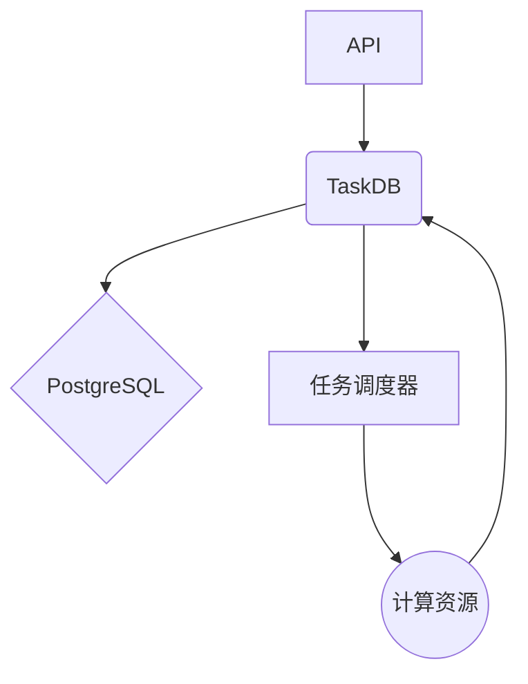

该图展示了API如何与TaskDB交互，TaskDB如何使用PostgreSQL存储数据，以及任务调度器如何将任务分配给计算资源。 Sources: [crates\taskdb\src\lib.rs]()

## 任务规划器 (Planner)

任务规划器（Planner）负责将高级别的计算任务分解为多个子任务，并确定这些子任务之间的依赖关系。它使用一种基于“峰值”（peaks）的数据结构来维护当前的任务状态，并根据任务的类型和依赖关系生成新的任务。 [crates\taskdb\src\planner\mod.rs]()

### 主要功能

*   **任务分解:** 将高级别的计算任务分解为多个子任务。 [crates\taskdb\src\planner\mod.rs]()
*   **依赖关系确定:** 确定子任务之间的依赖关系，确保任务按照正确的顺序执行。 [crates\taskdb\src\planner\mod.rs]()
*   **任务调度:** 将子任务添加到任务队列中，供任务调度器分配给计算资源。 [crates\taskdb\src\planner\mod.rs]()
*   **峰值维护:** 维护一个“峰值”列表，用于跟踪当前的任务状态。 [crates\taskdb\src\planner\mod.rs]()

### 数据结构

Planner使用以下数据结构来存储任务信息：

*   `tasks`: 存储所有任务的列表。
*   `peaks`: 存储当前“峰值”任务的列表，按照高度递减的顺序排列。
*   `keccak_peaks`: 存储Keccak任务的“峰值”列表。
*   `consumer_position`: 迭代器位置，用于`next_task()`方法。
*   `last_task`: 最后一个任务的索引。

Sources: [crates\taskdb\src\planner\mod.rs]()

### 代码示例

以下代码展示了如何使用Planner API创建一个新的Segment任务：

```rust
{{#include crates\taskdb\src\planner\mod.rs:101:109}}
```

Sources: [crates\taskdb\src\planner\mod.rs:101-109]()

### Mermaid 图

以下Mermaid图展示了Planner的核心组件和它们之间的关系：

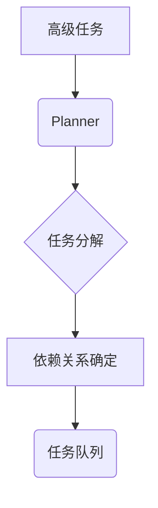

该图展示了Planner如何将高级任务分解为多个子任务，并确定它们之间的依赖关系，然后将这些子任务添加到任务队列中。 Sources: [crates\taskdb\src\planner\mod.rs]()

## 工作流执行器 (Executor)

工作流执行器（Executor）负责执行任务队列中的任务，并将任务的结果返回给TaskDB。它使用`workflow-common` crate中定义的`TaskType`枚举来表示不同类型的任务，并根据任务的类型调用相应的执行函数。 [crates\workflow\src\tasks\executor.rs](), [crates\workflow-common\src\lib.rs]()

### 主要功能

*   **任务执行:** 执行任务队列中的任务。 [crates\workflow\src\tasks\executor.rs]()
*   **结果验证:** 验证任务的执行结果是否正确。 [crates\workflow\src\tasks\executor.rs]()
*   **错误处理:** 处理任务执行过程中发生的错误，并进行重试。 [crates\workflow\src\tasks\executor.rs]()
*   **状态更新:** 将任务的状态更新到TaskDB。 [crates\workflow\src\tasks\executor.rs]()

### 任务类型

Executor支持以下任务类型：

*   `Executor`: 执行一般的计算任务。
*   `Prove`: 执行证明任务。
*   `Join`: 执行连接任务。
*   `Resolve`: 执行解析任务。
*   `Finalize`: 执行最终任务。
*   `Snark`: 执行SNARK压缩任务.
*   `Union`: 执行Union任务.
*   `Keccak`: 执行Keccak任务.

Sources: [crates\workflow\src\tasks\executor.rs](), [crates\workflow-common\src\lib.rs]()

### 代码示例

以下代码展示了如何使用Executor API执行一个Finalize任务：

```rust
{{#include crates\workflow\src\tasks\executor.rs:137:155}}
```

Sources: [crates\workflow\src\tasks\executor.rs:137-155]()

### Mermaid 图

以下Mermaid图展示了Executor的核心组件和它们之间的关系：

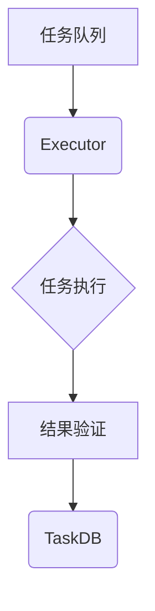

该图展示了Executor如何从任务队列中获取任务，执行任务，验证结果，并将结果更新到TaskDB。 Sources: [crates\workflow\src\tasks\executor.rs]()

## API

API模块 (`crates\api\src\lib.rs`) 提供了与外部系统交互的接口，包括任务提交、状态查询和结果获取等功能。它使用Axum框架构建，支持RESTful API，并通过S3客户端与对象存储服务交互。

### 主要功能

*   **任务提交:** 接收用户提交的任务请求，并将任务添加到任务队列中。 [crates\api\src\lib.rs]()
*   **状态查询:** 提供API用于查询任务的状态和执行进度。 [crates\api\src\lib.rs]()
*   **结果获取:** 允许用户下载任务的执行结果，例如生成的证明。 [crates\api\src\lib.rs]()
*   **输入上传:** 允许用户上传任务执行所需的输入数据。 [crates\api\src\lib.rs]()
*   **结果上传:** 允许系统上传任务执行的结果数据. [crates\api\src\lib.rs]()

### API 接口

| 接口                                  | 方法   | 描述                                                                                           |
| ------------------------------------- | ------ | ---------------------------------------------------------------------------------------------- |
| /inputs/upload/:input\_id            | PUT    | 上传输入数据到指定的input\_id                                                                   |
| /receipts/upload                      | POST   | 创建一个用于上传receipt的URL                                                                     |
| /receipts/upload/:receipt\_id         | PUT    | 上传receipt数据到指定的receipt\_id                                                                |

Sources: [crates\api\src\lib.rs]()

### 代码示例

以下代码展示了如何使用API上传输入数据：

```rust
{{#include crates\api\src\lib.rs:180:200}}
```

Sources: [crates\api\src\lib.rs:180-200]()

### Mermaid 图

以下Mermaid图展示了API模块的核心组件和它们之间的关系：

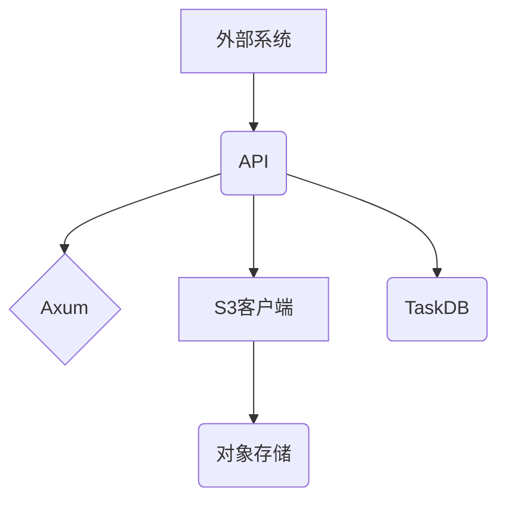

该图展示了外部系统如何通过API与系统交互，API如何使用Axum框架处理请求，如何使用S3客户端与对象存储服务交互，以及如何与TaskDB交互。 Sources: [crates\api\src\lib.rs]()

## 总结

本项目提供了一个完整的分布式任务处理框架，用于执行零知识证明相关计算任务。该框架通过模块化的设计，实现了任务的分解、并行处理和最终结果的整合。核心组件包括任务数据库（TaskDB）、任务规划器（Planner）和工作流执行器（Executor），它们协同工作，确保任务能够高效、可靠地完成。该系统通过API对外提供服务，允许用户提交任务请求，并获取最终的计算结果。该框架的设计目标是支持大规模的ZKP计算，通过将复杂的计算任务分解为多个子任务，并利用分布式计算资源并行执行这些子任务，从而显著提高计算效率。


---

<a id='overview-getting-started'></a>

## 快速开始

<details>
<summary>Relevant source files</summary>

The following files were used as context for generating this wiki page:

- [crates\api\src\lib.rs](crates\api\src\lib.rs)
- [crates\taskdb\src\lib.rs](crates\taskdb\src\lib.rs)
- [crates\workflow\src\tasks\executor.rs](crates\workflow\src\tasks\executor.rs)
- [crates\workflow\src\tasks\snark.rs](crates\workflow\src\tasks\snark.rs)
- [crates\workflow\src\tasks\finalize.rs](crates\workflow\src\tasks\finalize.rs)
- [crates\taskdb\src\planner\mod.rs](crates\taskdb\src\planner\mod.rs)
</details>

# 快速开始

本页概述了如何快速开始使用该项目，重点介绍如何创建和管理任务，包括执行器任务、SNARK 任务和最终确定任务。它涵盖了 API 端点、数据结构和关键组件，以便开发人员能够快速上手并理解项目的工作流程。

## 创建任务

任务创建是项目中的核心操作。任务可以是执行器任务（用于执行计算）、SNARK 任务（用于生成简洁的非交互式知识论证），或最终确定任务（用于清理和汇总结果）。

### 执行器任务创建

执行器任务的创建涉及使用 `/sessions/create` API 端点。此端点接受包含镜像（`img`）、输入（`input`）、用户 ID、假设（`assumptions`）、`execute_only` 标志和执行周期限制（`exec_cycle_limit`）的 JSON 请求。任务定义被序列化为 `TaskType::Executor`，然后使用 `taskdb::create_job` 函数将其添加到任务数据库中。  Sources: [crates\api\src\lib.rs:98-117]()

```rust
{{#include crates\api\src\lib.rs:98-117}}
```

创建任务后，会返回一个包含任务 UUID 的 `CreateSessRes` 对象。  Sources: [crates\api\src\lib.rs:118-120]()

### SNARK 任务创建

SNARK 任务的创建涉及使用 `/snark/create` API 端点。此端点接受包含会话 ID 的 JSON 请求，并创建一个 `TaskType::Snark` 任务。该任务用于将 Stark 证明转换为 Groth16 证明。  Sources: [crates\api\src\lib.rs:60-71]()

```rust
{{#include crates\api\src\lib.rs:60-71}}
```

与执行器任务类似，SNARK 任务也使用 `taskdb::create_job` 函数添加到任务数据库中，并返回一个包含任务 UUID 的 `CreateSessRes` 对象。  Sources: [crates\api\src\lib.rs:72-74]()

### 最终确定任务创建

最终确定任务通常在执行器任务完成后创建。它涉及创建一个 `TaskType::Finalize` 任务，该任务负责清理和汇总执行器任务的结果。这通常涉及从 Redis 检索数据、验证收据以及将最终收据上传到 S3。  Sources: [crates\workflow\src\tasks\executor.rs:42-57]()

```rust
{{#include crates\workflow\src\tasks\executor.rs:42-57}}
```

## 任务状态查询

可以使用 `/sessions/status/:job_id` (Stark) 和 `/snark/status/:job_id` (Groth16) API 端点查询任务的状态。这些端点返回包含任务状态、错误消息（如果存在）和输出的 JSON 响应。

### Stark 任务状态

`stark_status` 函数查询任务数据库以获取指定 `job_id` 的任务状态。如果任务完成，它还会检索执行统计信息并提供收据下载 URL。  Sources: [crates\api\src\lib.rs:122-151]()

```rust
{{#include crates\api\src\lib.rs:122-151}}
```

### Groth16 任务状态

`groth16_status` 函数以类似的方式查询 SNARK 任务的状态。如果任务完成，它会提供一个收据下载 URL。  Sources: [crates\api\src\lib.rs:76-93]()

```rust
{{#include crates\api\src\lib.rs:76-93}}
```

## 数据流

以下 Mermaid 图表展示了任务创建和状态查询过程中的数据流：

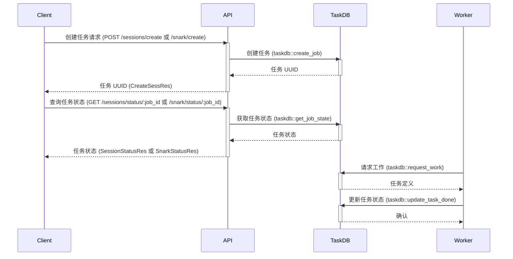

此图显示了客户端如何通过 API 创建任务并查询其状态，以及工作节点如何从任务数据库请求工作并更新任务状态。

## 关键组件

以下表格总结了快速入门过程中涉及的关键组件：

| 组件         | 描述                                                                                                                                                                                          |
|--------------|------------------------------------------------------------------------------------------------------------------------------------------------------------------------------------------------|
| API          | 提供用于创建和管理任务的 API 端点。                                                                                                                                                              |
| TaskDB       | 存储任务定义和状态。                                                                                                                                                                               |
| Worker       | 执行任务并更新任务数据库中的状态。                                                                                                                                                                 |
| Executor     | 执行计算任务。  Sources: [crates\workflow\src\tasks\executor.rs]()                                                                                                                                                           |
| SNARK Prover | 生成简洁的非交互式知识论证。  Sources: [crates\workflow\src\tasks\snark.rs]()                                                                                                                                                         |
| Finalizer    | 清理和汇总任务结果。  Sources: [crates\workflow\src\tasks\finalize.rs]()                                                                                                                                                           |

## 任务数据库 (TaskDB)

任务数据库是任务管理的核心。`taskdb::create_job` 函数用于创建新任务，而 `taskdb::get_job_state` 函数用于检索任务的状态。`taskdb::request_work` 函数允许工作节点从数据库请求新任务。  Sources: [crates\taskdb\src\lib.rs]()

### 任务状态

任务可以处于以下状态之一：`Running`、`Done` 或 `Failed`。`JobState` 枚举表示这些状态。  Sources: [crates\api\src\lib.rs:84-91]()

```rust
{{#include crates\api\src\lib.rs:84-91}}
```

## 结论

本页提供了快速开始使用该项目的概述，重点介绍了任务创建、状态查询和关键组件。通过理解这些概念，开发人员可以快速上手并开始构建自己的任务工作流程。


---

<a id='architecture-overview'></a>

## 架构概览

```html
<details>
<summary>Relevant source files</summary>

The following files were used as context for generating this wiki page:

- [crates/api/src/lib.rs](crates/api/src/lib.rs)
- [crates/workflow/src/lib.rs](crates/workflow/src/lib.rs)
- [crates/taskdb/src/lib.rs](crates/taskdb/src/lib.rs)
- [crates/taskdb/src/planner/mod.rs](crates/taskdb/src/planner/mod.rs)
- [crates/workflow/src/tasks/executor.rs](crates/workflow/src/tasks/executor.rs)
- [crates/workflow/src/tasks/snark.rs](crates/workflow/src/tasks/snark.rs)
</details>

# 架构概览

本页概述了`local-bento`项目的架构。 本项目旨在提供一个本地的、分布式的零知识证明工作流系统。 它涉及多个组件，包括API接口、任务数据库以及工作流处理代理。该系统使用S3兼容的对象存储来存储各种工件，例如ELF文件、输入数据、证明和收据。 [crates/api/src/lib.rs](), [crates/workflow/src/lib.rs]()

该架构的核心围绕着任务的创建、调度和执行。 任务被定义为不同的工作类型，例如执行器任务、证明任务、连接任务和SNARK任务。 任务数据库用于跟踪任务的状态和依赖关系，而工作流代理则负责从任务数据库中获取任务并执行它们。 [crates/taskdb/src/lib.rs](), [crates/workflow/src/lib.rs]()

## 主要组件

以下是`local-bento`架构中的关键组件：

*   **API Server:** 提供RESTful API，用于与系统交互，例如提交任务、查询任务状态和下载结果。 [crates/api/src/lib.rs]()
*   **Task Database:** 使用PostgreSQL存储任务信息，包括任务状态、依赖关系和输入/输出位置。 [crates/taskdb/src/lib.rs]()
*   **Workflow Agent:** 从任务数据库轮询任务，并根据任务类型执行相应的操作。 [crates/workflow/src/lib.rs]()
*   **Object Storage (S3):** 用于存储工件，例如ELF文件、输入数据、证明和收据。 [crates/api/src/lib.rs]()

## API Server

API服务器使用Axum框架构建，并提供以下功能：

*   **任务提交:** 接收执行器任务、证明任务、连接任务和SNARK任务的请求。 [crates/api/src/lib.rs]()
*   **任务状态查询:** 允许用户查询任务的状态，例如`Running`、`Done`或`Error`。 [crates/api/src/lib.rs]()
*   **结果下载:** 提供下载任务结果的接口，例如证明和收据。 [crates/api/src/lib.rs]()

以下是一个使用Mermaid序列图描述任务提交流程的例子：

```mermaid
sequenceDiagram
    participant User
    participant API Server
    participant Task Database
    participant Workflow Agent
    participant Object Storage

    User->>API Server: Submit Task (ExecutorReq)
    activate API Server
    API Server->>Task Database: Create Job/Tasks
    activate Task Database
    Task Database-->>API Server: Job ID
    deactivate Task Database
    API Server-->>User: Job ID (CreateSessRes)
    deactivate API Server
    Workflow Agent->>Task Database: Request Work
    activate Workflow Agent
    Task Database-->>Workflow Agent: ReadyTask (Executor)
    deactivate Task Database
    Workflow Agent->>Workflow Agent: Execute Task
    activate Workflow Agent
    Workflow Agent->>Object Storage: Read Input
    activate Object Storage
    Object Storage-->>Workflow Agent: Input Data
    deactivate Object Storage
    Workflow Agent->>Object Storage: Write Output
    activate Object Storage
    Object Storage-->>Workflow Agent: Output URL
    deactivate Object Storage
    Workflow Agent->>Task Database: Update Task State (Done)
    activate Task Database
    Task Database-->>Workflow Agent: OK
    deactivate Task Database
    Workflow Agent-->>Workflow Agent: Task Complete
    deactivate Workflow Agent
```

此图展示了用户如何通过API服务器提交任务，任务如何存储在任务数据库中，工作流代理如何从任务数据库中获取任务并执行，以及结果如何存储在对象存储中。

### API 路由

API服务器定义了多个路由来处理不同的请求。 下表总结了一些关键路由：

| 路由                       | HTTP方法 | 描述                                                                 |
| -------------------------- | -------- | -------------------------------------------------------------------- |
| `/exec/create`            | POST     | 创建一个新的执行器任务。                                                       |
| `/exec/status/:job_id`     | GET      | 获取指定ID的执行器任务的状态。                                                     |
| `/inputs/upload/:input_id` | PUT      | 上传输入数据到指定的输入ID。                                                       |
| `/receipts/upload`        | POST     | 创建一个新的收据上传会话。                                                       |
| `/receipts/upload/:receipt_id`| PUT      | 上传收据数据到指定的收据ID。                                                       |
| `/snark/create`           | POST     | 创建一个新的SNARK任务。                                                          |
| `/snark/status/:job_id`    | GET      | 获取指定ID的SNARK任务的状态。                                                       |

Sources: [crates/api/src/lib.rs:128-281]()

### 数据结构

以下是一些API服务器使用的关键数据结构：

*   `ExecutorReq`: 表示执行器任务的请求。 它包含诸如镜像ID、输入数据和执行限制等信息。 [crates/workflow-common/src/lib.rs]()
*   `CreateSessRes`: 表示任务创建会话的响应。 它包含新创建任务的UUID。 [crates/api/src/lib.rs]()
*   `SessionStatusRes`: 表示任务的状态。 它包含诸如任务状态、错误消息和输出等信息。 [crates/api/src/lib.rs]()
*   `SnarkReq`: 表示SNARK任务的请求，包含Stark收据UUID和压缩类型。 [crates/workflow-common/src/lib.rs]()
*   `SnarkStatusRes`: 表示SNARK任务的状态，包含错误信息和输出。 [crates/api/src/lib.rs]()

这些数据结构用于在API服务器和客户端之间传递数据。

## Task Database

任务数据库使用PostgreSQL来存储任务信息。 它包含以下表：

*   `jobs`: 存储有关任务的信息，例如任务ID、状态和用户ID。 [crates/taskdb/src/lib.rs]()
*   `tasks`: 存储有关各个任务的信息，例如任务ID、流ID和任务定义。 [crates/taskdb/src/lib.rs]()
*   `task_deps`: 存储任务之间的依赖关系。 [crates/taskdb/src/lib.rs]()

以下是一个展示数据库表之间关系的ER图：

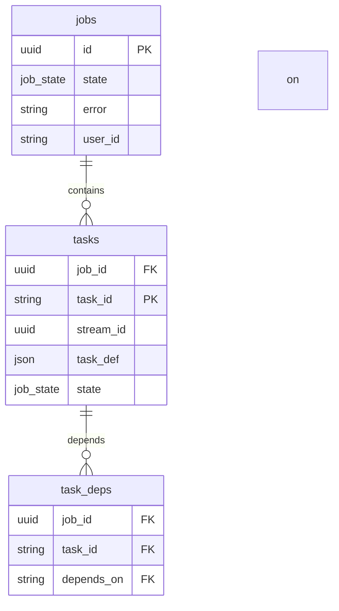

此图显示了`jobs`表如何包含多个`tasks`，以及`tasks`表如何通过`task_deps`表定义依赖关系。

### 数据库操作

任务数据库提供了一组函数来执行以下操作：

*   `create_job`: 创建一个新的任务。 [crates/taskdb/src/lib.rs]()
*   `create_task`: 创建一个新的任务。 [crates/taskdb/src/lib.rs]()
*   `get_job_state`: 获取任务的状态。 [crates/taskdb/src/lib.rs]()
*   `get_ready_tasks`: 获取准备好执行的任务。 [crates/taskdb/src/lib.rs]()
*   `update_task_state`: 更新任务的状态。 [crates/taskdb/src/lib.rs]()

这些函数用于管理任务数据库中的任务信息。

## Workflow Agent

工作流代理负责从任务数据库中获取任务并执行它们。 它支持以下任务类型：

*   `Executor`: 执行一个计算任务。 [crates/workflow/src/tasks/executor.rs]()
*   `Prove`: 生成一个证明。 [crates/workflow/src/lib.rs]()
*   `Join`: 连接两个证明。 [crates/workflow/src/lib.rs]()
*   `Resolve`: 解析最终的证明。 [crates/workflow/src/lib.rs]()
*   `Finalize`: 完成任务。 [crates/workflow/src/lib.rs]()
*   `Snark`: 将Stark证明转换为SNARK证明。 [crates/workflow/src/tasks/snark.rs]()
*   `Keccak`: 执行Keccak操作。 [crates/workflow/src/lib.rs]()
*   `Union`: 合并两个Keccak证明。 [crates/workflow/src/lib.rs]()

以下是一个描述工作流代理如何处理执行器任务的Mermaid活动图：

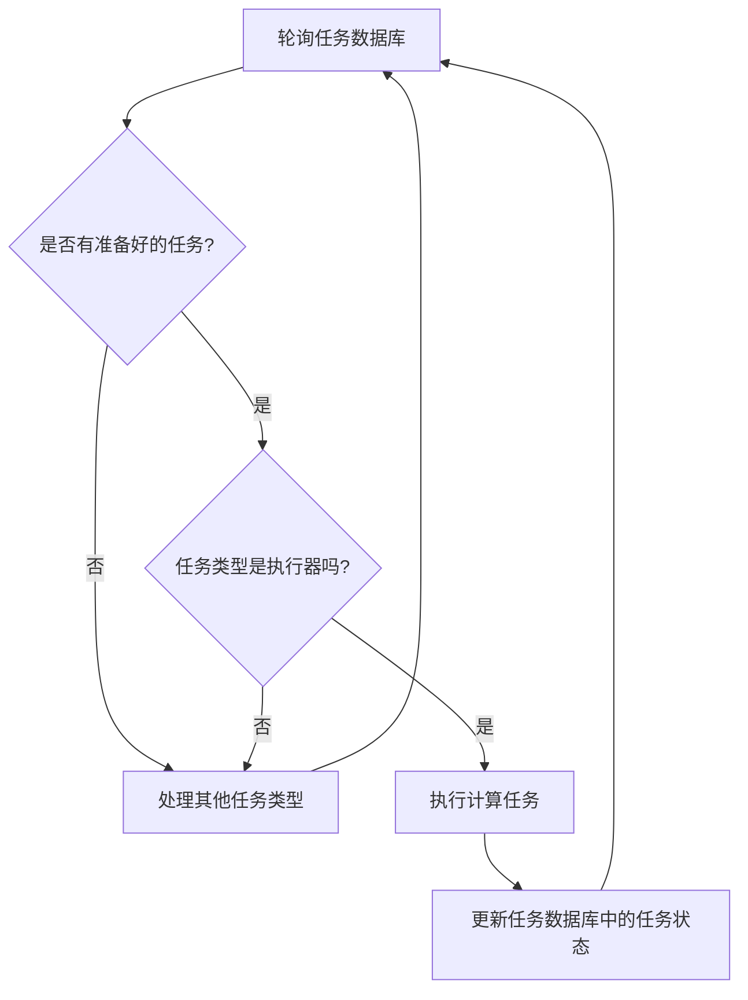

此图显示了工作流代理如何轮询任务数据库，检查是否有准备好的任务，以及如何根据任务类型执行相应的操作。

### 任务执行

工作流代理使用不同的函数来执行不同类型的任务。 例如，`executor::execute`函数用于执行执行器任务，而`snark::stark2snark`函数用于将Stark证明转换为SNARK证明。 [crates/workflow/src/tasks/executor.rs](), [crates/workflow/src/tasks/snark.rs]()

## 任务规划器 (Task Planner)

任务规划器位于 `crates\taskdb\src\planner\mod.rs` 中，负责规划任务的执行顺序。 它通过 `Planner` 结构体来管理任务，并使用 `enqueue_segment` 和 `enqueue_keccak` 等方法来添加任务。 任务规划器维护一个任务列表 `tasks`，以及两个分别用于 `Segment/Join` 和 `Keccak/Union` 命令的峰值列表 `peaks` 和 `keccak_peaks`。 [crates/taskdb/src/planner/mod.rs]()

以下是任务规划器中任务添加流程的简化流程图：

```mermaid
graph TD
    A[开始] --> B{添加任务 (enqueue_segment 或 enqueue_keccak)};
    B --> C{更新 peaks 或 keccak_peaks};
    C --> D[创建 Task 结构体];
    D --> E[添加到 tasks 列表];
    E --> F[结束];
```

## 总结

`local-bento`架构是一个复杂的系统，涉及多个组件。 API服务器提供与系统交互的接口，任务数据库存储任务信息，工作流代理执行任务。 通过理解这些组件以及它们之间的关系，可以更好地理解`local-bento`架构。


---

<a id='architecture-components'></a>

## 组件详解

<details>
<summary>Relevant source files</summary>

The following files were used as context for generating this wiki page:

- [crates/api/src/lib.rs](crates/api/src/lib.rs)
- [crates/taskdb/src/lib.rs](crates/taskdb/src/lib.rs)
- [crates/workflow/src/lib.rs](crates/workflow/src/lib.rs)
- [crates/taskdb/src/planner/mod.rs](crates/taskdb/src/planner/mod.rs)
- [crates/taskdb/src/planner/task.rs](crates/taskdb/src/planner/task.rs)
- [crates/workflow-common/src/lib.rs](crates/workflow-common/src/lib.rs)
</details>

# 组件详解

组件详解主要涉及 Bonsai 系统的任务调度和执行流程。该系统使用 taskdb 来管理任务，workflow crate 定义了任务的类型和执行逻辑，而 api crate 提供了与外部交互的接口。整体目标是高效、可靠地执行计算任务，并提供查询任务状态和下载结果的接口。

## Taskdb 组件

Taskdb 组件负责存储和管理任务的状态和依赖关系。它使用 PostgreSQL 数据库作为后端存储，并提供了一组 API 用于创建、更新和查询任务。Sources: [crates/taskdb/src/lib.rs]()

### 核心数据结构

以下是 Taskdb 中一些关键的数据结构：

*   **Job**: 代表一个计算任务，包含任务 ID、状态、错误信息和用户 ID。Sources: [crates/taskdb/src/lib.rs]()
*   **Task**: 代表一个需要执行的子任务，包含任务 ID、所属 Job ID、任务定义、依赖关系和执行结果。Sources: [crates/taskdb/src/lib.rs]()
*   **TaskDep**: 描述任务之间的依赖关系。Sources: [crates/taskdb/src/lib.rs]()

### 主要功能

Taskdb 提供了以下主要功能：

*   **创建任务 (create\_task)**: 将一个新任务添加到数据库中，包括任务定义和依赖关系。Sources: [crates/taskdb/src/lib.rs]()
*   **更新任务状态 (update\_task\_state)**: 更新任务的状态，例如从 "待处理" 到 "已完成"。Sources: [crates/taskdb/src/lib.rs]()
*   **获取任务 (get\_task)**: 根据任务 ID 获取任务的详细信息。Sources: [crates/taskdb/src/lib.rs]()
*   **请求工作 (request\_work)**:  从数据库中查询可执行的任务。Sources: [crates/taskdb/src/lib.rs]()
*   **删除任务 (delete\_job)**:  删除一个任务以及它的所有依赖。Sources: [crates/taskdb/src/lib.rs]()

### 数据库交互

Taskdb 使用 `sqlx` crate 与 PostgreSQL 数据库进行交互。 以下是一个简化的数据库交互流程图：

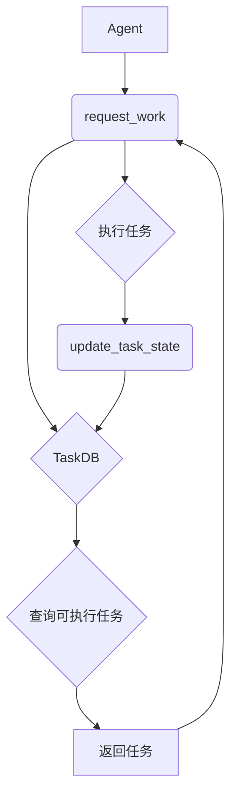

Agent 向 TaskDB 请求工作，TaskDB 查询可执行任务并返回给 Agent，Agent 执行任务后更新 TaskDB 中的任务状态。Sources: [crates/taskdb/src/lib.rs]()

### 代码示例

以下是一个创建任务的代码示例：

```rust
{{#include crates/taskdb/src/lib.rs:59-71}}
```

该函数将一个新任务添加到 `tasks` 表中，并将任务之间的依赖关系添加到 `task_deps` 表中。Sources: [crates/taskdb/src/lib.rs:59-71]()

## Workflow 组件

Workflow 组件定义了任务的类型和执行逻辑。它包含了各种任务类型，例如 `Executor`, `Prove`, `Join`, `Resolve`, `Finalize`, `Snark`, `Keccak` 和 `Union`。Sources: [crates/workflow/src/lib.rs](), [crates/workflow-common/src/lib.rs]()

### 任务类型

以下是 Workflow 组件中定义的一些任务类型：

| 任务类型   | 描述                                                                                                                                                               |
| -------- | ------------------------------------------------------------------------------------------------------------------------------------------------------------------ |
| Executor | 执行计算任务。Sources: [crates/workflow-common/src/lib.rs]()                                                                                             |
| Prove    | 执行证明任务。Sources: [crates/workflow-common/src/lib.rs]()                                                                                                |
| Join     | 合并两个任务的结果。Sources: [crates/workflow-common/src/lib.rs]()                                                                                               |
| Resolve  | 解析最终结果。Sources: [crates/workflow-common/src/lib.rs]()                                                                                              |
| Finalize | 完成任务，生成最终结果。Sources: [crates/workflow-common/src/lib.rs]()                                                                                           |
| Snark    | 将 Stark 证明转换为 Snark 证明。Sources: [crates/workflow-common/src/lib.rs]()                                                                                          |
| Keccak   | 执行 Keccak 哈希计算。Sources: [crates/workflow-common/src/lib.rs]()                                                                                             |
| Union    | 合并两个 Keccak 任务的结果。Sources: [crates/workflow-common/src/lib.rs]()                                                                                               |

### 任务执行流程

Workflow 组件根据任务类型调用相应的函数来执行任务。例如，`finalize` 任务会调用 `tasks::finalize::finalize` 函数来生成最终的 rollup receipt 并上传到 S3。Sources: [crates/workflow/src/lib.rs]()

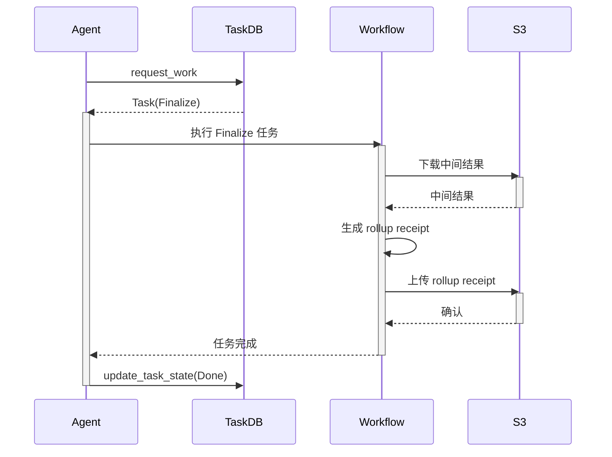

该图展示了 `Finalize` 任务的执行流程。Agent 从 TaskDB 获取 `Finalize` 任务，Workflow 组件执行 `Finalize` 任务，从 S3 下载中间结果，生成 rollup receipt，上传到 S3，最后更新 TaskDB 中的任务状态。Sources: [crates/workflow/src/lib.rs](), [crates/workflow-common/src/lib.rs]()

## API 组件

API 组件提供了与外部交互的接口，允许用户创建任务、查询任务状态和下载结果。它使用 `axum` crate 构建 RESTful API，并使用 `sqlx` crate 与 Taskdb 交互。Sources: [crates/api/src/lib.rs]()

### API 接口

以下是 API 组件提供的一些主要接口：

| 接口                     | HTTP 方法 | 描述                                                                                                                                                                                                                                                                                                                                                                                                                                                  |
| ------------------------ | ------- | ----------------------------------------------------------------------------------------------------------------------------------------------------------------------------------------------------------------------------------------------------------------------------------------------------------------------------------------------------------------------------------------------------------------------------------------------------- |
| /jobs/create             | POST    | 创建一个新的 Job。Sources: [crates/api/src/lib.rs]()                                                                                                                                                                                                                                                                                                                                                                                                                                                                                                                                                                        |
| /inputs/upload/{input\_id} | PUT     | 上传输入数据到 S3。Sources: [crates/api/src/lib.rs]()                                                                                                                                                                                                                                                                                                                                                                                                                                                                                                                                                                      |
| /receipts/upload         | POST    | 获取上传 Receipt 的 URL。Sources: [crates/api/src/lib.rs]()                                                                                                                                                                                                                                                                                                                                                                                                                                                                                                                                                                  |
| /receipts/upload/{receipt\_id} | PUT     | 上传 Receipt 数据到 S3。Sources: [crates/api/src/lib.rs]()                                                                                                                                                                                                                                                                                                                                                                                                                                                                                                                                                                |
| /snark/status/{job\_id}   | GET     | 获取 Snark 任务的状态。Sources: [crates/api/src/lib.rs]()                                                                                                                                                                                                                                                                                                                                                                                                                                                                                                                                                                   |
| /receipts/groth16/receipt/{job\_id} | GET     | 下载 Groth16 格式的 Receipt。Sources: [crates/api/src/lib.rs]()                                                                                                                                                                                                                                                                                                                                                                                                                                                                                                                                                      |

### 认证

API 组件使用 `x-api-key` header 进行认证。如果没有提供 `x-api-key` header，则使用默认的 `USER_ID`。Sources: [crates/api/src/lib.rs]()

### 错误处理

API 组件定义了一个 `AppError` enum 来处理各种错误情况，例如输入已存在、Receipt 缺失等。Sources: [crates/api/src/lib.rs]()

### 代码示例

以下是一个创建 API 路由的代码示例：

```rust
{{#include crates/api/src/lib.rs:188-225}}
```

该函数创建了一个 `axum` Router，并定义了各种 API 接口的处理函数。Sources: [crates/api/src/lib.rs:188-225]()

## Planner 组件

Planner 组件（位于 `crates\taskdb\src\planner\mod.rs`）负责规划任务的执行顺序，尤其是在涉及到分段（Segment）和 Keccak 计算等复杂任务时。它维护任务之间的依赖关系，并确保任务按照正确的顺序执行。Sources: [crates/taskdb/src/planner/mod.rs]()

### 核心概念

*   **Task**: 表示一个需要执行的计算单元。每个任务都有一个命令（`Command`），例如 `Segment`、`Join`、`Keccak` 和 `Union`。Sources: [crates/taskdb/src/planner/task.rs]()
*   **Peak**: 一个任务，它是一个 `Segment` 或 `Join` 命令，并且没有其他 join 任务依赖于它。
*   **Keccak Peak**: 一个任务，它是一个 `Keccak Segment` 或 `Union` 命令，并且没有其他 union 任务依赖于它。
*   **Task Height**: 任务的高度，用于确定任务的优先级。

### 主要功能

*   **enqueue\_segment**:  添加一个分段任务到计划中。Sources: [crates/taskdb/src/planner/mod.rs]()
*   **enqueue\_keccak**:  添加一个 Keccak 任务到计划中。Sources: [crates/taskdb/src/planner/mod.rs]()
*   **next\_task**:  返回下一个可以执行的任务。Sources: [crates/taskdb/src/planner/mod.rs]()
*   **finish**:  完成任务计划。Sources: [crates/taskdb/src/planner/mod.rs]()
*   **get\_task**:  获取指定任务的信息。Sources: [crates/taskdb/src/planner/mod.rs]()

### 任务规划流程

Planner 组件维护一个任务列表（`tasks`）和两个峰值列表（`peaks` 和 `keccak_peaks`）。当添加新任务时，Planner 会更新这些列表，并根据任务之间的依赖关系确定任务的执行顺序。

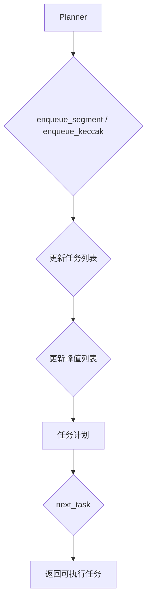

### 代码示例

以下是一个添加分段任务的代码示例：

```rust
{{#include crates/taskdb/src/planner/mod.rs:128-138}}
```

## 总结

组件详解描述了 Bonsai 系统的任务调度和执行流程，涉及 Taskdb、Workflow、API 和 Planner 四个核心组件。Taskdb 负责存储和管理任务，Workflow 定义任务类型和执行逻辑，API 提供外部交互接口，Planner 规划任务执行顺序。这些组件协同工作，确保任务高效、可靠地执行。


---

<a id='features-task-scheduling'></a>

## 任务调度

<details>
<summary>Relevant source files</summary>

The following files were used as context for generating this wiki page:

- [crates/taskdb/src/planner/mod.rs](crates/taskdb/src/planner/mod.rs)
- [crates/workflow/src/tasks/executor.rs](crates/workflow/src/tasks/executor.rs)
- [crates/taskdb/src/lib.rs](crates/taskdb/src/lib.rs)
- [crates/api/src/lib.rs](crates/api/src/lib.rs)
- [crates/taskdb/tests/e2e.rs](crates/taskdb/tests/e2e.rs)
- [crates/workflow/src/lib.rs](crates/workflow/src/lib.rs)
</details>

# 任务调度

任务调度在本项目中扮演着关键角色，它负责管理和执行各种任务，确保系统能够高效、可靠地完成既定的工作流程。任务调度涉及到任务的创建、分配、执行和监控，以及任务之间的依赖关系管理。本页面将详细介绍任务调度的架构、组件以及相关实现细节。

## 任务调度器 (Planner)

任务调度器（Planner）是任务调度的核心组件，负责规划和组织任务的执行顺序。它维护任务列表，跟踪任务之间的依赖关系，并确定下一个要执行的任务。Sources: [crates/taskdb/src/planner/mod.rs]()

### Planner 结构体

`Planner` 结构体包含以下字段：

*   `tasks`: 存储所有任务的 `Vec<Task>` 列表。Sources: [crates/taskdb/src/planner/mod.rs]()
*   `peaks`: 存储当前“峰值”任务的 `Vec<usize>` 列表，按照高度递减排序。峰值任务是指 `Segment` 或 `Join` 命令，且没有其他 `join` 任务依赖于它。Sources: [crates/taskdb/src/planner/mod.rs]()
*   `keccak_peaks`: 存储当前 "keccak_peak" 任务的 `VecDeque<usize>` 列表，按照高度递减排序。一个任务是 "keccak_peak"，如果它是 `Keccak` `Segment` 或 `Union` 命令，并且没有其他 `union` 任务依赖于它。Sources: [crates/taskdb/src/planner/mod.rs]()
*   `consumer_position`: 迭代器位置，用于 `self.next_task()`。Sources: [crates/taskdb/src/planner/mod.rs]()
*   `last_task`: 计划中的最后一个任务，由 `self.finish()` 设置。Sources: [crates/taskdb/src/planner/mod.rs]()

### Planner 的 Debug 实现

`Planner` 结构体实现了 `core::fmt::Debug` trait，用于调试输出任务计划。它通过栈来遍历任务依赖关系，并打印任务的命令类型和任务编号。Sources: [crates/taskdb/src/planner/mod.rs]()

```rust
impl core::fmt::Debug for Planner {
    fn fmt(&self, f: &mut core::fmt::Formatter) -> core::fmt::Result {
        use crate::planner::task::Command;

        let mut stack = Vec::new();

        if self.last_task.is_none() {
            writeln!(f, "Still in planning phases ...")?;
        } else {
            stack.push((0, self.last_task.unwrap()));
        }

        while let Some((indent, cursor)) = stack.pop() {
            if indent > 0 {
                write!(f, "\n{}", " ".repeat(indent))?
            }

            let task = self.get_task(cursor);

            match task.command {
                Command::Finalize => {
                    write!(f, "{:?} Finalize", task.task_number)?;
                    stack.push((indent + 2, task.depends_on[0]));
                }
                Command::Join => {
                    write!(f, "{:?} Join", task.task_number)?;
                    stack.push((indent + 2, task.depends_on[0]));
                    stack.push((indent + 2, task.depends_on[1]));
                }
                Command::Segment => {
                    write!(f, "{:?} Segment", task.task_number)?;
                }
                Command::Keccak => {
                    write!(f, "{:?} Keccak", task.task_number)?;
                }
                Command::Union => {
                    write!(f, "{:?} Union", task.task_number)?;
                    stack.push((indent + 2, task.depends_on[0]));
                    stack.push((indent + 2, task.depends_on[1]));
                }
            }
        }

        Ok(())
    }
}
```

Sources: [crates/taskdb/src/planner/mod.rs:38-85]()

### 任务调度流程

任务调度的基本流程如下：

1.  **任务创建:** 通过 `create_task` 函数创建新任务，并将其添加到任务数据库中。Sources: [crates/taskdb/src/lib.rs]()
2.  **任务规划:** `Planner` 负责规划任务的执行顺序，并确定下一个要执行的任务。Sources: [crates/taskdb/src/planner/mod.rs]()
3.  **任务执行:**  `Executor` 负责执行任务，并更新任务的状态。Sources: [crates/workflow/src/tasks/executor.rs]()
4.  **任务完成:** 任务完成后，更新任务数据库中的任务状态，并通知相关的依赖任务。Sources: [crates/taskdb/src/lib.rs]()

### 任务状态

任务状态由 `TaskState` 枚举定义，包括以下状态：

*   `Ready`: 任务已准备好执行。Sources: [crates/taskdb/src/lib.rs]()
*   `Pending`: 任务正在等待依赖任务完成。Sources: [crates/taskdb/src/lib.rs]()
*   `Running`: 任务正在执行。
*   `Done`: 任务已成功完成。Sources: [crates/taskdb/src/lib.rs]()
*   `Failed`: 任务执行失败。Sources: [crates/taskdb/src/lib.rs]()

### 任务命令

任务命令由 `Command` 枚举定义，包括以下命令：

*   `Finalize`: 结束任务。Sources: [crates/taskdb/src/planner/mod.rs]()
*   `Join`: 合并任务。Sources: [crates/taskdb/src/planner/mod.rs]()
*   `Segment`: 分割任务。Sources: [crates/taskdb/src/planner/mod.rs]()
*   `Keccak`: 执行 Keccak 哈希算法。Sources: [crates/taskdb/src/planner/mod.rs]()
*   `Union`: 合并 Keccak 任务。Sources: [crates/taskdb/src/planner/mod.rs]()

## 任务执行器 (Executor)

任务执行器（Executor）负责执行具体的任务。它接收任务调度器分配的任务，并根据任务类型执行相应的操作。Sources: [crates/workflow/src/tasks/executor.rs]()

### ExecutorReq 结构体

`ExecutorReq` 结构体定义了执行器任务的请求参数，包括：

*   `image`: 镜像名称。Sources: [crates/api/src/lib.rs]()
*   `input`: 输入数据。Sources: [crates/api/src/lib.rs]()
*   `user_id`: 用户 ID。Sources: [crates/api/src/lib.rs]()
*   `assumptions`: 假设条件。Sources: [crates/api/src/lib.rs]()
*   `execute_only`: 是否仅执行。Sources: [crates/api/src/lib.rs]()
*   `compress`: 压缩类型。Sources: [crates/api/src/lib.rs]()
*   `exec_limit`: 执行周期限制。Sources: [crates/api/src/lib.rs]()

### 任务执行流程

1.  **接收任务:** 任务执行器从任务调度器接收任务。
2.  **解析任务:** 任务执行器解析任务类型和参数。
3.  **执行任务:** 任务执行器根据任务类型执行相应的操作，例如执行计算、访问数据库等。
4.  **更新状态:** 任务执行器更新任务的状态，并将结果返回给任务调度器。

### 代码示例

以下代码展示了如何创建一个执行器任务：

```rust
let task_def = serde_json::to_value(TaskType::Executor(ExecutorReq {
    image: start_req.img,
    input: start_req.input,
    user_id: api_key.clone(),
    assumptions: start_req.assumptions,
    execute_only: start_req.execute_only,
    compress: workflow_common::CompressType::None,
    exec_limit: start_req.exec_cycle_limit,
}))
.context("Failed to serialize ExecutorReq")?;

let job_id = taskdb::create_job(
    &state.db_pool,
    &exec_stream,
    &task_def,
    state.exec_retries,
    state.exec_timeout,
    &api_key,
)
.await
.context("Failed to create exec / init task")?;
```

Sources: [crates/api/src/lib.rs:34-51]()

## 任务数据库

任务数据库用于存储任务的状态、依赖关系和执行结果。它提供了一组 API，用于创建、查询、更新和删除任务。Sources: [crates/taskdb/src/lib.rs]()

### 数据库表结构

任务数据库包含以下表：

*   `jobs`: 存储任务作业的信息，包括作业 ID、状态、错误信息、用户 ID 等。Sources: [crates/taskdb/src/lib.rs]()
*   `tasks`: 存储任务的信息，包括任务 ID、作业 ID、流 ID、任务定义、依赖关系、状态、创建时间、开始时间、更新时间、等待依赖数量、进度、重试次数、最大重试次数、超时时间、输出结果、错误信息等。Sources: [crates/taskdb/src/lib.rs]()
*   `task_deps`: 存储任务之间的依赖关系。Sources: [crates/taskdb/src/lib.rs]()

### API

任务数据库提供以下 API：

*   `create_job`: 创建一个新任务作业。Sources: [crates/taskdb/src/lib.rs]()
*   `create_task`: 创建一个新任务。Sources: [crates/taskdb/src/lib.rs]()
*   `request_work`: 请求一个可执行的任务。Sources: [crates/taskdb/src/lib.rs]()
*   `update_task_done`: 更新任务的状态为完成。Sources: [crates/taskdb/src/lib.rs]()
*   `get_job_state`: 获取任务作业的状态。Sources: [crates/api/src/lib.rs]()
*   `get_task`: 获取任务的信息。Sources: [crates/taskdb/src/lib.rs]()
*   `delete_job`: 删除一个任务作业及其相关任务和依赖关系。Sources: [crates/taskdb/src/lib.rs]()

### 代码示例

以下代码展示了如何创建一个任务：

```rust
pub async fn create_task(
    pool: &PgPool,
    job_id: &Uuid,
    task_id: &str,
    stream_id: &Uuid,
    task_def: &JsonValue,
    prereqs: &JsonValue,
    max_retries: i32,
    timeout_secs: i32,
) -> Result<(), TaskDbErr> {
    sqlx::query!(
        "CALL create_task($1, $2, $3, $4, $5, $6, $7)",
        job_id,
        task_id,
        stream_id,
        task_def,
        prereqs,
        max_retries,
        timeout_secs,
    )
    .execute(pool)
    .await?;

    Ok(())
}
```

Sources: [crates/taskdb/src/lib.rs:166-189]()

## 工作流集成

任务调度与工作流系统紧密集成，以实现自动化任务管理。工作流系统定义任务的流程和依赖关系，任务调度器负责按照工作流的定义执行任务。Sources: [crates/workflow/src/lib.rs]()

### 代码示例

以下代码展示了工作流中任务完成后的处理逻辑：

```rust
TaskType::Snark(req) => serde_json::to_value(
    tasks::snark::stark2snark(self, &task.job_id.to_string(), &req)
        .await
        .context("Snark failed")?,
)
.context("failed to serialize snark response")?,
```

Sources: [crates/workflow/src/lib.rs:22-27]()

## 总结

任务调度是本项目中的关键组成部分，它负责管理和执行各种任务，确保系统能够高效、可靠地完成既定的工作流程。通过任务调度器、任务执行器和任务数据库的协同工作，实现了任务的自动化管理和执行。


---

<a id='features-zkvm-integration'></a>

## ZkVM 集成

<details>
<summary>Relevant source files</summary>

The following files were used as context for generating this wiki page:

- [crates/workflow/src/lib.rs](crates/workflow/src/lib.rs)
- [crates/workflow/src/tasks/executor.rs](crates/workflow/src/tasks/executor.rs)
- [crates/workflow/src/tasks/finalize.rs](crates/workflow/src/tasks/finalize.rs)
- [crates/workflow/src/tasks/snark.rs](crates/workflow/src/tasks/snark.rs)
- [crates/api/src/lib.rs](crates/api/src/lib.rs)
- [crates/workflow-common/src/lib.rs](crates/workflow-common/src/lib.rs)
</details>

# ZkVM 集成

ZkVM 集成是指在工作流处理代理服务中利用 RISC Zero 的零知识虚拟机（ZkVM）技术来实现安全、可验证的计算。该集成涉及多个组件和任务，包括执行、证明、连接、解析、最终确定和生成 SNARK。通过 ZkVM，工作流可以保证计算的完整性，同时保护底层数据的隐私。 [crates/workflow/src/lib.rs](), [crates/workflow/src/tasks/executor.rs](), [crates/workflow/src/tasks/finalize.rs](), [crates/workflow/src/tasks/snark.rs]()

## ZkVM 工作流概述

ZkVM 集成的核心在于处理各种类型的任务，每个任务都代表工作流中的一个步骤。这些任务包括：

*   **执行任务 (Executor Task):** 执行 RISC-V 代码并生成执行轨迹。
*   **证明任务 (Prove Task):** 为执行轨迹生成零知识证明。
*   **连接任务 (Join Task):** 将多个证明合并成一个聚合证明。
*   **解析任务 (Resolve Task):** 确定最终的证明结果。
*   **最终确定任务 (Finalize Task):** 创建最终的汇总收据（rollup receipt），并将其上传到 S3 存储。
*   **SNARK 任务:** 将 STARK 证明转换为 SNARK 证明，以实现更小的证明大小和更快的验证速度。

### 工作流任务类型

下表总结了不同的工作流任务类型及其功能：

| 任务类型      | 描述                                                         | 相关文件                                            |
| ----------- | ------------------------------------------------------------ | --------------------------------------------------- |
| Executor    | 执行 RISC-V 代码并生成执行轨迹。                                 | [crates/workflow/src/tasks/executor.rs]()           |
| Prove       | 为执行轨迹生成零知识证明。                                     | [crates/workflow/src/lib.rs]()                      |
| Join        | 将多个证明合并成一个聚合证明。                                 | [crates/workflow/src/lib.rs]()                      |
| Resolve     | 确定最终的证明结果。                                           | [crates/workflow/src/lib.rs]()                      |
| Finalize    | 创建最终的汇总收据，并将其上传到 S3 存储。                         | [crates/workflow/src/tasks/finalize.rs]()           |
| Snark       | 将 STARK 证明转换为 SNARK 证明。                               | [crates/workflow/src/tasks/snark.rs]()              |
| Keccak      | Keccak coproc callback req                                    | [crates/workflow/src/lib.rs]()                      |
| Union       | Union task                                                     | [crates/workflow/src/lib.rs]()                      |

Sources: [crates/workflow/src/lib.rs](), [crates/workflow/src/tasks/executor.rs](), [crates/workflow/src/tasks/finalize.rs](), [crates/workflow/src/tasks/snark.rs]()

### 任务处理流程

工作流代理服务会监听任务数据库（taskdb）中指定流的新任务。当有新任务到达时，代理会根据任务类型调用相应的处理函数。每个任务处理函数都会执行特定的操作，例如执行代码、生成证明或上传数据。

以下 Mermaid 图描述了任务处理的总体流程：

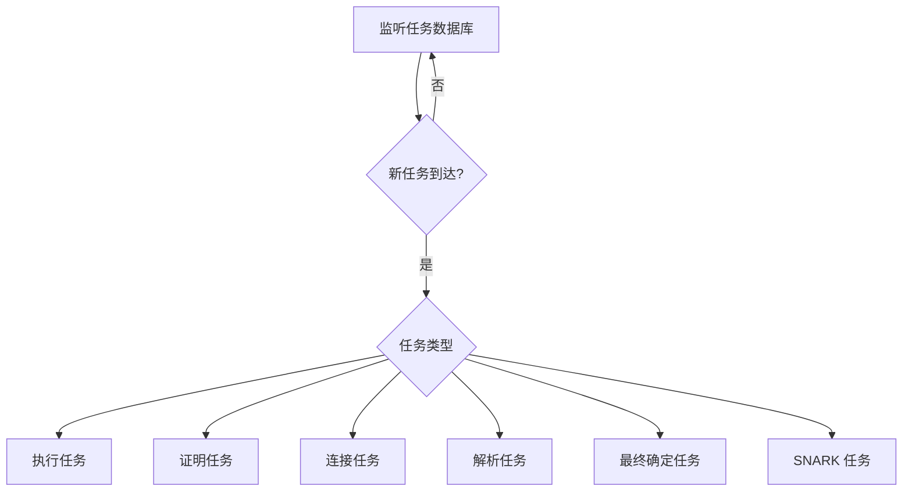

Sources: [crates/workflow/src/lib.rs](), [crates/workflow/src/tasks/executor.rs](), [crates/workflow/src/tasks/finalize.rs](), [crates/workflow/src/tasks/snark.rs]()

## 关键组件

### Agent

`Agent` 结构体是工作流代理的核心，它包含了执行任务所需的所有依赖项，例如 Redis 连接池、Postgres 连接池和 S3 客户端。 [crates/workflow/src/lib.rs]()

```rust
/// Workflow agent
///
/// Monitors taskdb for new tasks on the selected stream and processes the work.
/// Requires redis / task (psql) access
#[derive(Parser, Debug, Clone)]
#[command(author, version, about, long_about = None)]
pub struct Args {
    /// agent stream type to monitor for tasks
    ///
    /// ex: `cpu`, `prove`, `join`, `snark`, etc
    #[arg(short, long)]
    pub task_stream: String,

    /// Polling internal between tasks
    ///
    /// Time to wait between request_work calls
    #[arg(short, long, default_value_t = 1)]
    pub poll_time: u64,

    /// taskdb postgres DATABASE_URL
    #[clap(env)]
    pub database_url: String,

    /// redis connection URL
    #[clap(env)]
    pub redis_url: String,

    /// risc0 segment po2 arg
    #[clap(short, long, default_value_t = 20)]
    pub segment_po2: u32,

    /// max connections to SQL db in connection pool
    #[clap(long, default_value_t = 1)]
    pub db_max_connections: u32,

    /// Redis TTL, seconds before objects expire automatically
    ///
    /// Defaults to 8 hours
    #[clap(long, default_value_t = 8 * 60 * 60)]
    pub redis_ttl: u64,

    /// Executor limit, in millions of cycles
    #[clap(short, long, default_value_t = 100_000)]
    pub exec_cycle_limit: u64,

    /// S3 / Minio bucket
    #[clap(env)]
    pub s3_bucket: String,

    /// S3 / Minio access key
    #[clap(env)]
```

Sources: [crates/workflow/src/lib.rs]()

### S3Client

`S3Client` 用于与 S3 兼容的对象存储进行交互，例如上传和下载收据、日志和其他工件。 [crates/workflow/src/lib.rs]()

### RedisPool

`RedisPool` 用于管理与 Redis 数据库的连接，Redis 用于缓存中间结果和状态信息。 [crates/workflow/src/lib.rs]()

### PgPool

`PgPool` 用于管理与 Postgres 数据库的连接，Postgres 用于存储任务定义、任务状态和其他持久化数据。 [crates/workflow/src/lib.rs]()

## 任务类型详解

### 执行任务 (Executor Task)

执行任务负责执行 RISC-V 代码并生成执行轨迹。它使用 `ExecutorEnv` 和 `ExecutorImpl` 来设置和运行 ZkVM。 [crates/workflow/src/tasks/executor.rs]()

### 证明任务 (Prove Task)

证明任务为执行轨迹生成零知识证明。此任务涉及使用 RISC Zero 的证明器来创建证明，该证明可以验证计算的完整性，而无需透露底层数据。 [crates/workflow/src/lib.rs]()

### 连接任务 (Join Task)

连接任务将多个证明合并成一个聚合证明。这对于构建分层证明系统非常有用，其中多个较小的证明可以组合成一个较大的证明。 [crates/workflow/src/lib.rs]()

### 解析任务 (Resolve Task)

解析任务确定最终的证明结果。此任务可能涉及验证证明、提取结果或执行其他后处理步骤。 [crates/workflow/src/lib.rs]()

### 最终确定任务 (Finalize Task)

最终确定任务创建最终的汇总收据，并将其上传到 S3 存储。此收据包含计算结果和证明，可以由其他方验证。 [crates/workflow/src/tasks/finalize.rs]()

```rust
/// Run finalize tasks / cleanup
///
/// Creates the final rollup receipt, uploads that to S3
/// job path
pub async fn finalize(agent: &Agent, job_id: &Uuid, request: &FinalizeReq) -> Result<()> {
    let mut conn = agent.redis_pool.get().await?;

    let job_prefix = format!("job:{job_id}");
    let root_receipt_key = format!("{job_prefix}:{RECUR_RECEIPT_PATH}:{}", request.max_idx);

    // pull the root receipt from redis
    let root_receipt: Vec<u8> = conn
        .get::<_, Vec<u8>>(&root_receipt_key)
        .await
        .with_context(|| format!("failed to get the root receipt key: {root_receipt_key}"))?;

    let root_receipt: SuccinctReceipt<ReceiptClaim> =
        deserialize_obj(&root_receipt).context("could not deseriailize the root receipt")?;

    // construct the journal key and grab the journal from redis
    let journal_key = format!("{job_prefix}:journal");
    let journal: Vec<u8> = conn
        .get::<_, Vec<u8>>(&journal_key)
        .await
        .with_context(|| format!("Journal data not found for key ID: {journal_key}"))?;

    let journal = deserialize_obj(&journal).context("could not deseriailize the journal");
    let rollup_receipt = Receipt::new(InnerReceipt::Succinct(root_receipt), journal?);

    // build the image ID for pulling the image from redis
    let image_key = format!("{job_prefix}:image_id");
    let image_id_string: String = conn
        .get::<_, String>(&image_key)
        .await
        .with_context(|| format!("Journal data not found for key ID: {image_key}"))?;
    let image_id = read_image_id(&image_id_string)?;

    rollup_receipt
        .verify(image_id)
        .context("Receipt verification failed")?;

    if !matches!(rollup_receipt.inner, InnerReceipt::Succinct(_)) {
        bail!("rollup_receipt is not Succinct")
    }
```

Sources: [crates/workflow/src/tasks/finalize.rs]()

### SNARK 任务

SNARK 任务将 STARK 证明转换为 SNARK 证明。SNARK 证明比 STARK 证明小，验证速度更快，但生成速度较慢。此任务对于需要快速验证证明的应用程序非常有用。 [crates/workflow/src/tasks/snark.rs]()

```rust
/// Converts a stark, stored in s3 to a snark
pub async fn stark2snark(agent: &Agent, job_id: &str, req: &SnarkReq) -> Result<SnarkResp> {
    let work_dir = tempdir().context("Failed to create tmpdir")?;

    let receipt_key = format!(
        "{RECEIPT_BUCKET_DIR}/{STARK_BUCKET_DIR}/{}.bincode",
        req.receipt
    );
    tracing::info!("Downloading receipt, {receipt_key}");
    let receipt: Receipt = agent
        .s3_client
        .read_from_s3(&receipt_key)
        .await
        .context("Failed to download receipt from obj store")?;

    tracing::info!("performing identity predicate on receipt, {job_id}");

    let succinct_receipt = receipt.inner.succinct()?;
    let receipt_ident = risc0_zkvm::recursion::identity_p254(succinct_receipt)
        .context("identity predicate failed")?;
    let seal_bytes = receipt_ident.get_seal_bytes();

    tracing::info!("Completing identity predicate, {job_id}");

    tracing::info!("Running seal-to-json, {job_id}");
    let seal_path = work_dir.path().join("input.json");
    let seal_json = File::create(&seal_path)?;
    let mut seal_reader = Cursor::new(&seal_bytes);
    seal_to_json(&mut seal_reader, &seal_json)?;

    let app_path = Path::new("/").join(APP_DIR);
    if !app_path.exists() {
        bail!("Missing app path");
    }

    tracing::info!("Running stark_verify, {job_id}");
    let witness_file = work_dir.path().join(WITNESS_FILE);

    // Create a named pipe for the witness data so that the prover can start before
    // the witness generation is complete.
    unistd::mkfifo(&witness_file, stat::Mode::S_IRWXU).context("Failed to create fifo")?;

    // Spawn stark_verify process
    let mut wit_gen =
```

Sources: [crates/workflow/src/tasks/snark.rs]()

## API 端点

`crates/api/src/lib.rs` 文件定义了用于与工作流代理服务交互的 API 端点。这些端点允许客户端提交任务、检查任务状态和检索结果。

### 创建 SNARK 任务

`/snark/create` 端点用于创建 SNARK 任务。它接收一个 `SnarkReq` 对象作为输入，并返回一个 `CreateSessRes` 对象，其中包含新创建的任务的 UUID。 [crates/api/src/lib.rs]()

```rust
const SNARK_START_PATH: &str = "/snark/create";
async fn prove_groth16(
    State(state): State<Arc<AppState>>,
    ExtractApiKey(api_key): ExtractApiKey,
    Json(start_req): Json<SnarkReq>,
) -> Result<Json<CreateSessRes>, AppError> {
    let (
        _aux_stream,
        _exec_stream,
        _gpu_prove_stream,
        _gpu_coproc_stream,
        _gpu_join_stream,
        snark_stream,
    ) = helpers::get_or_create_streams(&state.db_pool, &api_key)
        .await
        .context("Failed to get / create steams")?;

    let task_def = serde_json::to_value(TaskType::Snark(WorkflowSnarkReq {
        receipt: start_req.session_id,
        compress_type: CompressType::Groth16,
    }))
    .context("Failed to serialize ExecutorReq")?;

    let job_id = taskdb::create_job(
        &state.db_pool,
        &snark_stream,
        &task_def,
        state.snark_retries,
        state.snark_timeout,
        &api_key,
    )
    .await
    .context("Failed to create exec / init task")?;

    Ok(Json(CreateSessRes {
        uuid: job_id.to_string(),
    }))
}
```

Sources: [crates/api/src/lib.rs]()

### 获取 SNARK 任务状态

`/snark/status/:job_id` 端点用于获取 SNARK 任务的状态。它接收任务的 UUID 作为路径参数，并返回一个 `SnarkStatusRes` 对象，其中包含任务的状态信息。 [crates/api/src/lib.rs]()

```rust
const SNARK_STATUS_PATH: &str = "/snark/status/:job_id";
async fn groth16_status(
    State(state): State<Arc<AppState>>,
    ExtractApiKey(api_key): ExtractApiKey,
    Path(job_id): Path<Uuid>,
    Host(hostname): Host,
) -> Result<Json<SnarkStatusRes>, AppError> {
    let job_state = taskdb::get_job_state(&state.db_pool, &job_id, &api_key)
        .await
        .context("Failed to get job state")?;
    let (error_msg, output) = match job_state {
        JobState::Running => (None, None),
        JobState::Done => (
```

Sources: [crates/api/src/lib.rs]()

## 数据结构

### TaskType

`TaskType` 枚举定义了工作流中支持的不同类型的任务。 [crates/workflow-common/src/lib.rs]()

```rust
/// High level enum of different sub task types and data
#[derive(Debug, Deserialize, Serialize)]
pub enum TaskType {
    /// Executor task
    Executor(ExecutorReq),
    /// rv32im Prove + lift task
    Prove(ProveReq),
    /// Join task
    Join(JoinReq),
    /// Resolve task
    Resolve(ResolveReq),
    /// Finalize task
    Finalize(FinalizeReq),
    /// Stark 2 Snark task
    Snark(SnarkReq),
    /// Keccak coproc callback req
    Keccak(KeccakReq),
    /// Union task
    Union(UnionReq),
}
```

Sources: [crates/workflow-common/src/lib.rs]()

### SnarkReq

`SnarkReq` 结构体定义了创建 SNARK 任务所需的输入参数。 [crates/workflow-common/src/lib.rs]()

```rust
/// Snark task definition
#[derive(Debug, Serialize, Deserialize)]
pub struct SnarkReq {
    /// Stark receipt UUID to pull from minio
    pub receipt: String,
    /// Type of snark compression to run
    pub compress_type: CompressType,
}
```

Sources: [crates/workflow-common/src/lib.rs]()

### FinalizeReq

`FinalizeReq` 结构体定义了创建 Finalize 任务所需的输入参数。 [crates/workflow-common/src/lib.rs]()

```rust
/// Input request
#[derive(Debug, Deserialize, Serialize)]
pub struct FinalizeReq {
    /// Index of the final joined receipt
    pub max_idx: usize,
}
```

Sources: [crates/workflow-common/src/lib.rs]()

## 总结

ZkVM 集成是工作流处理代理服务中的一个关键特性，它允许以安全和可验证的方式执行计算。通过利用 RISC Zero 的 ZkVM 技术，工作流可以保证计算的完整性，同时保护底层数据的隐私。该集成涉及多个组件和任务，每个组件和任务都扮演着特定的角色，以实现整体目标。


---

<a id='data-flow'></a>

## 数据流

```html
<details>
<summary>Relevant source files</summary>

The following files were used as context for generating this wiki page:

- [crates/workflow/src/lib.rs](crates/workflow/src/lib.rs)
- [crates/workflow/src/tasks/executor.rs](crates/workflow/src/tasks/executor.rs)
- [crates/api/src/lib.rs](crates/api/src/lib.rs)
- [crates/taskdb/src/lib.rs](crates/taskdb/src/lib.rs)
- [crates/taskdb/src/planner/mod.rs](crates/taskdb/src/planner/mod.rs)
- [crates/workflow/src/tasks/finalize.rs](crates/workflow/src/tasks/finalize.rs)
- [crates/workflow/src/tasks/snark.rs](crates/workflow/src/tasks/snark.rs)
</details>
```

# 数据流

数据流 (Data Flow) 在此项目中指的是任务在不同处理阶段之间的传递和管理，尤其是在工作流代理 (Workflow Agent) 处理任务时。它涉及到任务的创建、调度、执行和最终结果的存储。数据流管理依赖于 Redis 和 PostgreSQL (通过 taskdb) 来协调任务，并使用 S3 对象存储来存储中间结果和最终输出。[任务类型](#任务类型)和[工作流代理](#工作流代理)是数据流中的关键概念。Sources: [crates/workflow/src/lib.rs](), [crates/taskdb/src/lib.rs]()

数据流的设计目标是实现可靠、高效和可扩展的任务处理流程，以支持各种计算密集型工作负载。通过将任务分解为更小的单元并在不同的执行器上并行处理，可以显著提高整体吞吐量和缩短完成时间。Sources: [crates/workflow/src/lib.rs](), [crates/taskdb/src/lib.rs]()

## 核心组件

### 工作流代理

工作流代理 (Workflow Agent) 负责监控任务数据库 (taskdb) 中新的任务，并根据任务类型执行相应的工作。代理通过轮询 taskdb 来获取任务，并使用 Redis 进行协调。Sources: [crates/workflow/src/lib.rs]()

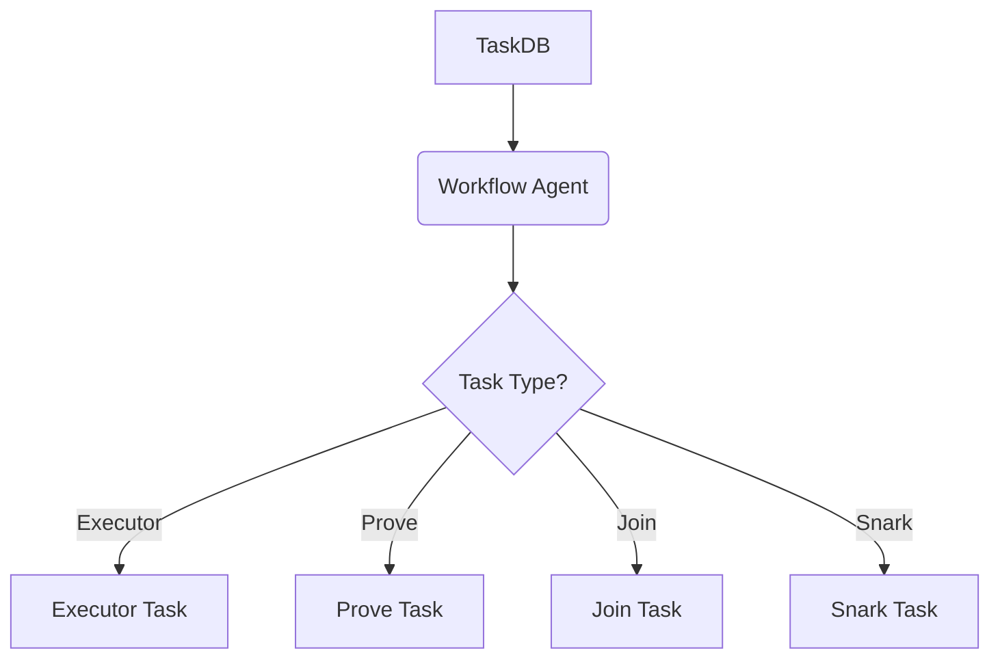

工作流代理根据任务类型（例如 `cpu`, `prove`, `join`, `snark`）来执行不同的任务。代理使用 S3 对象存储来存储和检索任务的输入和输出数据。Sources: [crates/workflow/src/lib.rs]()

### 任务数据库 (TaskDB)

任务数据库 (TaskDB) 是一个 PostgreSQL 数据库，用于存储任务的状态、依赖关系和元数据。TaskDB 提供了创建、查询和更新任务的 API。Sources: [crates/taskdb/src/lib.rs]()

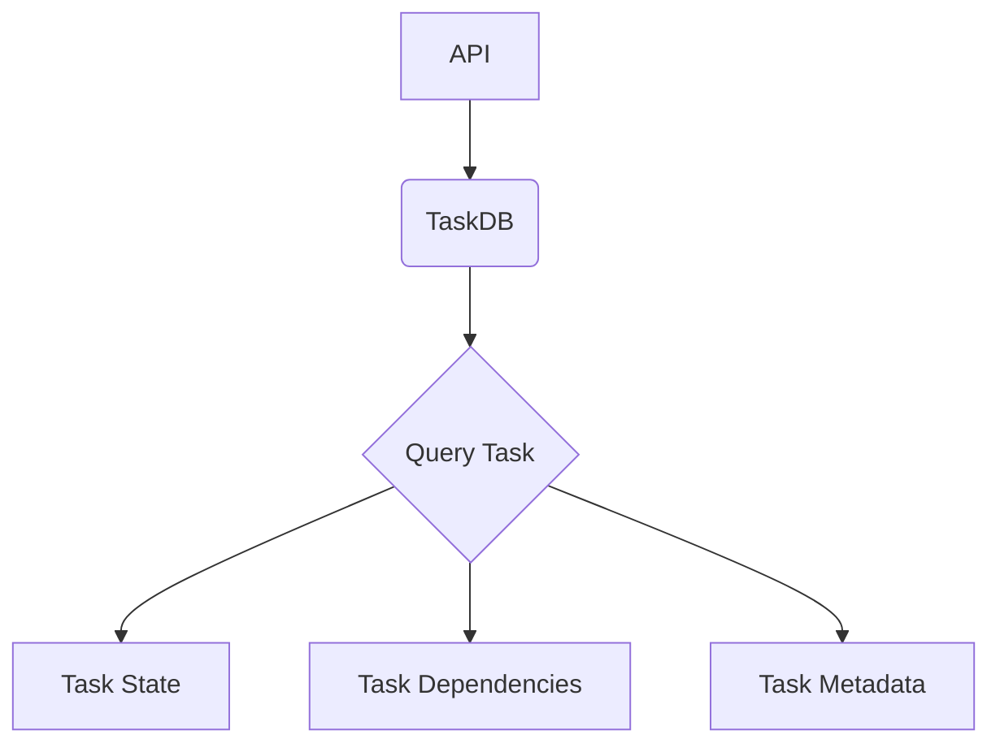

TaskDB 使用 SQLx 库与 PostgreSQL 数据库进行交互。它定义了多个函数来管理任务，包括 `create_stream`、`create_job`、`create_task`、`request_work` 和 `update_task_done`。Sources: [crates/taskdb/src/lib.rs]()

### Redis

Redis 用于在工作流代理和任务数据库之间进行协调。它存储任务的中间结果和状态信息，并用于实现任务的排队和调度。Sources: [crates/workflow/src/lib.rs]()

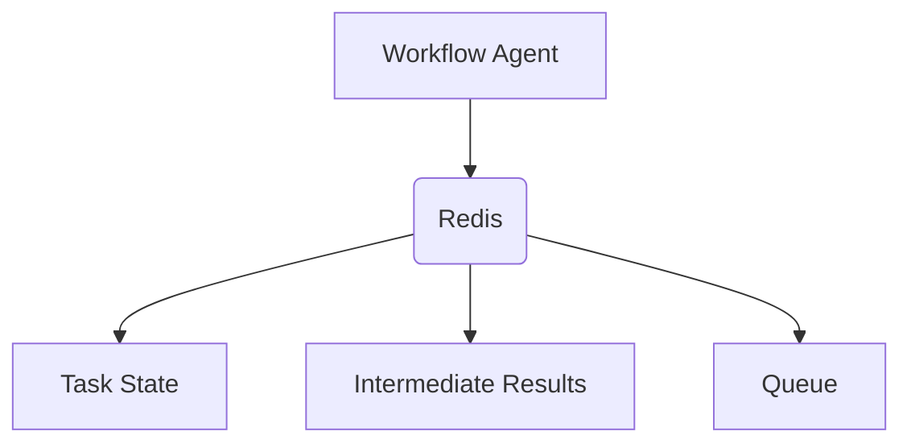

Redis 提供了快速的键值存储，用于存储任务的状态和中间结果。工作流代理使用 Redis 客户端库与 Redis 服务器进行交互。Sources: [crates/workflow/src/lib.rs]()

### S3 对象存储

S3 对象存储用于存储任务的输入和输出数据。它提供了可靠和可扩展的存储解决方案，用于存储大型数据集和文件。Sources: [crates/workflow/src/lib.rs]()

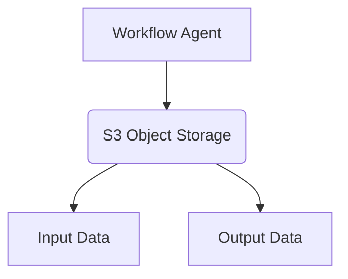

S3 对象存储使用 S3 客户端库与 S3 服务器进行交互。工作流代理使用 S3 客户端库来上传和下载数据。Sources: [crates/workflow/src/lib.rs]()

## 任务类型

工作流支持多种任务类型，每种任务类型都有不同的处理逻辑和执行器。以下是一些常见的任务类型：

*   **Executor 任务:** 用于执行计算密集型任务。Sources: [crates/workflow/src/tasks/executor.rs]()
*   **Prove 任务:** 用于生成零知识证明。Sources: [crates/workflow/src/lib.rs]()
*   **Join 任务:** 用于合并多个任务的结果。Sources: [crates/workflow/src/lib.rs]()
*   **Snark 任务:** 用于将 Stark 证明转换为 Snark 证明。Sources: [crates/workflow/src/tasks/snark.rs]()

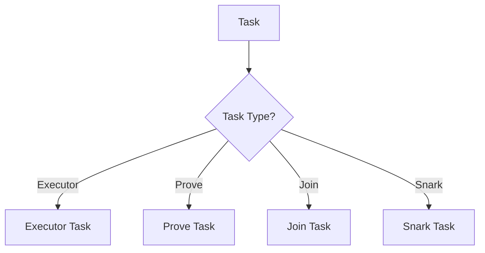

任务类型定义了任务的处理逻辑和执行器。工作流代理根据任务类型来选择相应的执行器。Sources: [crates/workflow/src/lib.rs]()

## 数据流过程

1.  **任务创建:** 客户端通过 API 创建一个任务，并将任务信息存储在 TaskDB 中。API 调用 `taskdb::create_job` 创建一个新作业，并将任务定义序列化为 JSON 格式。Sources: [crates/api/src/lib.rs](), [crates/taskdb/src/lib.rs]()
2.  **任务调度:** 工作流代理轮询 TaskDB，查找新的任务。代理调用 `taskdb::request_work` 来获取可执行的任务。Sources: [crates/workflow/src/lib.rs](), [crates/taskdb/src/lib.rs]()
3.  **任务执行:** 工作流代理根据任务类型选择相应的执行器，并执行任务。执行器从 S3 对象存储中检索任务的输入数据，并将结果存储回 S3 对象存储。Sources: [crates/workflow/src/lib.rs]()
4.  **结果存储:** 任务执行完成后，工作流代理将任务的结果存储在 S3 对象存储中，并将任务的状态更新到 TaskDB。代理调用 `taskdb::update_task_done` 来更新任务的状态和输出。Sources: [crates/workflow/src/lib.rs](), [crates/taskdb/src/lib.rs]()

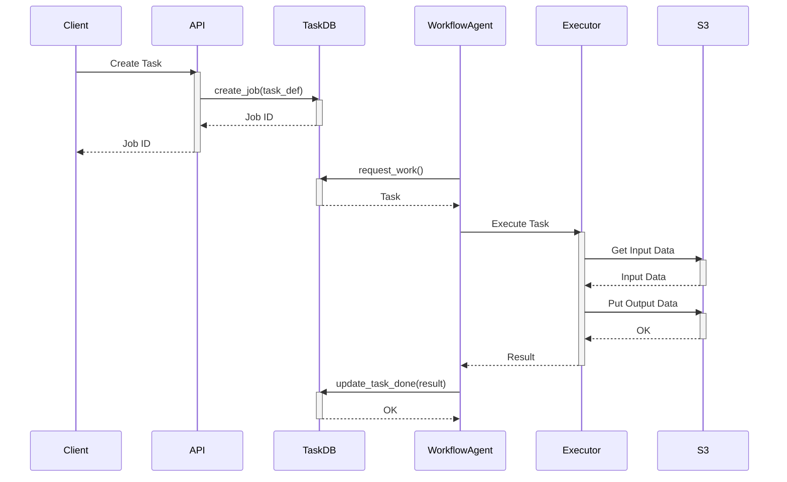

## 代码示例

以下是一些代码示例，展示了数据流中的关键操作：

**创建任务:**

```rust
{{#include crates/api/src/lib.rs:149-168}}
```

Sources: [crates/api/src/lib.rs:149-168]()

**请求工作:**

```rust
{{#include crates/taskdb/src/lib.rs:621-632}}
```

Sources: [crates/taskdb/src/lib.rs:621-632]()

**更新任务状态:**

```rust
{{#include crates/taskdb/src/lib.rs:634-646}}
```

Sources: [crates/taskdb/src/lib.rs:634-646]()

## 错误处理

数据流中的错误处理至关重要，以确保任务的可靠执行。如果任务执行失败，工作流代理会将错误信息存储在 TaskDB 中，并将任务的状态更新为 `Failed`。Sources: [crates/taskdb/src/lib.rs]()

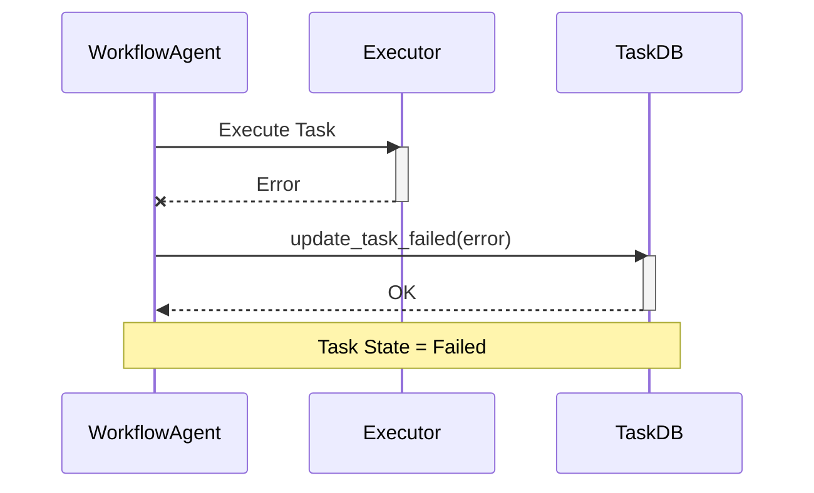

API 提供了错误处理机制，以便在任务执行失败时通知客户端。API 使用 `AppError` 枚举来表示不同的错误类型，并将错误信息返回给客户端。Sources: [crates/api/src/lib.rs]()

## 总结

数据流是此项目中的一个关键概念，它定义了任务在不同处理阶段之间的传递和管理。数据流管理依赖于 Redis 和 TaskDB 来协调任务，并使用 S3 对象存储来存储中间结果和最终输出。通过将任务分解为更小的单元并在不同的执行器上并行处理，可以显著提高整体吞吐量和缩短完成时间. Sources: [crates/workflow/src/lib.rs](), [crates/taskdb/src/lib.rs]()


---

<a id='data-persistence'></a>

## 数据持久化

<details>
<summary>Relevant source files</summary>

The following files were used as context for generating this wiki page:

- [crates/taskdb/src/lib.rs](crates/taskdb/src/lib.rs)
- [crates/taskdb/migrations/1_taskdb.sql](crates/taskdb/migrations/1_taskdb.sql)
- [crates/taskdb/src/test_helpers.rs](crates/taskdb/src/test_helpers.rs)
- [crates/taskdb/src/planner/mod.rs](crates/taskdb/src/planner/mod.rs)
- [crates/taskdb/benches/taskdb.rs](crates/taskdb/benches/taskdb.rs)
- [crates/taskdb/src/db.rs](crates/taskdb/src/db.rs)
</details>

# 数据持久化

数据持久化在 `local-bento` 项目中，特别是 `taskdb` crate 中，指的是将任务和作业的状态、配置以及结果存储到 PostgreSQL 数据库的过程。这允许系统在重启或崩溃后恢复任务状态，并提供任务执行历史的审计跟踪。`taskdb` crate 提供了用于创建、查询、更新和删除作业、任务和流的 API。本页面概述了数据持久化的各个方面，包括数据库模式、API 函数以及测试辅助工具。

## 数据库模式

`taskdb` crate 使用 PostgreSQL 数据库来持久化数据。数据库模式在 `crates/taskdb/migrations/1_taskdb.sql` 文件中定义。该模式包括以下表：

-   `jobs`: 存储关于作业的信息，例如 ID、状态、错误信息和用户 ID。
-   `tasks`: 存储关于任务的信息，例如作业 ID、任务 ID、流 ID、任务定义、状态、输出和错误信息。
-   `task_deps`: 存储任务之间的依赖关系。
-   `streams`: 存储关于流的信息，例如工作类型、并发性和优先级。

以下是 `jobs` 表的模式：

```sql
CREATE TABLE jobs (
    id UUID PRIMARY KEY,
    state VARCHAR(20) NOT NULL,
    error TEXT,
    user_id TEXT NOT NULL
);
```

以下是 `tasks` 表的模式：

```sql
CREATE TABLE tasks (
    job_id UUID NOT NULL,
    task_id TEXT NOT NULL,
    stream_id UUID NOT NULL,
    task_def JSONB NOT NULL,
    state VARCHAR(20) NOT NULL,
    output JSONB,
    error TEXT,
    progress REAL NOT NULL DEFAULT 0.0,
    timeout_secs INTEGER NOT NULL DEFAULT 60,
    start_time TIMESTAMPTZ,
    PRIMARY KEY (job_id, task_id)
);
```

以下是 `task_deps` 表的模式：

```sql
CREATE TABLE task_deps (
    job_id UUID NOT NULL,
    task_id TEXT NOT NULL,
    depends_on TEXT NOT NULL,
    PRIMARY KEY (job_id, task_id, depends_on)
);
```

以下是 `streams` 表的模式：

```sql
CREATE TABLE streams (
    id UUID PRIMARY KEY,
    worker_type TEXT NOT NULL,
    concurrency INTEGER NOT NULL,
    priority REAL NOT NULL
);
```

这些表之间的关系可以使用以下 ER 图表示：

```mermaid
erDiagram
    jobs {
        UUID id PK
        VARCHAR state
        TEXT error
        TEXT user_id
    }
    tasks {
        UUID job_id FK
        TEXT task_id PK
        UUID stream_id FK
        JSONB task_def
        VARCHAR state
        JSONB output
        TEXT error
        REAL progress
        INTEGER timeout_secs
        TIMESTAMPTZ start_time
    }
    task_deps {
        UUID job_id FK
        TEXT task_id PK
        TEXT depends_on
    }
    streams {
        UUID id PK
        TEXT worker_type
        INTEGER concurrency
        REAL priority
    }
    jobs ||--o{ tasks : contains
    tasks ||--o{ task_deps : depends on
    streams ||--o{ tasks : uses
```

该图显示了 `jobs` 表和 `tasks` 表之间的一对多关系，`tasks` 表和 `task_deps` 表之间的一对多关系，以及 `streams` 表和 `tasks` 表之间的一对多关系。Sources: [crates/taskdb/migrations/1_taskdb.sql]()

## API 函数

`taskdb` crate 提供了用于与数据库交互的 API 函数。这些函数在 `crates/taskdb/src/lib.rs` 文件中定义。一些关键函数包括：

*   `create_job`: 创建一个新的作业。
*   `create_task`: 创建一个新的任务。
*   `request_work`: 请求一个可执行的任务。
*   `update_task_done`: 更新任务的状态为已完成。
*   `update_task_failed`: 更新任务的状态为失败。
*   `get_job`: 获取一个作业的信息。
*   `get_task`: 获取一个任务的信息。
*   `delete_job`: 删除一个作业和所有相关的任务和依赖关系。

以下是 `create_job` 函数的签名：

```rust
pub async fn create_job(
    pool: &PgPool,
    stream_id: &Uuid,
    task_def: &JsonValue,
    priority: i32,
    timeout_secs: i64,
    user_id: &str,
) -> Result<Uuid, TaskDbErr>
```

该函数接受一个 `PgPool` 连接池、一个流 ID、一个任务定义、一个优先级、一个超时时间和用户 ID 作为输入，并返回新创建的作业的 UUID。Sources: [crates/taskdb/src/lib.rs:104-113]()

以下是 `create_task` 函数的签名：

```rust
pub async fn create_task(
    pool: &PgPool,
    job_id: &Uuid,
    task_id: &str,
    stream_id: &Uuid,
    task_def: &JsonValue,
    prereqs: &JsonValue,
    retries: i32,
    timeout_secs: i64,
) -> Result<(), TaskDbErr>
```

该函数接受一个 `PgPool` 连接池、一个作业 ID、一个任务 ID、一个流 ID、一个任务定义、先决条件、重试次数和超时时间作为输入，并返回一个 `Result`，指示任务是否成功创建。Sources: [crates/taskdb/src/lib.rs:134-145]()

以下是一个使用 `create_job` 和 `create_task` 函数的例子：

```rust
use sqlx::PgPool;
use uuid::Uuid;
use serde_json::json;

async fn create_new_job_and_task(pool: &PgPool) -> Result<(), sqlx::Error> {
    let stream_id = Uuid::new_v4();
    let task_def = json!({"init": "test"});
    let user_id = "user1";
    let job_id = taskdb::create_job(pool, &stream_id, &task_def, 0, 100, user_id).await.unwrap();

    let task_name = "test_task";
    let task_def = json!({"member": "data"});
    let prereqs = json!([]);
    let task_timeout = 10;
    taskdb::create_task(pool, &job_id, task_name, &stream_id, &task_def, &prereqs, 0, task_timeout).await.unwrap();

    Ok(())
}
```

此代码段演示了如何使用 `taskdb` crate 创建新的作业和任务。Sources: [crates/taskdb/src/lib.rs:104-113](), [crates/taskdb/src/lib.rs:134-145]()

## 测试辅助工具

`taskdb` crate 提供了一些测试辅助工具，用于简化单元测试和集成测试。这些工具在 `crates/taskdb/src/test_helpers.rs` 文件中定义。一些关键的测试辅助工具包括：

*   `cleanup`: 删除所有表中的所有数据。
*   `get_job`: 获取一个作业的信息。
*   `get_task`: 获取一个任务的信息。
*   `get_tasks`: 获取所有任务的信息。

以下是 `cleanup` 函数的签名：

```rust
pub async fn cleanup(pool: &PgPool) {
    sqlx::query("DELETE FROM task_deps").execute(pool).await.unwrap();
    sqlx::query("DELETE FROM tasks").execute(pool).await.unwrap();
    sqlx::query("DELETE FROM jobs").execute(pool).await.unwrap();
    sqlx::query("DELETE FROM streams").execute(pool).await.unwrap();
}
```

该函数接受一个 `PgPool` 连接池作为输入，并删除所有表中的所有数据。Sources: [crates/taskdb/src/test_helpers.rs:40-46]()

以下是一个使用 `cleanup` 函数的例子：

```rust
#[sqlx::test()]
async fn test_example(pool: PgPool) -> sqlx::Result<()> {
    // Run tests
    taskdb::test_helpers::cleanup(&pool).await;
    Ok(())
}
```

此代码段演示了如何在单元测试中使用 `cleanup` 函数来清理数据库。Sources: [crates/taskdb/src/test_helpers.rs:40-46]()

## 任务规划器

任务规划器负责确定任务的执行顺序。任务规划器在 `crates/taskdb/src/planner/mod.rs` 文件中定义。任务规划器使用依赖关系图来确定任务的执行顺序。依赖关系图是一个有向图，其中节点表示任务，边表示任务之间的依赖关系。

以下是一个简单的依赖关系图的例子：

```mermaid
graph TD
    A[Task A] --> B[Task B]
    A --> C[Task C]
    B --> D[Task D]
    C --> D
```

在此图中，任务 B 和任务 C 依赖于任务 A，任务 D 依赖于任务 B 和任务 C。任务规划器将首先执行任务 A，然后并行执行任务 B 和任务 C，最后执行任务 D。Sources: [crates/taskdb/src/planner/mod.rs]()

## 性能测试

`taskdb` crate 包含一些性能测试，用于衡量 API 函数的性能。这些测试在 `crates/taskdb/benches/taskdb.rs` 文件中定义。性能测试使用 `criterion` crate 来衡量 API 函数的执行时间。

以下是一个性能测试的例子：

```rust
c.bench_function("request_work", |b| {
    b.to_async(&runtime).iter_custom(|iters| async move {
        let db = PgPoolOptions::new()
            .max_connections(4)
            .connect(db_url)
            .await
            .expect("failed to connect to DATABASE_URL");

        let stream_id = taskdb::create_stream(&db, worker_type, 0, 1.0, user_id)
            .await
            .unwrap();
        let task_def = Value::default();
        let job_id = taskdb::create_job(&db, &stream_id, &task_def, 0, 1, user_id)
            .await
            .unwrap();

        // Pre populate the tasks:
        for i in 0..iters {
            // creates a linear task dep tree:
            let pre_reqs = if i == 0 {
                serde_json::json!([taskdb::INIT_TASK])
            } else {
                serde_json::json!([format!("{}", i - 1)])
            };
            taskdb::create_task(
                &db,
                &job_id,
                &format!("{i}"),
                &stream_id,
                &task_def,
                &pre_reqs,
                0,
                1,
            )
            .await
            .unwrap();
        }

        let start = Instant::now();
        for _i in 0..iters {
            // creates a linear task dep tree:
            black_box(taskdb::request_work(&db, worker_type).await.unwrap());
        }

        let elapsed = start.elapsed();
        taskdb::test_helpers::cleanup(&db).await;
        elapsed
    });
});
```

此代码段演示了如何使用 `criterion` crate 来衡量 `request_work` 函数的执行时间。Sources: [crates/taskdb/benches/taskdb.rs:25-69]()

## 总结

`taskdb` crate 提供了一个强大的数据持久化层，用于在 PostgreSQL 数据库中存储任务和作业的状态。该 crate 提供了用于创建、查询、更新和删除作业、任务和流的 API 函数。该 crate 还提供了一些测试辅助工具，用于简化单元测试和集成测试。任务规划器负责确定任务的执行顺序。性能测试用于衡量 API 函数的性能。


---

<a id='backend-taskdb'></a>

## Taskdb 后端

<details>
<summary>Relevant source files</summary>

The following files were used as context for generating this wiki page:

- [crates/taskdb/src/lib.rs](crates/taskdb/src/lib.rs)
- [crates/taskdb/src/planner/mod.rs](crates/taskdb/src/planner/mod.rs)
- [crates/taskdb/examples/stress.rs](crates/taskdb/examples/stress.rs)
- [crates/taskdb/benches/taskdb.rs](crates/taskdb/benches/taskdb.rs)
- [crates/taskdb/tests/e2e.rs](crates/taskdb/tests/e2e.rs)
- [crates/workflow/src/tasks/executor.rs](crates/workflow/src/tasks/executor.rs)
</details>

# Taskdb 后端

Taskdb 后端是一个用于管理和调度任务的数据库系统。它允许创建、请求、更新和删除任务，并跟踪任务之间的依赖关系。Taskdb 旨在提供一个可靠和高效的任务管理解决方案，支持各种工作负载和并发操作。此系统用于工作流处理代理服务中，例如`workflow-common` crate。

## 架构概览

Taskdb 后端使用 PostgreSQL 数据库作为其持久化存储。它提供了一组 API，用于与数据库交互，执行诸如创建作业、创建任务、请求工作和更新任务状态等操作。该系统还包括任务规划器，用于确定任务的执行顺序和依赖关系。 Sources: [crates/taskdb/src/lib.rs]()

### 主要组件

*   **数据库连接池 (PgPool):** 用于管理与 PostgreSQL 数据库的连接。 Sources: [crates/taskdb/src/lib.rs]()
*   **任务 (Task):** 表示需要执行的单个工作单元。 Sources: [crates/taskdb/src/lib.rs]()
*   **作业 (Job):** 表示一组相关的任务。 Sources: [crates/taskdb/src/lib.rs]()
*   **流 (Stream):** 表示任务的类型或类别。 Sources: [crates/taskdb/src/lib.rs]()
*   **任务规划器 (Task Planner):** 确定任务的执行顺序和依赖关系。 Sources: [crates/taskdb/src/planner/mod.rs]()

### 数据模型

Taskdb 使用以下数据模型来表示任务和作业：

*   **Job:**
    *   `id`: 作业的唯一标识符 (UUID)。 Sources: [crates/taskdb/src/lib.rs]()
    *   `state`: 作业的状态 (例如，`Pending`, `Running`, `Done`, `Failed`)。 Sources: [crates/taskdb/src/lib.rs]()
    *   `error`: 如果作业失败，则包含错误消息。 Sources: [crates/taskdb/src/lib.rs]()
    *   `user_id`: 创建作业的用户标识符。 Sources: [crates/taskdb/src/lib.rs]()
*   **Task:**
    *   `job_id`: 任务所属的作业的 ID (UUID)。 Sources: [crates/taskdb/src/lib.rs]()
    *   `task_id`: 任务的唯一标识符 (字符串)。 Sources: [crates/taskdb/src/lib.rs]()
    *   `stream_id`: 任务所属的流的 ID (UUID)。 Sources: [crates/taskdb/src/lib.rs]()
    *   `task_def`: 任务的定义 (JSON)。 Sources: [crates/taskdb/src/lib.rs]()
    *   `state`: 任务的状态 (例如，`Pending`, `Ready`, `Running`, `Done`, `Failed`)。 Sources: [crates/taskdb/src/lib.rs]()
    *   `prereqs`: 任务的前提条件 (JSON 数组)。 Sources: [crates/taskdb/src/lib.rs]()
    *   `output`: 任务的输出 (JSON)。 Sources: [crates/taskdb/src/lib.rs]()
    *   `error`: 如果任务失败，则包含错误消息。 Sources: [crates/taskdb/src/lib.rs]()
    *   `max_retries`: 任务的最大重试次数。 Sources: [crates/taskdb/src/lib.rs]()
    *   `timeout_secs`: 任务的超时时间 (秒)。 Sources: [crates/taskdb/src/lib.rs]()
*   **Stream:**
    *   `id`: 流的唯一标识符 (UUID)。 Sources: [crates/taskdb/src/lib.rs]()
    *   `worker_type`: 与流关联的工作人员类型 (字符串)。 Sources: [crates/taskdb/src/lib.rs]()

以下 Mermaid 实体关系图展示了 Taskdb 的数据模型：

```mermaid
erDiagram
    Job {
        Uuid id PK
        JobState state
        String error
        String user_id
    }
    Task {
        Uuid job_id FK
        String task_id PK
        Uuid stream_id FK
        JsonValue task_def
        TaskState state
        JsonValue prereqs
        JsonValue output
        String error
        i32 max_retries
        i32 timeout_secs
    }
    Stream {
        Uuid id PK
        String worker_type
    }
    Job ||--o{ Task : contains
    Stream ||--o{ Task : contains
```

此图显示了 `Job`、`Task` 和 `Stream` 实体之间的关系。`Job` 包含多个 `Task`，`Stream` 也包含多个 `Task`。`Task` 具有外键 `job_id` 和 `stream_id`，分别引用 `Job` 和 `Stream` 的主键。 Sources: [crates/taskdb/src/lib.rs]()

## API

Taskdb 后端提供了一组 API，用于与数据库交互。以下是一些关键 API：

*   `create_job`: 创建一个新作业。 Sources: [crates/taskdb/src/lib.rs]()
*   `create_task`: 创建一个新任务。 Sources: [crates/taskdb/src/lib.rs]()
*   `request_work`: 请求一个可执行的任务。 Sources: [crates/taskdb/src/lib.rs]()
*   `update_task_done`: 更新任务的状态为完成。 Sources: [crates/taskdb/src/lib.rs]()
*   `delete_job`: 删除一个作业及其所有相关任务。 Sources: [crates/taskdb/src/lib.rs]()

### `create_job`

此 API 用于创建一个新作业。

```rust
pub async fn create_job(
    pool: &PgPool,
    stream_id: &Uuid,
    task_def: &JsonValue,
    max_retries: i32,
    timeout_secs: i32,
    user_id: &str,
) -> Result<Uuid, TaskDbErr> {
    // ...
}
```

参数：

*   `pool`: 数据库连接池。 Sources: [crates/taskdb/src/lib.rs]()
*   `stream_id`: 作业所属的流的 ID。 Sources: [crates/taskdb/src/lib.rs]()
*   `task_def`: 作业的任务定义。 Sources: [crates/taskdb/src/lib.rs]()
*   `max_retries`: 作业的最大重试次数。 Sources: [crates/taskdb/src/lib.rs]()
*   `timeout_secs`: 作业的超时时间。 Sources: [crates/taskdb/src/lib.rs]()
*   `user_id`: 创建作业的用户 ID。 Sources: [crates/taskdb/src/lib.rs]()

返回值：

*   `Uuid`: 新创建的作业的 ID。 Sources: [crates/taskdb/src/lib.rs]()

### `create_task`

此 API 用于创建一个新任务。

```rust
pub async fn create_task(
    pool: &PgPool,
    job_id: &Uuid,
    task_id: &str,
    stream_id: &Uuid,
    task_def: &JsonValue,
    prereqs: &JsonValue,
    max_retries: i32,
    timeout_secs: i32,
) -> Result<(), TaskDbErr> {
    // ...
}
```

参数：

*   `pool`: 数据库连接池。 Sources: [crates/taskdb/src/lib.rs]()
*   `job_id`: 任务所属的作业的 ID。 Sources: [crates/taskdb/src/lib.rs]()
*   `task_id`: 任务的唯一标识符。 Sources: [crates/taskdb/src/lib.rs]()
*   `stream_id`: 任务所属的流的 ID。 Sources: [crates/taskdb/src/lib.rs]()
*   `task_def`: 任务的定义。 Sources: [crates/taskdb/src/lib.rs]()
*   `prereqs`: 任务的前提条件。 Sources: [crates/taskdb/src/lib.rs]()
*   `max_retries`: 任务的最大重试次数。 Sources: [crates/taskdb/src/lib.rs]()
*   `timeout_secs`: 任务的超时时间。 Sources: [crates/taskdb/src/lib.rs]()

返回值：

*   `Result<(), TaskDbErr>`: 如果任务创建成功，则返回 `Ok(())`；否则，返回一个 `TaskDbErr` 错误。 Sources: [crates/taskdb/src/lib.rs]()

### `request_work`

此 API 用于请求一个可执行的任务。

```rust
pub async fn request_work(
    pool: &PgPool,
    worker_type: &str,
) -> Result<Option<ReadyTask>, TaskDbErr> {
    // ...
}
```

参数：

*   `pool`: 数据库连接池。 Sources: [crates/taskdb/src/lib.rs]()
*   `worker_type`: 请求任务的工作人员类型。 Sources: [crates/taskdb/src/lib.rs]()

返回值：

*   `Result<Option<ReadyTask>, TaskDbErr>`: 如果找到一个可执行的任务，则返回 `Some(ReadyTask)`；否则，返回 `None`。如果发生错误，则返回一个 `TaskDbErr` 错误。 Sources: [crates/taskdb/src/lib.rs]()

### `update_task_done`

此 API 用于更新任务的状态为完成。

```rust
pub async fn update_task_done(
    pool: &PgPool,
    job_id: &Uuid,
    task_id: &str,
    output: JsonValue,
) -> Result<bool, TaskDbErr> {
    // ...
}
```

参数：

*   `pool`: 数据库连接池。 Sources: [crates/taskdb/src/lib.rs]()
*   `job_id`: 任务所属的作业的 ID。 Sources: [crates/taskdb/src/lib.rs]()
*   `task_id`: 任务的唯一标识符。 Sources: [crates/taskdb/src/lib.rs]()
*   `output`: 任务的输出。 Sources: [crates/taskdb/src/lib.rs]()

返回值：

*   `Result<bool, TaskDbErr>`: 如果任务状态更新成功，则返回 `true`；否则，返回 `false`。如果发生错误，则返回一个 `TaskDbErr` 错误。 Sources: [crates/taskdb/src/lib.rs]()

## 任务规划器

任务规划器负责确定任务的执行顺序和依赖关系。它使用任务的 `prereqs` 字段来确定任务的依赖关系。

```mermaid
graph TD
    A[Task A] --> B[Task B]
    A --> C[Task C]
    B --> D[Task D]
    C --> D
```

此图显示了任务之间的依赖关系。`Task A` 是 `Task B` 和 `Task C` 的前提条件。`Task B` 和 `Task C` 都是 `Task D` 的前提条件。 Sources: [crates/taskdb/src/planner/mod.rs]()

## 错误处理

Taskdb 后端使用 `TaskDbErr` 枚举来表示可能发生的错误。

## 测试

Taskdb 后端包含一组单元测试和集成测试，用于验证系统的正确性。 Sources: [crates/taskdb/tests/e2e.rs](), [crates/taskdb/benches/taskdb.rs]()

以下是一个测试用例的示例：

```rust
#[sqlx::test()]
async fn update_task(pool: PgPool) -> sqlx::Result<()> {
    let user_id = "user1";
    let worker_type = "CPU";
    let stream_id = create_stream(&pool, worker_type, 1, 1.0, user_id)
        .await
        .unwrap();
    let task_def = serde_json::json!({"init": "test"});
    let job_id = create_job(&pool, &stream_id, &task_def, 0, 100, user_id)
        .await
        .unwrap();

    let init = request_work(&pool, worker_type).await.unwrap().unwrap();

    let output_res_value = "SUCCESS";
    let output_res = serde_json::json!({"result": output_res_value});
    assert!(update_task_done(&pool, &job_id, &init.task_id, output_res)
        .await
        .unwrap());

    let tasks = get_tasks(&pool).await.unwrap();

    assert_eq!(tasks.len(), 1);
    let init = &tasks[0];

    assert!(init.error.is_none());
    assert_eq!(
        init.output
            .get("result")
            .unwrap()
            .as_str()
            .unwrap(),
        output_res_value
    );
    assert_eq!(init.state, TaskState::Done);

    Ok(())
}
```

此测试用例验证了 `update_task_done` API 的正确性。 Sources: [crates/taskdb/tests/e2e.rs]()

## 总结

Taskdb 后端是一个用于管理和调度任务的数据库系统。它提供了一组 API，用于与数据库交互，执行诸如创建作业、创建任务、请求工作和更新任务状态等操作。该系统还包括任务规划器，用于确定任务的执行顺序和依赖关系。Taskdb 旨在提供一个可靠和高效的任务管理解决方案，支持各种工作负载和并发操作。


---

<a id='backend-workflow'></a>

## Workflow 后端

<details>
<summary>Relevant source files</summary>

The following files were used as context for generating this wiki page:

- [crates/workflow/src/lib.rs](crates/workflow/src/lib.rs)
- [crates/workflow/src/tasks/executor.rs](crates/workflow/src/tasks/executor.rs)
- [crates/workflow/src/tasks/snark.rs](crates/workflow/src/tasks/snark.rs)
- [crates/api/src/lib.rs](crates/api/src/lib.rs)
- [crates/taskdb/src/lib.rs](crates/taskdb/src/lib.rs)
- [crates/workflow/src/tasks/finalize.rs](crates/workflow/src/tasks/finalize.rs)
</details>

# Workflow 后端

Workflow 后端是整个 Bonsai 系统中处理任务的核心组件。它负责接收、调度和执行来自前端或其他服务的任务请求，并管理任务的生命周期。Workflow 后端与 TaskDB、Redis 和 S3 等多个服务交互，以实现任务的持久化存储、状态管理和数据访问。它支持多种任务类型，包括执行器任务、证明任务、连接任务和 SNARK 任务，并通过定义明确的接口和数据结构来确保任务的正确执行和结果的可靠性。 [crates/workflow/src/lib.rs](), [crates/workflow/src/tasks/executor.rs]()

Workflow 后端的目标是提供一个可扩展、可靠和高效的任务处理平台，以支持 Bonsai 系统的各种应用场景。它通过异步处理、并发执行和错误处理机制来最大程度地提高任务处理的吞吐量和性能。

## 架构概览

Workflow 后端采用模块化架构，主要包括以下几个核心组件：

*   **Agent:** 负责监控任务流，从 TaskDB 获取新任务，并将任务分发给相应的任务处理器。 [crates/workflow/src/lib.rs]()
*   **Task Processors:** 负责执行特定类型的任务，例如执行器任务、证明任务、连接任务和 SNARK 任务。 [crates/workflow/src/tasks/executor.rs](), [crates/workflow/src/tasks/snark.rs]()
*   **TaskDB:** 负责存储任务的状态、输入和输出，以及任务之间的依赖关系。 [crates/taskdb/src/lib.rs]()
*   **Redis:** 负责缓存任务的中间结果和状态信息，以提高任务处理的效率。 [crates/workflow/src/lib.rs]()
*   **S3:** 负责存储任务的输入和输出数据，以及最终的证明和结果。 [crates/workflow/src/lib.rs]()

```mermaid
graph TD
    A[Agent] --> B(TaskDB);
    B --> C{Task Processor};
    C --> D[Redis];
    C --> E[S3];
    style A fill:#f9f,stroke:#333,stroke-width:2px
    style B fill:#ccf,stroke:#333,stroke-width:2px
    style C fill:#ccf,stroke:#333,stroke-width:2px
    style D fill:#ccf,stroke:#333,stroke-width:2px
    style E fill:#ccf,stroke:#333,stroke-width:2px
```

该图展示了 Workflow 后端的核心组件及其交互关系。Agent 从 TaskDB 获取任务，Task Processor 执行任务，Redis 缓存数据，S3 存储数据。 [crates/workflow/src/lib.rs](), [crates/taskdb/src/lib.rs]()

## 任务处理流程

Workflow 后端的任务处理流程如下：

1.  **任务创建:** API 服务接收到任务请求后，将任务信息存储到 TaskDB 中，并创建一个初始任务。 [crates/api/src/lib.rs]()
2.  **任务调度:** Agent 监控 TaskDB 中的新任务，并将任务分发给相应的任务处理器。 [crates/workflow/src/lib.rs]()
3.  **任务执行:** 任务处理器执行任务，并将任务的中间结果和状态信息存储到 Redis 中。 [crates/workflow/src/tasks/executor.rs](), [crates/workflow/src/tasks/snark.rs]()
4.  **任务完成:** 任务处理器完成任务后，将任务的最终结果存储到 S3 中，并更新 TaskDB 中的任务状态。 [crates/workflow/src/tasks/executor.rs](), [crates/workflow/src/tasks/snark.rs]()

```mermaid
sequenceDiagram
    participant API 服务
    participant TaskDB
    participant Agent
    participant Task Processor
    participant Redis
    participant S3

    API 服务->>TaskDB: 创建任务
    activate TaskDB
    TaskDB-->>API 服务: 任务ID
    deactivate TaskDB

    Agent->>TaskDB: 请求任务
    activate TaskDB
    TaskDB-->>Agent: 任务信息
    deactivate TaskDB

    Agent->>Task Processor: 分发任务
    activate Task Processor
    Task Processor->>Redis: 存储中间结果
    activate Redis
    Redis-->>Task Processor: OK
    deactivate Redis
    Task Processor->>S3: 存储最终结果
    activate S3
    S3-->>Task Processor: OK
    deactivate S3
    Task Processor->>TaskDB: 更新任务状态
    activate TaskDB
    TaskDB-->>Task Processor: OK
    deactivate TaskDB
    Task Processor-->>Agent: 任务完成
    deactivate Task Processor
```

该图展示了 Workflow 后端的任务处理流程，包括任务创建、任务调度、任务执行和任务完成等步骤。 [crates/api/src/lib.rs](), [crates/workflow/src/lib.rs](), [crates/taskdb/src/lib.rs](), [crates/workflow/src/tasks/executor.rs](), [crates/workflow/src/tasks/snark.rs]()

## 关键组件详解

### Agent

Agent 是 Workflow 后端的核心组件，负责监控任务流，从 TaskDB 获取新任务，并将任务分发给相应的任务处理器。Agent 通过以下步骤来完成任务调度：

1.  **监控任务流:** Agent 周期性地从 TaskDB 请求新任务。 [crates/workflow/src/lib.rs]()
2.  **获取新任务:** Agent 从 TaskDB 获取新任务，并根据任务类型选择相应的任务处理器。 [crates/workflow/src/lib.rs]()
3.  **分发任务:** Agent 将任务分发给相应的任务处理器，并等待任务完成。 [crates/workflow/src/lib.rs]()

```rust
#[derive(Parser, Debug, Clone)]
#[command(author, version, about, long_about = None)]
pub struct Args {
    /// agent stream type to monitor for tasks
    ///
    /// ex: `cpu`, `prove`, `join`, `snark`, etc
    #[arg(short, long)]
    pub task_stream: String,

    /// Polling internal between tasks
    ///
    /// Time to wait between request_work calls
    #[arg(short, long, default_value_t = 1)]
    pub poll_time: u64,

    // ... 其他参数
}
```

这段代码展示了 Agent 的命令行参数，包括任务流类型和轮询时间等。 [crates/workflow/src/lib.rs:18-42]()

### Task Processors

Task Processors 负责执行特定类型的任务，例如执行器任务、证明任务、连接任务和 SNARK 任务。每个任务处理器都实现了相应的任务执行逻辑，并将任务的中间结果和状态信息存储到 Redis 中，将最终结果存储到 S3 中。

#### Executor Task Processor

Executor Task Processor 负责执行执行器任务，该任务主要用于执行 RISC Zero ZKVM 中的代码。Executor Task Processor 通过以下步骤来完成任务执行：

1.  **获取任务输入:** Executor Task Processor 从 TaskDB 获取任务的输入数据，包括镜像 ID 和输入数据 ID。 [crates/workflow/src/tasks/executor.rs]()
2.  **执行代码:** Executor Task Processor 使用 RISC Zero ZKVM 执行指定的代码，并生成执行结果。 [crates/workflow/src/tasks/executor.rs]()
3.  **存储结果:** Executor Task Processor 将执行结果存储到 S3 中，并更新 TaskDB 中的任务状态。 [crates/workflow/src/tasks/executor.rs]()

```rust
serde_json::to_value(
    tasks::finalize::finalize(self, &task.job_id, &req)
        .await
        .context("Finalize failed")?,
)
.context("Failed to serialize finalize response")?,
```

这段代码展示了 Executor Task Processor 在完成执行后，会创建一个 Finalize 任务。 [crates/workflow/src/tasks/executor.rs:83-87]()

#### SNARK Task Processor

SNARK Task Processor 负责将 Stark 证明转换为 SNARK 证明，以提高证明的效率和可验证性。SNARK Task Processor 通过以下步骤来完成任务执行：

1.  **获取 Stark 证明:** SNARK Task Processor 从 S3 获取 Stark 证明。 [crates/workflow/src/tasks/snark.rs]()
2.  **转换为 SNARK 证明:** SNARK Task Processor 将 Stark 证明转换为 SNARK 证明。 [crates/workflow/src/tasks/snark.rs]()
3.  **存储 SNARK 证明:** SNARK Task Processor 将 SNARK 证明存储到 S3 中，并更新 TaskDB 中的任务状态。 [crates/workflow/src/tasks/snark.rs]()

```rust
const APP_DIR: &str = "app";
const WITNESS_FILE: &str = "output.wtns";
const PROOF_FILE: &str = "proof.json";
```

这段代码展示了 SNARK Task Processor 中使用的常量，包括应用程序目录、Witness 文件和 Proof 文件。 [crates/workflow/src/tasks/snark.rs:21-23]()

### Finalize Task Processor
Finalize Task Processor is responsible for creating the final rollup receipt and uploading it to S3. [crates/workflow/src/tasks/finalize.rs]()
The process includes:
1. Pulling the root receipt from Redis. [crates/workflow/src/tasks/finalize.rs]()
2. Constructing the journal key and grabbing the journal from Redis. [crates/workflow/src/tasks/finalize.rs]()
3. Deserializing the journal. [crates/workflow/src/tasks/finalize.rs]()
4. Building the image ID for pulling the image from Redis. [crates/workflow/src/tasks/finalize.rs]()
5. Verifying the rollup receipt. [crates/workflow/src/tasks/finalize.rs]()
6. Checking if the rollup receipt is Succinct. [crates/workflow/src/tasks/finalize.rs]()

## 数据模型

Workflow 后端使用以下数据模型来存储任务信息：

*   **Job:** 表示一个完整的任务，包括任务 ID、任务状态、任务类型和任务输入等信息. [crates/taskdb/src/lib.rs]()
*   **Task:** 表示一个任务的子任务，包括任务 ID、任务状态、任务类型、任务输入和任务输出等信息. [crates/taskdb/src/lib.rs]()
*   **Stream:** 表示一个任务流，包括任务流 ID、任务流类型和任务流优先级等信息. [crates/taskdb/src/lib.rs]()

```rust
#[derive(Debug)]
pub struct Task {
    pub job_id: Uuid,
    pub task_id: String,
    pub stream_id: Uuid,
    pub task_def: JsonValue,
    pub output: Option<JsonValue>,
    pub error: Option<String>,
    pub state: TaskState,
    pub progress: f64,
    pub start_time: Option<NaiveDateTime>,
    pub finish_time: Option<NaiveDateTime>,
    pub max_retries: i32,
    pub retries: i32,
    pub timeout_secs: i32,
}
```

这段代码展示了 Task 数据模型的定义，包括任务 ID、任务状态、任务类型、任务输入和任务输出等信息. [crates/taskdb/src/lib.rs:404-421]()

## 错误处理

Workflow 后端采用以下机制来处理错误：

*   **重试机制:** 如果任务执行失败，Workflow 后端会自动重试任务，直到达到最大重试次数。 [crates/taskdb/src/lib.rs]()
*   **错误日志:** Workflow 后端会将任务执行过程中的错误信息记录到日志中，以便进行错误分析和调试。 [crates/taskdb/src/lib.rs]()
*   **告警机制:** 如果任务执行失败的次数超过阈值，Workflow 后端会发送告警信息，以便及时处理错误。 [crates/taskdb/src/lib.rs]()

## 总结

Workflow 后端是 Bonsai 系统中处理任务的核心组件，它负责接收、调度和执行来自前端或其他服务的任务请求，并管理任务的生命周期。Workflow 后端采用模块化架构，支持多种任务类型，并通过定义明确的接口和数据结构来确保任务的正确执行和结果的可靠性。它通过异步处理、并发执行和错误处理机制来最大程度地提高任务处理的吞吐量和性能。


---

<a id='deployment-docker'></a>

## Docker 部署

```
<details>
<summary>Relevant source files</summary>

The following files were used as context for generating this wiki page:

- [docker-compose.yml](docker-compose.yml)
- [dockerfiles/agent.dockerfile](dockerfiles/agent.dockerfile)
- [dockerfiles/rest_api.dockerfile](dockerfiles/rest_api.dockerfile)
- [crates/api/src/lib.rs](crates/api/src/lib.rs)
- [crates/workflow/src/lib.rs](crates/workflow/src/lib.rs)
- [crates/workflow/src/tasks/executor.rs](crates/workflow/src/tasks/executor.rs)
</details>

# Docker 部署

本文档概述了使用 Docker 部署本项目的相关信息。我们将探讨如何使用 `docker-compose.yml` 文件来编排服务，并查看 `dockerfiles` 目录下的 `agent.dockerfile` 和 `rest_api.dockerfile` 文件，以了解如何构建 Docker 镜像。此外，我们还会涉及到 `crates/api/src/lib.rs`、`crates/workflow/src/lib.rs` 和 `crates/workflow/src/tasks/executor.rs` 文件，它们分别与 API 服务、工作流管理和任务执行有关。

## Docker Compose 编排

`docker-compose.yml` 文件用于定义和运行多容器 Docker 应用程序。它允许使用单个命令创建和启动所有服务。以下是一个简化的 Docker Compose 文件示例：

```yaml
version: "3.9"
services:
  agent:
    build:
      context: .
      dockerfile: dockerfiles/agent.dockerfile
    ports:
      - "8000:8000"
    environment:
      DATABASE_URL: ${DATABASE_URL}
      REDIS_URL: ${REDIS_URL}
  rest_api:
    build:
      context: .
      dockerfile: dockerfiles/rest_api.dockerfile
    ports:
      - "3000:3000"
    environment:
      DATABASE_URL: ${DATABASE_URL}
      REDIS_URL: ${REDIS_URL}
```

此配置定义了两个服务：`agent` 和 `rest_api`。每个服务都指定了其构建上下文和 Dockerfile 路径，以及端口映射和环境变量。 Sources: [docker-compose.yml]()

### 服务构建

每个服务都使用 `build` 部分中指定的 Dockerfile 构建。例如，`agent` 服务使用 `dockerfiles/agent.dockerfile` 构建。以下是一个 `agent.dockerfile` 的示例：

```dockerfile
FROM ubuntu:latest

WORKDIR /app

COPY . .

RUN apt-get update && apt-get install -y --no-install-recommends some-dependencies

CMD ["./start-agent.sh"]
```

此 Dockerfile 从 Ubuntu 镜像开始，设置工作目录，复制应用程序代码，安装依赖项，并定义启动代理的命令。`rest_api.dockerfile` 的结构类似，但包含 API 服务所需的特定依赖项和启动命令。 Sources: [dockerfiles/agent.dockerfile](), [dockerfiles/rest_api.dockerfile]()

### 环境变量

Docker Compose 文件使用环境变量配置服务。示例中使用了 `DATABASE_URL` 和 `REDIS_URL`，这些变量在 Docker Compose 文件外部定义，并在运行时传递给容器。这允许在不同的环境中轻松配置应用程序，而无需修改 Docker Compose 文件或 Dockerfile。 Sources: [docker-compose.yml]()

## Agent 服务

Agent 服务负责执行工作流任务。它监视任务数据库，查找新任务，并处理这些任务。`crates/workflow/src/lib.rs` 文件定义了 Agent 的主要结构和功能。

### Agent 结构

```rust
#[derive(Parser, Debug, Clone)]
#[command(author, version, about, long_about = None)]
pub struct Args {
    /// agent stream type to monitor for tasks
    ///
    /// ex: `cpu`, `prove`, `join`, `snark`, etc
    #[arg(short, long)]
    pub task_stream: String,

    /// Polling internal between tasks
    ///
    /// Time to wait between request_work calls
    #[arg(short, long, default_value_t = 1)]
    pub poll_time: u64,

    /// taskdb postgres DATABASE_URL
    #[clap(env)]
    pub database_url: String,

    /// redis connection URL
    #[clap(env)]
    pub redis_url: String,

    // ... other fields
}

/// Workflow agent
///
/// Monitors taskdb for new tasks on the selected stream and processes the work.
/// Requires redis / task (psql) access
```

`Args` 结构体定义了 Agent 的命令行参数，包括任务流类型、轮询间隔、数据库 URL 和 Redis URL。 Sources: [crates/workflow/src/lib.rs]()

### 任务处理流程

Agent 通过以下步骤处理任务：

1.  **轮询任务数据库：** Agent 定期轮询任务数据库，查找新任务。
2.  **获取任务：** 如果找到新任务，Agent 会获取任务定义和先决条件。
3.  **执行任务：** Agent 根据任务类型执行任务。例如，它可以执行计算任务、证明任务或连接任务。
4.  **更新任务状态：** 任务完成后，Agent 会更新任务数据库中的任务状态。

### 任务类型

Agent 支持多种任务类型，包括执行任务、证明任务、连接任务和 SNARK 任务。`crates/workflow/src/tasks/executor.rs` 文件包含有关执行任务的详细信息。 Sources: [crates/workflow/src/lib.rs](), [crates/workflow/src/tasks/executor.rs]()

## API 服务

API 服务提供了一个 RESTful 接口，用于与系统交互。`crates/api/src/lib.rs` 文件定义了 API 终结点和处理程序。

### API 终结点

API 服务提供以下终结点：

*   `/images/upload/:image_id`：上传镜像。
*   `/inputs/upload/:input_id`：上传输入。
*   `/sessions/create`：创建会话。
*   `/sessions/status/:job_id`：获取会话状态。
*   `/receipts/upload`：上传收据。

### 创建会话

`/sessions/create` 终结点用于创建新会话。它接受一个包含镜像、输入和执行限制的 JSON 请求。处理程序创建一个执行任务，并将其添加到任务数据库中。

```rust
const SESSION_CREATE_PATH: &str = "/sessions/create";
#[derive(Debug, Deserialize, Serialize)]
pub struct CreateSessReq {
    pub img: String,
    pub input: String,
    pub assumptions: Option<Vec<String>>,
    pub execute_only: Option<bool>,
    pub exec_cycle_limit: Option<u64>,
}

async fn session_create(
    State(state): State<Arc<AppState>>,
    Host(hostname): Host,
    Json(start_req): Json<CreateSessReq>,
    ExtractApiKey(api_key): ExtractApiKey,
) -> Result<Json<CreateSessRes>, AppError> {
    // ...
}
```

此代码段定义了 `/sessions/create` 终结点和 `CreateSessReq` 结构体，用于表示创建会话的请求。 Sources: [crates/api/src/lib.rs]()

### 获取会话状态

`/sessions/status/:job_id` 终结点用于获取会话状态。它接受一个作业 ID 作为路径参数，并返回一个包含作业状态、执行统计信息和收据 URL 的 JSON 响应。

```rust
const STARK_STATUS_PATH: &str = "/sessions/status/:job_id";
async fn stark_status(
    State(state): State<Arc<AppState>>,
    Host(hostname): Host,
    Path(job_id): Path<Uuid>,
    ExtractApiKey(api_key): ExtractApiKey,
) -> Result<Json<SessionStatusRes>, AppError> {
    // ...
}
```

此代码段定义了 `/sessions/status/:job_id` 终结点和 `stark_status` 函数，用于处理获取会话状态的请求。 Sources: [crates/api/src/lib.rs]()

## 总结

本文档介绍了使用 Docker 部署本项目的相关信息。我们探讨了如何使用 `docker-compose.yml` 文件来编排服务，并查看了 `dockerfiles` 目录下的 `agent.dockerfile` 和 `rest_api.dockerfile` 文件，以了解如何构建 Docker 镜像。此外，我们还介绍了 `crates/api/src/lib.rs`、`crates/workflow/src/lib.rs` 和 `crates/workflow/src/tasks/executor.rs` 文件，它们分别与 API 服务、工作流管理和任务执行有关。


---

